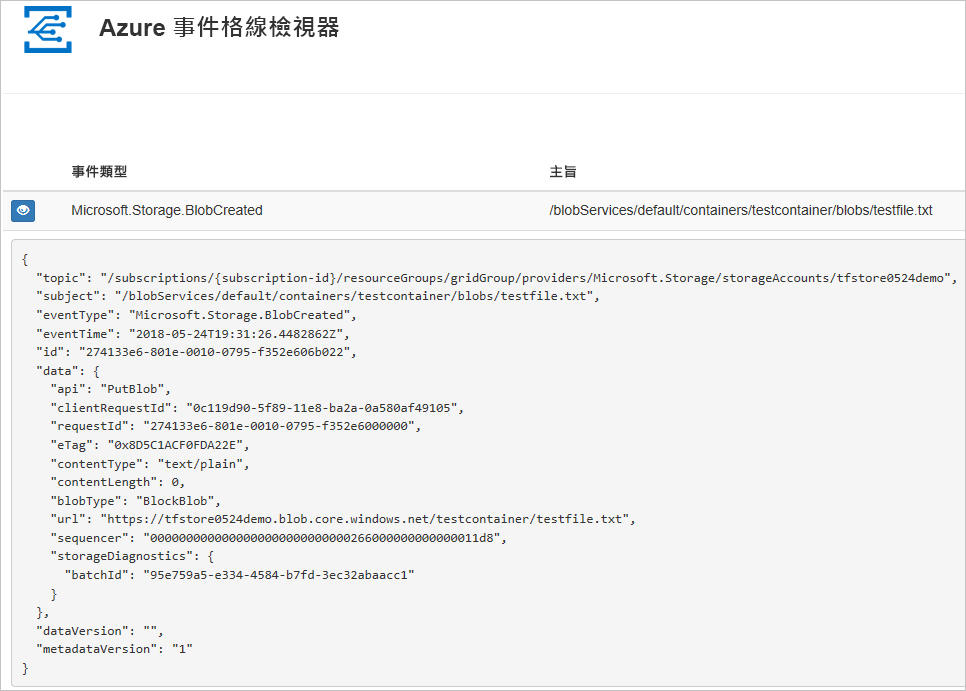
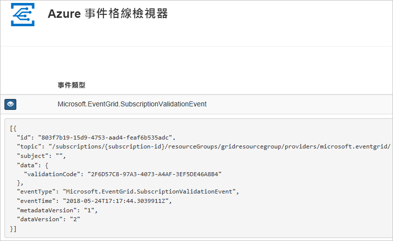

# <a name="route-blob-storage-events-to-a-custom-web-endpoint-with-azure-cli"></a>使用 Azure CLI 將 Blob 儲存體事件路由至自訂的 Web 端點

Azure Event Grid 是一項雲端事件服務。 在本文中，您可使用 Azure CLI 訂閱 Blob 儲存體事件，以及觸發事件來檢視結果。

通常，您會將事件傳送至可處理事件資料及採取行動的端點。 不過，若要簡化這篇文章，您可將事件傳送至可收集及顯示訊息的 Web 應用程式。

當您完成本文所述的步驟時，會看到事件資料已傳送至 Web 應用程式。




[!INCLUDE [quickstarts-free-trial-note.md](../../../includes/quickstarts-free-trial-note.md)]

[!INCLUDE [cloud-shell-try-it.md](../../../includes/cloud-shell-try-it.md)]

如果您選擇在本機安裝和使用 CLI，本文會要求您執行最新版的 Azure CLI (2.0.24 或更新版本)。 若要尋找版本，請執行 `az --version`。 如果您需要安裝或升級，請參閱[安裝 Azure CLI](/cli/azure/install-azure-cli)。

如果您未使用 Cloud Shell，您必須先使用 `az login` 登入。

## <a name="create-a-resource-group"></a>建立資源群組

Event Grid 為 Azure 資源，必須放入 Azure 資源群組中。 資源群組是在其中部署與管理 Azure 資源的邏輯集合。

使用 [az group create](/cli/azure/group#az_group_create) 命令來建立資源群組。 

下列範例會在 *westcentralus* 位置建立名為 `<resource_group_name>` 的資源群組。  以資源群組的唯一名稱取代 `<resource_group_name>`。

```azurecli-interactive
az group create --name <resource_group_name> --location westcentralus
```

## <a name="create-a-storage-account"></a>建立儲存體帳戶

若要使用 Blob 儲存體事件，您需要 [Blob 儲存體帳戶](../common/storage-create-storage-account.md?toc=%2fazure%2fstorage%2fblobs%2ftoc.json#blob-storage-accounts)或[一般用途 v2 儲存體帳戶](../common/storage-account-options.md#general-purpose-v2-accounts)。 **一般用途 v2 (GPv2)** 儲存體帳戶支援所有儲存體服務 (包括 Blob、檔案、佇列和表格) 的所有功能。 **Blob 儲存體帳戶**是特製化的儲存體帳戶，可將非結構化資料儲存為 Azure 儲存體中的 Blob (物件)。 Blob 儲存體帳戶類似於一般用途儲存體帳戶，可共用所有強大的持續性、可用性、延展性以及您現今使用的效能功能，包括區塊 Blob 和附加 Blob 的 100% API 一致性。 對於只需要封鎖或附加 Blob 儲存體的應用程式，我們建議使用 Blob 儲存體帳戶。 

> [!NOTE]
> 儲存體事件的可用性會繫結至事件格線[可用性](../../event-grid/overview.md)，並且將在其他區域中變成可用狀態，就像事件格線所做的一樣。

以儲存體帳戶的唯一名稱取代 `<storage_account_name>`，並以您稍早建立的資源群組取代 `<resource_group_name>`。

```azurecli-interactive
az storage account create \
  --name <storage_account_name> \
  --location westcentralus \
  --resource-group <resource_group_name> \
  --sku Standard_LRS \
  --kind BlobStorage \
  --access-tier Hot
```

## <a name="create-a-message-endpoint"></a>建立訊息端點

訂閱主題之前，讓我們建立事件訊息的端點。 通常，端點會根據事件資料採取動作。 若要簡化此快速入門，請部署[預先建置的 Web 應用程式](https://github.com/dbarkol/azure-event-grid-viewer)以顯示事件訊息。 已部署的解決方案包含 App Service 方案、App Service Web 應用程式，以及 GitHub 中的原始程式碼。

以 Web 應用程式的唯一名稱取代 `<your-site-name>`。 Web 應用程式名稱必須是唯一的，因為它是 DNS 項目的一部分。

```azurecli-interactive
sitename=<your-site-name>

az group deployment create \
  --resource-group <resource_group_name> \
  --template-uri "https://raw.githubusercontent.com/dbarkol/azure-event-grid-viewer/master/azuredeploy.json" \
  --parameters siteName=$sitename hostingPlanName=viewerhost
```

部署需要幾分鐘的時間才能完成。 成功部署之後，檢視 Web 應用程式，確定它正在執行。 在網頁瀏覽器中，瀏覽至：`https://<your-site-name>.azurewebsites.net`

您應會看到網站目前未顯示任何訊息。

[!INCLUDE [event-grid-register-provider-cli.md](../../../includes/event-grid-register-provider-cli.md)]

## <a name="subscribe-to-your-storage-account"></a>訂閱您的儲存體帳戶

您可訂閱主題，告知 Event Grid 您想要追蹤的事件，以及要將事件傳送至何處。 下列範例會訂閱您所建立的儲存體帳戶，並從 Web 應用程式傳遞 URL 作為事件通知的端點。 以事件訂用帳戶的名稱來取代 `<event_subscription_name>`。 對於 `<resource_group_name>` 和 `<storage_account_name>`，使用您稍早建立的值。

Web 應用程式的端點必須包含的尾碼 `/api/updates/`。

```azurecli-interactive
storageid=$(az storage account show --name <storage_account_name> --resource-group <resource_group_name> --query id --output tsv)
endpoint=https://$sitename.azurewebsites.net/api/updates

az eventgrid event-subscription create \
  --resource-id $storageid \
  --name <event_subscription_name> \
  --endpoint $endpoint
```

再次檢視 Web 應用程式，並注意訂用帳戶的驗證事件已傳送給它。 選取眼睛圖示來展開事件資料。 Event Grid 會傳送驗證事件，以便端點確認它要接收事件資料。 Web 應用程式包含用來驗證訂用帳戶的程式碼。



## <a name="trigger-an-event-from-blob-storage"></a>從 Blob 儲存體觸發事件

現在，讓我們觸發事件以了解 Event Grid 如何將訊息散發至您的端點。 首先，我們要設定儲存體帳戶的名稱和金鑰，然後建立容器，接著建立並上傳檔案。 同樣地，使用您稍早建立之 `<storage_account_name>` 和 `<resource_group_name>` 的值。

```azurecli-interactive
export AZURE_STORAGE_ACCOUNT=<storage_account_name>
export AZURE_STORAGE_ACCESS_KEY="$(az storage account keys list --account-name <storage_account_name> --resource-group <resource_group_name> --query "[0].value" --output tsv)"

az storage container create --name testcontainer

touch testfile.txt
az storage blob upload --file testfile.txt --container-name testcontainer --name testfile.txt
```

您已觸發此事件，而 Event Grid 會將訊息傳送至您在訂閱時設定的端點。 檢視您的 Web 應用程式以查看剛傳送的事件。


```json
[{
  "topic": "/subscriptions/xxxxxxxx-xxxx-xxxx-xxxx-xxxxxxxxxxxx/resourceGroups/myrg/providers/Microsoft.Storage/storageAccounts/myblobstorageaccount",
  "subject": "/blobServices/default/containers/testcontainer/blobs/testfile.txt",
  "eventType": "Microsoft.Storage.BlobCreated",
  "eventTime": "2017-08-16T20:33:51.0595757Z",
  "id": "4d96b1d4-0001-00b3-58ce-16568c064fab",
  "data": {
    "api": "PutBlockList",
    "clientRequestId": "d65ca2e2-a168-4155-b7a4-2c925c18902f",
    "requestId": "4d96b1d4-0001-00b3-58ce-16568c000000",
    "eTag": "0x8D4E4E61AE038AD",
    "contentType": "text/plain",
    "contentLength": 0,
    "blobType": "BlockBlob",
    "url": "https://myblobstorageaccount.blob.core.windows.net/testcontainer/testblob1.txt",
    "sequencer": "00000000000000EB0000000000046199",
    "storageDiagnostics": {
      "batchId": "dffea416-b46e-4613-ac19-0371c0c5e352"
    }
  },
  "dataVersion": "",
  "metadataVersion": "1"
}]

```

## <a name="clean-up-resources"></a>清除資源
如果您打算繼續使用此儲存體帳戶和事件訂用帳戶，請勿清除在本文中建立的資源。 如果您不打算繼續，請使用下列命令來刪除您在本文建立的資源。

以您在上面建立的資源群組取代 `<resource_group_name>`。

```azurecli-interactive
az group delete --name <resource_group_name>
```

## <a name="next-steps"></a>後續步驟

您現在知道如何建立主題和事件訂用帳戶，請深入了解 Blob 儲存體事件以及 Event Grid 如何協助您：

- [回應 Blob 儲存體事件](storage-blob-event-overview.md)
- [關於 Event Grid](../../event-grid/overview.md)
