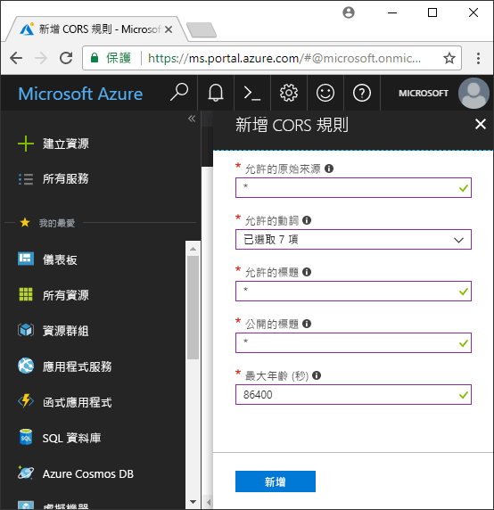

<!-- Customer intent: As a web application developer I want to interface with Azure Blob storage entirely on the client so that I can build a SPA application that is able to upload and delete files on blob storage. -->

# <a name="quickstart-upload-list-and-delete-blobs-using-javascripthtml-in-the-browser"></a>快速入門：在瀏覽器中使用 JavaScript/HTML 來上傳、列出及刪除 Blob
本快速入門會示範如何從完全在瀏覽器中執行的程式碼中管理 Blob。 這裡使用的方法會說明如何使用必要安全措施，來確保 Blob 儲存體帳戶的存取會受到保護。 若要完成本快速入門，您需要 [Azure 訂用帳戶](https://azure.microsoft.com/free/?WT.mc_id=A261C142F)。

[!INCLUDE [storage-quickstart-tutorial-create-account-portal](../../../includes/storage-quickstart-tutorial-create-account-portal.md)]

## <a name="setting-up-storage-account-cors-rules"></a>設定儲存體帳戶 CORS 規則 
您必須先設定帳戶以啟用[跨原始資源共用](https://docs.microsoft.com/rest/api/storageservices/cross-origin-resource-sharing--cors--support-for-the-azure-storage-services) (或簡稱為 CORS)，Web 應用程式才可從用戶端存取 Blob 儲存體。 

返回 Azure 入口網站，然後選取您的儲存體帳戶。 若要定義新的 CORS 規則，請返回 [設定] 區段，然後按一下 [CORS] 連結。 接著，按一下 [新增] 按鈕，以開啟 [新增 CORS 規則] 視窗。 在此快速入門中，您會建立開啟的 CORS 規則：



下表說明每個 CORS 設定以及用來定義規則的值。

|設定  |值  | 說明 |
|---------|---------|---------|
| 允許的原始來源 | * | 接受設為可接受原始來源之網域的逗號分隔清單。 將值設為 `*` 時，會允許所有網域存取儲存體帳戶。 |
| 允許的動詞     | delete、get、head、merge、post、options 和 put | 列出可對儲存體帳戶執行的 HTTP 動詞。 基於此快速入門的用途，請選取所有可用選項。 |
| 允許的標頭 | * | 定義儲存體帳戶所允許的要求標頭清單 (包括帶有前置詞的標頭)。 將值設為 `*`，會允許所有標頭存取。 |
| 公開的標頭 | * | 列出帳戶允許的回應標頭。 將值設為 `*`，會允許帳戶傳送任何標頭。  |
| 最長使用期限 (秒) | 86400 | 瀏覽器快取預檢 OPTIONS 要求的時間量上限。 值為 *86400* 時，會允許快取保留一天。 |

> [!IMPORTANT]
> 請確定您在生產環境中使用的任何設定，都只會公開對您的儲存體帳戶所需的最低存取數量，以維護安全存取。 此處所說明的 CORS 設定定義的是寬鬆的安全性原則，適用於快速入門。 不過，不建議將這些設定用於實際的環境中。

接下來，您將使用 Azure Cloud Shell 建立安全性權杖。

[!INCLUDE [Open the Azure cloud shell](../../../includes/cloud-shell-try-it.md)]

## <a name="create-a-shared-access-signature"></a>建立共用存取簽章
在瀏覽器中執行的程式碼會使用共用存取簽章 (SAS) 為 Blob 儲存體的要求授權。 藉由使用 SAS，用戶端不需要帳戶存取金鑰或連接字串，即可為儲存體資源的存取授權。 如需 SAS 的詳細資訊，請參閱[使用共用存取簽章 (SAS)](../common/storage-dotnet-shared-access-signature-part-1.md)。

您可以透過 Azure Cloud Shell 或 Azure 儲存體總管使用 Azure CLI 建立 SAS。 下表說明為使用 CLI 產生 SAS 而需為其提供值的參數。

| 參數      |說明  | Placeholder |
|----------------|-------------|-------------|
| *expiry*       | 存取權杖到期日 (格式為 YYYY-MM-DD)。 請輸入明天的日期，用於此快速入門。 | *FUTURE_DATE* |
| *account-name* | 儲存體帳戶名稱。 使用在先前的步驟中設定的名稱。 | *YOUR_STORAGE_ACCOUNT_NAME* |
| *account-key*  | 儲存體帳戶金鑰。 使用在先前的步驟中設定的金鑰。 | *YOUR_STORAGE_ACCOUNT_KEY* |

下列指令碼會使用 Azure CLI 建立可傳遞至 JavaScript Blob 服務的 SAS。

> [!NOTE]
> 為了獲得最佳結果，請先移除參數之間多餘的空格，再將命令貼到 Azure Cloud Shell 中。

```bash
az storage account generate-sas
                    --permissions racwdl
                    --resource-types sco
                    --services b
                    --expiry FUTURE_DATE
                    --account-name YOUR_STORAGE_ACCOUNT_NAME
                    --account-key YOUR_STORAGE_ACCOUNT_KEY
```
您可能會發現每個參數後面的值序列都有點難以理解。 這些參數值取自其各自權限的第一個字母。 下表說明這些值來自於何處： 

| 參數        | 值   | 說明  |
|------------------|---------|---------|
| *permissions*    | racwdl  | 此 SAS 允許讀取、附加、建立、寫入、刪除和列出功能。 |
| *resource-types* | sco     | 受到 SAS 影響的資源為服務、容器和物件。 |
| *services*       | b       | 受到 SAS 影響的服務為 Blob 服務。 |

現在，SAS 已產生，請將主控台中傳回的值複製到文字編輯器中。 您將在後續步驟中使用此值。

> [!IMPORTANT]
> 在生產環境中，請一律使用 SSL 傳遞 SAS 權杖。 此外，SAS 權杖應在伺服器上產生，並傳送至 HTML 網頁，以傳回至 Azure Blob 儲存體。 您可以考慮的其中一個方法，是使用無伺服器函式產生 SAS 權杖。 Azure 入口網站包含函式範本，可提供透過 JavaScript 函式產生 SAS 的功能。

## <a name="implement-the-html-page"></a>實作 HTML 網頁

### <a name="set-up-the-web-application"></a>設定 Web 應用程式
Azure 儲存體 JavaScript 用戶端程式庫無法直接從檔案系統運作，而必須由 Web 伺服器提供服務。 因此，下列步驟將詳細說明如何透過 Node.js 使用簡單的本機 Web 伺服器。

> [!NOTE]
> 本節說明如何建立需要在您的電腦上安裝 Node.js 的本機 Web 伺服器。 如果您不想安裝 Node.js，您可以使用任何其他執行本機 Web 伺服器的方法。

首先，為您的專案建立新的資料夾，並將其命名為 *azure-blob-javascript*。 接著，在 *azure-blob-javascript* 資料夾中開啟命令提示字元，並輸入下列命令，將應用程式備妥以安裝 Web 伺服器模組：

```bash
npm init -y
```
執行 *init* 會新增有助於安裝 Web 伺服器模組的檔案。 若要安裝模組，請輸入下列命令：

```bash
npm i http-server
```
接著，編輯 package.json 檔案，並將現有的指令碼定義取代為下列程式碼片段：

```javascript
"scripts": {
    "start": "http-server"
}
```
最後，在命令提示字元中輸入 `npm start`，以啟動 Web 伺服器：

```bash
npm start
```

### <a name="get-the-blob-storage-client-library"></a>取得 Blob 儲存體用戶端程式庫
[下載 JavaScript 用戶端程式庫](https://aka.ms/downloadazurestoragejs)、解壓縮 zip 的內容，並將 bundle 資料夾中的指令碼檔案放入名為 scripts 的資料夾中。

### <a name="add-the-client-script-reference-to-the-page"></a>將用戶端指令碼參考新增至頁面
在 azure-blob-javascript 資料夾的根目錄建立 HTML 網頁，並將其命名為 index.html。 此頁面建立後，請在頁面中新增下列標記。

```html
<!DOCTYPE html>
<html>
    <body>
        <button id="create-button">Create Container</button>

        <input type="file" id="fileinput" />
        <button id="upload-button">Upload</button>

        <button id="list-button">List</button>
        
        <button id="delete-button">Delete</button>
    </body>
    <script src="scripts/azure-storage.blob.min.js"></script>
    <script>
        // Blob-related code goes here
    </script>
</html>
```
此標記會將下列項目新增至頁面：

- scripts/azure-storage.blob.js 的參考
- 用來建立容器，上傳、列出及刪除 Blob 的按鈕
- 用來上傳檔案的 INPUT 元素
- 儲存體專用程式碼的預留位置

### <a name="create-an-instance-of-blobservice"></a>建立 BlobService 執行個體 
[BlobService](https://azure.github.io/azure-storage-node/BlobService.html) 提供 Azure Blob 儲存體的介面。 若要建立服務的執行個體，您必須提供儲存體帳戶名稱以及在先前的步驟中產生的 SAS。

```javascript
const account = {
    name: YOUR_STORAGE_ACCOUNT_NAME,
    sas:  YOUR_SAS
};

const blobUri = 'https://' + account.name + '.blob.core.windows.net';
const blobService = AzureStorage.Blob.createBlobServiceWithSas(blobUri, account.sas);
```

### <a name="create-a-blob-container"></a>建立 Blob 容器
在 Blob 服務建立後，您現在可以建立新的容器，以存放已上傳的 Blob。 [createContainerIfNotExists](https://azure.github.io/azure-storage-node/BlobService.html#createContainerIfNotExists__anchor) 方法會建立新容器，且在已有容器存在時並不會傳回錯誤。

```javascript
document.getElementById('create-button').addEventListener('click', () => {

    blobService.createContainerIfNotExists('mycontainer',  (error, container) => {
        if (error) {
            // Handle create container error
        } else {
            console.log(container.name);
        }
    });

});
```

### <a name="upload-a-blob"></a>上傳 Blob
若要從 HTML 表單上傳 Blob，您可以從 INPUT 元素取得所選檔案的參考。 當元素的「類型」設為「檔案」時，您可以透過`files` 陣列取得選取的檔案。

透過指令碼，您可以參考 HTML 元素，並將選取的檔案傳遞至 Blob 服務。

```javascript
document.getElementById('upload-button').addEventListener('click', () => {

    const file = document.getElementById('fileinput').files[0];

    blobService.createBlockBlobFromBrowserFile('mycontainer', 
                                                file.name, 
                                                file, 
                                                (error, result) => {
                                                    if(error) {
                                                        // Handle blob error
                                                    } else {
                                                        console.log('Upload is successful');
                                                    }
                                                });

});
```

[createBlockBlobFromBrowserFile](https://azure.github.io/azure-storage-node/BlobService.html#createBlockBlobFromBrowserFile__anchor) 方法會直接使用瀏覽器檔案上傳至 Blob 容器。

### <a name="list-blobs"></a>列出 Blob
當您將檔案上傳至 Blob 容器中後，您可以使用 [listBlobsSegmented](https://azure.github.io/azure-storage-node/BlobService.html#listBlobsSegmented__anchor) 方法存取容器中的 Blob 清單。

```javascript
document.getElementById('list-button').addEventListener('click', () => {

    blobService.listBlobsSegmented('mycontainer', null, (error, results) => {
        if (error) {
            // Handle list blobs error
        } else {
            results.entries.forEach(blob => {
                console.log(blob.name);
            });
        }
    });
    
});
```

listBlobsSegmented 方法會傳回 Blob 的集合。 預設的集合數量為 5,000 個 Blob，但您可以調整此值以符合您的需求。 [接續範例](https://github.com/Azure/azure-storage-node/blob/master/examples/samples/continuationsample.js#L132)會示範如何處理大量 Blob 以及用戶端程式庫如何支援分頁作業。 


### <a name="delete-blobs"></a>刪除 Blob
您可以藉由呼叫 [deleteBlobIfExists](https://azure.github.io/azure-storage-node/BlobService.html#deleteBlobIfExists__anchor) 刪除您上傳的 Blob。

```javascript
document.getElementById('delete-button').addEventListener('click', () => {

    var blobName = YOUR_BLOB_NAME;
    blobService.deleteBlobIfExists('mycontainer', blobName, (error, result) => {
        if (error) {
            // Handle delete blob error
        } else {
            console.log('Blob deleted successfully');
        }
    });
    
});
```
> [!WARNING]
> 若要讓此程式碼範例運作，您必須提供 blobName 的字串值。

## <a name="clean-up-resources"></a>清除資源
若要清除在此快速入門期間建立的資源，請返回 [Azure 入口網站](https://portal.azure.com)，並選取您的儲存體帳戶。 選取之後，您可以移至下列位置刪除儲存體帳戶：**概觀 > 刪除儲存體帳戶**。

## <a name="next-steps"></a>後續步驟
瀏覽範例以了解如何下載 Blob，並在檔案上傳期間報告進度。

> [!div class="nextstepaction"]
> [Blob 儲存體用戶端程式庫](https://github.com/Azure/azure-storage-node/tree/master/browser)
