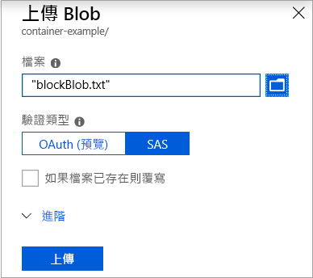

# 快速入門：使用 Azure 入口網站上傳、下載及列出 Blob

在本快速入門中，您會了解如何使用 [Azure 入口網站](https://portal.azure.com/)在 Azure 儲存體中建立容器，並且在該容器中上傳和下載區塊 blob。

## 必要條件

如果您沒有 Azure 訂用帳戶，請在開始前建立 [免費帳戶](https://azure.microsoft.com/free/?WT.mc_id=A261C142F) 。

[!INCLUDE [storage-quickstart-tutorial-create-account-portal](../../../includes/storage-quickstart-tutorial-create-account-portal.md)]

## 建立容器

若要在 Azure 入口網站中建立容器，請遵循下列步驟：

1. 在 Azure 入口網站中瀏覽至新的儲存體帳戶。
2. 在儲存體帳戶的左窗格中，捲動到 [Blob 服務] 區段，然後選取 [瀏覽 Blob]。
3. 按一下 [新增容器] 按鈕。
4. 輸入新容器的名稱。 容器名稱必須是小寫，以字母或數字開頭，並且只能包含字母、數字和虛線 (-) 字元。 如需有關容器和 Blob 名稱的詳細資訊，請參閱[命名和參考容器、Blob 及中繼資料](https://docs.microsoft.com/rest/api/storageservices/naming-and-referencing-containers--blobs--and-metadata)。
5. 設定容器的公用存取層級。 預設層級是 [私用 (沒有匿名存取權)]。
6. 按一下 [確定] 以建立容器。

    

## 上傳區塊 Blob

區塊 Blob 是由組合以成為 Blob 的資料區塊所組成。 使用 Blob 儲存體的大部分案例會採用區塊 Blob。 區塊 Blob 十分適用於在雲端中儲存文字和二進位資料，例如檔案、映像和影片。 本快速入門示範如何使用區塊 Blob。 

若要將區塊 Blob 上傳到 Azure 入口網站中的新容器，請遵循下列步驟：

1. 在 Azure 入口網站中，瀏覽至您在上一節中建立的容器。
2. 選取容器以顯示它所包含的 Blob 清單。 在此情況下，由於您已建立新的容器，所以尚未包含任何 Blob。
3. 按一下 [上傳] 按鈕，以將 Blob 上傳至容器。
4. 瀏覽您本機檔案系統以找出要上傳為區塊 Blob 的檔案，然後按一下 [上傳]。
     
    

5. 用這種方式上傳任意數量的 Blob。 您會看到新的 Blob 現在列在容器內。

    

## 下載區塊 Blob

您可以下載區塊 Blob，以在瀏覽器中顯示或儲存到本機檔案系統。 若要下載區塊 Blob，請遵循下列步驟：

1. 瀏覽至您在上一節中上傳的 Blob 清單。 
2. 選取要下載的 Blob。
3. 以滑鼠右鍵按一下 [更多] 按鈕 (**...**)，然後選取 [下載]。 

## 清除資源

若要移除您在本快速入門中建立的資源，只要刪除容器即可。 容器中的所有 Blob 也會遭到刪除。

若要刪除容器：

1. 在 Azure 入口網站中，瀏覽至儲存體帳戶中的容器清單。
2. 選取要刪除的容器。
3. 以滑鼠右鍵按一下 [更多] 按鈕 (**...**)，然後選取 [刪除]。
4. 確認您要刪除容器。

       

## 後續步驟

在此快速入門中，您已了解如何使用 .NET 在本機磁碟和 Azure Blob 儲存體之間傳輸檔案。 若要深入瞭解 Blob 儲存體的用法，請繼續閱讀 Blob 儲存體使用說明。

> [!div class="nextstepaction"]
> [Blob 儲存體作業操作說明](storage-dotnet-how-to-use-blobs.md)

