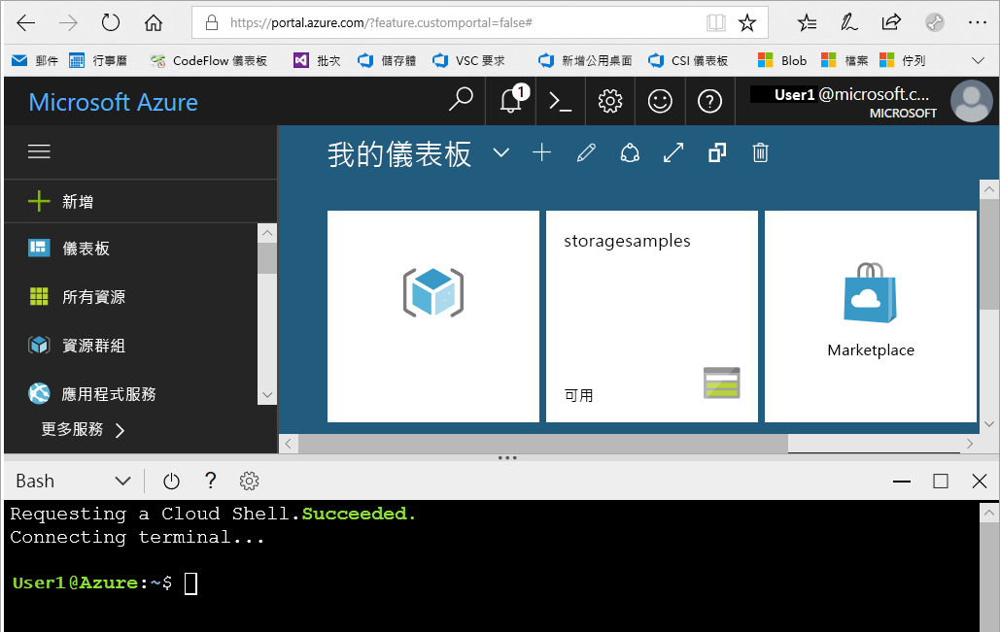

# <a name="create-a-storage-account"></a>建立儲存體帳戶

Azure 儲存體帳戶提供雲端中的唯一命名空間，來儲存及存取 Azure 儲存體中的資料物件。 儲存體帳戶包含您在該帳戶下建立的任何 Blob、檔案、佇列、資料表和磁碟。 

若要開始使用 Azure 儲存體，您必須先建立新的儲存體帳戶。 您可以使用 [Azure 入口網站](https://portal.azure.com/)、[Azure PowerShell](https://docs.microsoft.com/powershell/azure/overview) 或 [Azure CLI](https://docs.microsoft.com/cli/azure/overview?view=azure-cli-latest) 建立 Azure 儲存體帳戶。 本快速入門示範如何使用各個選項來建立新的儲存體帳戶。 


## <a name="prerequisites"></a>先決條件

如果您沒有 Azure 訂用帳戶，請在開始前建立 [免費帳戶](https://azure.microsoft.com/free/) 。

# <a name="portaltabportal"></a>[入口網站](#tab/portal)

無。

# <a name="powershelltabpowershell"></a>[PowerShell](#tab/powershell)

本快速入門需要 Azure PowerShell 模組 3.6 版或更新版本。 執行 `Get-Module -ListAvailable AzureRM` 來尋找您目前的版本。 如果您需要安裝或升級，請參閱[安裝 Azure PowerShell 模組](/powershell/azure/install-azurerm-ps)。

# <a name="azure-clitabazure-cli"></a>[Azure CLI](#tab/azure-cli)

您可以登入 Azure，並且以下列兩種方式之一執行 Azure CLI 命令：

- 您可以從 Azure 入口網站，在 Azure Cloud Shell 中執行 CLI 命令 
- 您可以安裝 CLI，並在本機執行 CLI 命令  

### <a name="use-azure-cloud-shell"></a>使用 Azure Cloud Shell

Azure Cloud Shell 是免費的 Bash Shell，您可以直接在 Azure 入口網站內執行。 它具有預先安裝和設定的 Azure CLI，可與您的帳戶搭配使用。 按一下 Azure 入口網站右上方功能表上的 [Cloud Shell] 按鈕：

[](https://portal.azure.com)

按鈕會啟動互動式殼層，可讓您用來執行本快速入門中的步驟：

[](https://portal.azure.com)

### <a name="install-the-cli-locally"></a>在本機安裝 CLI

您也可以在本機安裝及使用 Azure CLI。 本快速入門需要您執行 Azure CLI 2.0.4 版或更新版本。 執行 `az --version` 以尋找版本。 如果您需要安裝或升級，請參閱[安裝 Azure CLI 2.0](/cli/azure/install-azure-cli)。 

---

## <a name="log-in-to-azure"></a>登入 Azure

# <a name="portaltabportal"></a>[入口網站](#tab/portal)

登入 [Azure 入口網站](https://portal.azure.com)。

# <a name="powershelltabpowershell"></a>[PowerShell](#tab/powershell)

使用 `Login-AzureRmAccount` 命令登入 Azure 訂用帳戶，並遵循畫面上的指示以進行驗證。

```powershell
Login-AzureRmAccount
```

# <a name="azure-clitabazure-cli"></a>[Azure CLI](#tab/azure-cli)

若要啟動 Azure Cloud Shell，請登入 [Azure 入口網站](https://portal.azure.com)。

若要登入您的本機安裝 CLI，請執行登入命令：

```cli
az login
```

---

## <a name="create-a-resource-group"></a>建立資源群組

Azure 資源群組是在其中部署與管理 Azure 資源的邏輯容器。 如需資源群組的詳細資訊，請參閱 [Azure Resource Manager 概觀](../../azure-resource-manager/resource-group-overview.md)。

# <a name="portaltabportal"></a>[入口網站](#tab/portal)

若要在 Azure 入口網站中建立資源群組，請遵循下列步驟：

1. 在 Azure 入口網站中，展開左側功能表以開啟服務的功能表，然後選擇 [資源群組]。
2. 按一下 [新增] 按鈕，以新增新的資源群組。
3. 輸入新資源群組的名稱。
4. 選取要在其中建立新資源群組的訂用帳戶。
5. 選擇資源群組的位置。
6. 按一下 [ **建立** ] 按鈕。  


# <a name="powershelltabpowershell"></a>[PowerShell](#tab/powershell)

若要使用 PowerShell 建立新的資源群組，請使用 [New-AzureRmResourceGroup](/powershell/module/azurerm.resources/new-azurermresourcegroup) 命令： 

```powershell
# put resource group in a variable so you can use the same group name going forward,
# without hardcoding it repeatedly
$resourceGroup = "storage-quickstart-resource-group"
New-AzureRmResourceGroup -Name $resourceGroup -Location $location 
```

如果您不確定要針對 `-Location` 參數指定哪一個區域，您可以使用 [Get-AzureRmLocation](/powershell/module/azurerm.resources/get-azurermlocation) 命令擷取訂用帳戶所支援的區域清單：

```powershell
Get-AzureRmLocation | select Location 
$location = "westus"
```

# <a name="azure-clitabazure-cli"></a>[Azure CLI](#tab/azure-cli)

若要使用 Azure CLI 建立新的資源群組，請使用 [az group create](/cli/azure/group#create) 命令。 

```azurecli-interactive
az group create \
    --name storage-quickstart-resource-group \
    --location westus
```

如果您不確定要針對 `--location` 參數指定哪一個區域，您可以使用 [az account list-locations](/cli/azure/account#list) 命令擷取訂用帳戶所支援的區域清單。

```azurecli-interactive
az account list-locations \
    --query "[].{Region:name}" \
    --out table
```

---

## <a name="create-a-general-purpose-storage-account"></a>建立一般用途的儲存體帳戶

一般用途儲存體帳戶提供所有 Azure 儲存體服務的存取權：Blob、檔案、佇列和資料表。 一般用途儲存體帳戶可以在標準或進階層建立。 本文中的範例示範如何在標準層 (預設) 中建立一般用途儲存體帳戶。

Azure 儲存體提供兩種類型的一般用途儲存體帳戶：

- 一般用途 v2 帳戶 
- 一般用途 v1 帳戶。 

> [!NOTE]
> 建議您建立 **v2 一般用途帳戶**作為新的儲存體帳戶，以充分利用這些帳戶提供的新功能。  

如需儲存體帳戶類型的詳細資訊，請參閱 [Azure 儲存體帳戶選項](storage-account-options.md)。

為您的儲存體帳戶命名時，請記住這些規則：

- 儲存體帳戶名稱必須介於 3 到 24 個字元的長度，而且只能包含數字和小寫字母。
- 儲存體帳戶名稱必須在 Azure 中是獨一無二的。 任兩個儲存體帳戶名稱不得相同。

# <a name="portaltabportal"></a>[入口網站](#tab/portal)

若要在 Azure 入口網站中建立一般用途 v2 儲存體帳戶，請遵循下列步驟：

1. 在 Azure 入口網站中，展開左側功能表以開啟服務的功能表，然後選擇 [更多服務]。 然後，向下捲動至 [儲存體]，然後選擇 [儲存體帳戶]。 在出現的 [儲存體帳戶] 視窗上，選擇 [新增]。
2. 輸入儲存體帳戶的名稱。
3. 將 [帳戶類型] 欄位設定為 [StorageV2 (一般用途 v2)]。
4. 將 [複寫] 欄位的設定保留為 [本地備援儲存體 (LRS)]。 或者，您可以選擇 [區域備援儲存體 (ZRS 預覽版)]、[異地備援儲存體 (GRS)] 或 [讀取權限異地備援儲存體 (RA-GRS)]。
5. 將以下欄位的設定保留為預設值：**部署模型**、**效能**、**需要安全傳輸**。
6. 選擇您要在其中建立儲存體帳戶的訂用帳戶。
7. 在 [資源群組] 區段中，選取 [使用現有]，然後選擇您在上一節中建立的資源群組。
8. 選擇新儲存體帳戶的位置。
9. 按一下 [建立]  建立儲存體帳戶。      


# <a name="powershelltabpowershell"></a>[PowerShell](#tab/powershell)

若要從 PowerShell 建立具有本地備援儲存體 (LRS) 的一般用途 v2 儲存體帳戶，請使用 [New-AzureRmStorageAccount](/powershell/module/azurerm.storage/New-AzureRmStorageAccount) 命令： 

```powershell
New-AzureRmStorageAccount -ResourceGroupName $resourceGroup `
  -Name "storagequickstart" `
  -Location $location `
  -SkuName Standard_LRS `
  -Kind StorageV2 
```

若要建立具有區域備援儲存體 (ZRS 預覽版)、異地備援儲存體 (GRS) 或讀取權限異地備援儲存體 (RA-GRS) 的一般用途 v2 儲存體帳戶，請在下表中將 **SkuName** 參數取代為適當值。 

|複寫選項  |SkuName 參數  |
|---------|---------|
|本地備援儲存體 (LRS)     |Standard_LRS         |
|區域備援儲存體 (ZRS)     |Standard_ZRS         |
|異地備援儲存體 (GRS)     |Standard_GRS         |
|讀取權限異地備援儲存體 (GRS)     |Standard_RAGRS         |

# <a name="azure-clitabazure-cli"></a>[Azure CLI](#tab/azure-cli)

若要從 Azure CLI 建立具有本地備援儲存體的一般用途 v2 儲存體帳戶，請使用 [az storage account create](/cli/azure/storage/account#create) 命令。

```azurecli-interactive
az storage account create \
    --name storagequickstart \
    --resource-group storage-quickstart-resource-group \
    --location westus \
    --sku Standard_LRS \
    --kind StorageV2
```

若要建立具有區域備援儲存體 (ZRS 預覽版)、異地備援儲存體 (GRS) 或讀取權限異地備援儲存體 (RA-GRS) 的一般用途 v2 儲存體帳戶，請在下表中將 **sku** 參數取代為適當值。 

|複寫選項  |sku 參數  |
|---------|---------|
|本地備援儲存體 (LRS)     |Standard_LRS         |
|區域備援儲存體 (ZRS)     |Standard_ZRS         |
|異地備援儲存體 (GRS)     |Standard_GRS         |
|讀取權限異地備援儲存體 (GRS)     |Standard_RAGRS         |

---

> [!NOTE]
> [區域備援儲存體](https://azure.microsoft.com/blog/announcing-public-preview-of-azure-zone-redundant-storage/preview/)目前為預覽狀態，且僅適用於下列位置：
>    - 美國東部 2
>    - 美國中部
>    - 法國中部 (此區域目前為預覽狀態。 請參閱[具有 Azure 可用性區域的 Microsoft Azure 預覽版現在已在法國開放使用](https://azure.microsoft.com/blog/microsoft-azure-preview-with-azure-availability-zones-now-open-in-france)，以要求使用。)
    
如需關於各類可用複寫的詳細資訊，請參閱[儲存體複寫選項](storage-redundancy.md)。

## <a name="clean-up-resources"></a>清除資源

如果您想要清除本快速入門所建立的資源，只要刪除資源群組即可。 刪除資源群組也會刪除相關聯的儲存體帳戶，以及與資源群組相關聯的任何其他資源。

# <a name="portaltabportal"></a>[入口網站](#tab/portal)

若要使用 Azure 入口網站刪除資源群組：

1. 在 Azure 入口網站中，展開左側功能表以開啟服務的功能表，然後選擇 [資源群組] 以顯示資源群組的清單。
2. 找出要刪除的資源群組，以滑鼠右鍵按一下清單右側的 [更多] 按鈕 (**...**)。
3. 選取 [刪除資源群組] 並且確認。

# <a name="powershelltabpowershell"></a>[PowerShell](#tab/powershell)

若要移除資源群組及其相關聯的資源，包括新的儲存體帳戶，請使用 [Remove-AzureRmResourceGroup](/powershell/module/azurerm.resources/remove-azurermresourcegroup) 命令： 

```powershell
Remove-AzureRmResourceGroup -Name $resourceGroup
```

# <a name="azure-clitabazure-cli"></a>[Azure CLI](#tab/azure-cli)

若要移除資源群組及其相關聯的資源，包括新的儲存體帳戶，請使用 [az group delete](/cli/azure/group#delete) 命令。

```azurecli-interactive
az group delete --name myResourceGroup
```

---

## <a name="next-steps"></a>後續步驟

在這個快速入門中，您已建立一般用途的標準儲存體帳戶。 若要了解如何在您的儲存體帳戶之間上傳和下載 Blob，請繼續進行 Blob 儲存體快速入門。

# <a name="portaltabportal"></a>[入口網站](#tab/portal)

> [!div class="nextstepaction"]
> [使用 Azure 入口網站在 Azure Blob 儲存體之間傳送物件](../blobs/storage-quickstart-blobs-portal.md)

# <a name="powershelltabpowershell"></a>[PowerShell](#tab/powershell)

> [!div class="nextstepaction"]
> [使用 PowerShell 在 Azure Blob 儲存體之間傳送物件](../blobs/storage-quickstart-blobs-powershell.md)

# <a name="azure-clitabazure-cli"></a>[Azure CLI](#tab/azure-cli)

> [!div class="nextstepaction"]
> [使用 Azure CLI 在 Azure Blob 儲存體之間傳送物件](../blobs/storage-quickstart-blobs-cli.md)

---
