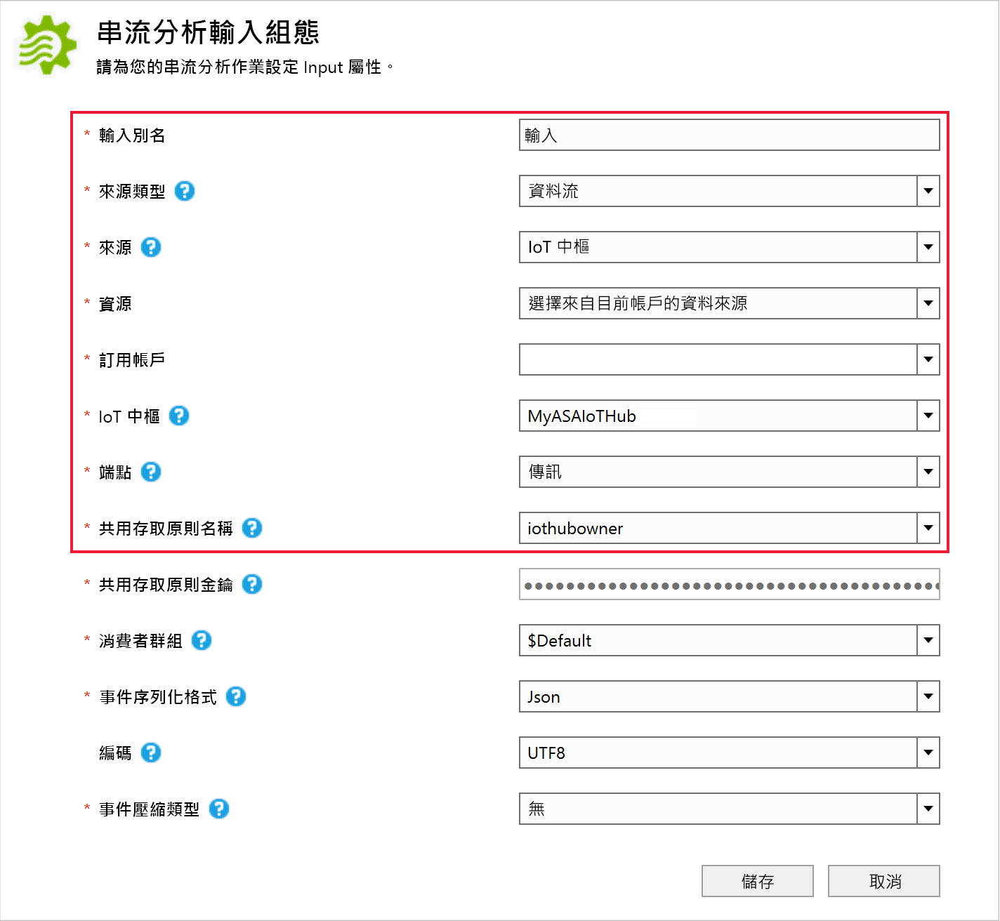
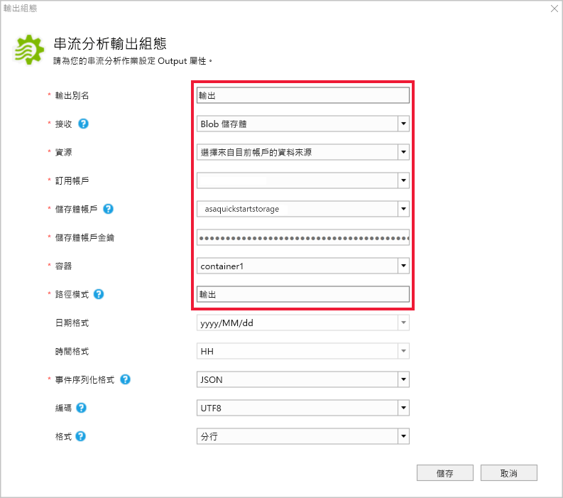
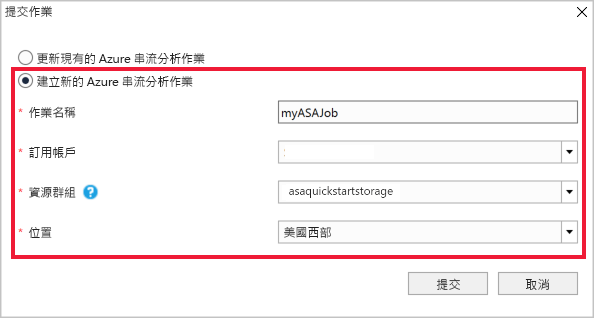
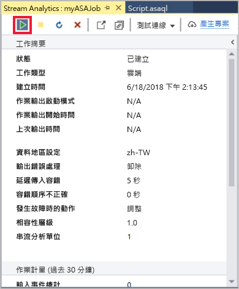

# <a name="quickstart-create-a-stream-analytics-job-by-using-the-azure-stream-analytics-tools-for-visual-studio"></a>快速入門：使用適用於 Visual Studio 的 Azure 串流分析工具建立串流分析作業

本快速入門將說明如何使用適用於 Visual Studio 的 Azure 串流分析工具建立及執行串流分析作業。 範例作業會從 Azure Blob 儲存體讀取串流資料。 本快速入門中所使用的輸入資料檔案包含僅供說明之用的靜態資料。 在實際案例中，您可以使用串流輸入資料來進行串流分析作業。 在本快速入門中，您會定義一項作業，用以計算溫度超過 100° 時的平均溫度，並將產生的輸出事件寫入至新的檔案。

## <a name="before-you-begin"></a>開始之前

* 如果您沒有 Azure 訂用帳戶，請建立[免費帳戶](https://azure.microsoft.com/free/)。

* 登入 [Azure 入口網站](https://portal.azure.com/)。

* 安裝 Visual Studio 2017、Visual Studio 2015 或 Visual Studio 2013 Update 4。 支援 Enterprise (Ultimate/Premium)、Professional 和 Community 版本。 不支援 Express 版本。

* 依照[安裝指示](https://docs.microsoft.com/azure/stream-analytics/stream-analytics-tools-for-visual-studio-install)，安裝適用於 Visual Studio 的串流分析工具。

## <a name="prepare-the-input-data"></a>準備輸入資料

定義串流分析作業前，您應先準備設定為作業輸入的資料。 為了準備作業所需的輸入資料，請執行下列步驟：

1. 從 GitHub 下載[感應器資料範例](https://raw.githubusercontent.com/Azure/azure-stream-analytics/master/Samples/GettingStarted/HelloWorldASA-InputStream.json)。 範例資料包含下列 JSON 格式的感應器資訊：  

   ```json
   {
     "time": "2018-01-26T21:18:52.0000000",
     "dspl": "sensorC",
     "temp": 87,
     "hmdt": 44
   }
   ```
2. 登入 [Azure 入口網站](https://portal.azure.com/)。

3. 從 Azure 入口網站的左上角，選取 [建立資源] > [儲存體] > [儲存體帳戶]。 填寫儲存體帳戶作業頁面，將 [名稱] 設為 "asaquickstartstorage"、[位置] 設為 [美國西部]、[資源群組] 設為 "asaquickstart-resourcegroup" (將儲存體帳戶裝載在與串流作業相同的資源群組中可增加效能)。 其餘設定可以保留預設值。  

   

4. 從 [所有資源] 頁面中，找出您在上一個步驟中建立的儲存體帳戶。 依序開啟 [概觀] 頁面及 [Blob] 圖格。  

5. 在 [Blob 服務] 頁面中選取 [容器]，並為容器提供 [名稱] (例如 container1)，然後選取 [確定]。  

   

6. 移至您在上一個步驟所建立的容器。 選取 [上傳] 並上傳您從第一個步驟取得的感應器資料。  

   

## <a name="create-a-stream-analytics-project"></a>建立串流分析專案

1. 啟動 Visual Studio。

2. 選取 [檔案] > [新增專案]。  

3. 在左側的範本清單中，選取 [串流分析]，然後選取 [Azure 串流分析應用程式]。  

4. 輸入專案的 [名稱]、[位置] 和 [解決方案名稱]，然後選取 [確定]。

   

請留意 Azure 串流分析專案中包含的元素。

   


## <a name="choose-the-required-subscription"></a>選擇必要的訂用帳戶

1. 在 Visual Studio 的 [檢視] 功能表上，選取 [伺服器總管]。

2. 以滑鼠右鍵按一下 [Azure]，選取 [連線到 Microsoft Azure 訂用帳戶]，然後以您的 Azure 帳戶登入。

## <a name="define-input"></a>定義輸入

1. 在 [方案總管] 中，展開 [輸入] 節點，然後按兩下 [Input.json]。

2. 在 [串流分析輸入組態] 中填入下列值：

   |**設定**  |**建議的值**  |**說明**   |
   |---------|---------|---------|
   |輸入別名  |  輸入   |  輸入名稱以識別作業的輸入。   |
   |來源類型   |  資料流 |  選擇適當的輸入來源：資料流或參考資料。   |
   |來源  |  Blob 儲存體 |  選擇適當的輸入來源。   |
   |資源  | 選擇目前帳戶中的資料來源 | 選擇以手動方式輸入資料，或選取現有的帳戶。   |
   |訂用帳戶  |  \<您的訂用帳戶\>   | 選取您在其中建立儲存體帳戶的 Azure 訂用帳戶。 儲存體帳戶可以位在相同或不同的訂用帳戶中。 此範例假設您已在相同的訂用帳戶中建立儲存體帳戶。   |
   |儲存體帳戶  |  asaquickstartstorage   |  選擇或輸入儲存體帳戶的名稱。 系統會自動偵測建立在相同訂用帳戶中的儲存體帳戶名稱。   |
   |容器  |  container1   |  選取您在儲存體帳戶中建立的現有容器。   |
   
3. 其他選項保留為預設值，然後選取 [儲存] 以儲存設定。  

   

## <a name="define-output"></a>定義輸出

1. 在 [方案總管] 中展開 [輸出] 節點，然後按兩下 [Output.json]。

2. 在 [串流分析輸出組態] 中填入下列值：

   |**設定**  |**建議的值**  |**說明**   |
   |---------|---------|---------|
   |輸出別名  |  輸出   |  輸入名稱以識別作業的輸出。   |
   |接收   |  Blob 儲存體 |  選擇適當的接收。    |
   |資源  |  手動提供資料來源設定 |  選擇以手動方式輸入資料，或選取現有的帳戶。   |
   |訂用帳戶  |  \<您的訂用帳戶\>   | 選取您在其中建立儲存體帳戶的 Azure 訂用帳戶。 儲存體帳戶可以位在相同或不同的訂用帳戶中。 此範例假設您已在相同的訂用帳戶中建立儲存體帳戶。   |
   |儲存體帳戶  |  asaquickstartstorage   |  選擇或輸入儲存體帳戶的名稱。 系統會自動偵測建立在相同訂用帳戶中的儲存體帳戶名稱。   |
   |容器  |  container1   |  選取您在儲存體帳戶中建立的現有容器。   |
   |路徑格式  |  output   |  輸入要在容器內建立的檔案路徑名稱。   |
   
3. 其他選項保留為預設值，然後選取 [儲存] 以儲存設定。  

   

## <a name="define-the-transformation-query"></a>定義轉換查詢

1. 從 Visual Studio 中的**方案總管**開啟 **Script.asaql**。

2. 新增下列查詢：

   ```sql
   SELECT 
   System.Timestamp AS OutputTime,
   dspl AS SensorName,
   Avg(temp) AS AvgTemperature
   INTO
     Output
   FROM
     Input TIMESTAMP BY time
   GROUP BY TumblingWindow(second,30),dspl
   HAVING Avg(temp)>100
   ```

## <a name="submit-a-stream-analytics-query-to-azure"></a>將串流分析查詢提交至 Azure

1. 在 [查詢編輯器] 中，選取指令碼編輯器中的 [提交至 Azure]。

2. 選取 [建立新的 Azure 串流分析作業]，然後輸入 [作業名稱]。 選擇您在快速入門一開始時使用的 [訂用帳戶]、[資源群組] 和 [位置]。

   

## <a name="start-the-stream-analytics-job-and-check-output"></a>啟動串流分析工作並查看輸出

1. 作業建立後，作業檢視會自動開啟。 選取綠色箭頭按鈕可啟動作業。

   

2. 將 [自訂時間] 的日期變更為 `2018-01-01`，然後選取 [啟動]。

   

3. 請留意作業狀態已變更為 [執行中]，並且有輸入/輸出事件。 這可能需要幾分鐘的時間。

   

4. 若要檢視結果，請在 [檢視] 功能表上選取 [Cloud Explorer]，並瀏覽至您資源群組中的儲存體帳戶。 在 [Blob 容器] 下方按兩下 **container1**，然後按兩下**輸出**檔案路徑。

   

## <a name="clean-up-resources"></a>清除資源

若不再需要，可刪除資源群組、串流作業和所有相關資源。 刪除作業可避免因為作業使用串流單位而產生費用。 如果您計劃在未來使用該作業，您可以將其停止並在之後需要時重新啟動。 如果您將不繼續使用此作業，請使用下列步驟，刪除本快速入門所建立的所有資源：

1. 從 Azure 入口網站的左側功能表中，選取 [資源群組]，然後選取您所建立資源的名稱。  

2. 在資源群組頁面上，選取 [刪除]，在文字方塊中輸入要刪除的資源名稱，然後選取 [刪除]。

## <a name="next-steps"></a>後續步驟

在本快速入門中，您已使用 Visual Studio 部署了簡單的串流分析作業。 您也可以使用 [Azure 入口網站](stream-analytics-quick-create-portal.md)和 [PowerShell](stream-analytics-quick-create-powershell.md) 部署串流分析作業。 

若要了解如何設定其他輸入來源及執行即時偵測，請前往下列文章：

> [!div class="nextstepaction"]
> [使用 Azure 串流分析進行即時詐騙偵測](stream-analytics-real-time-fraud-detection.md)
