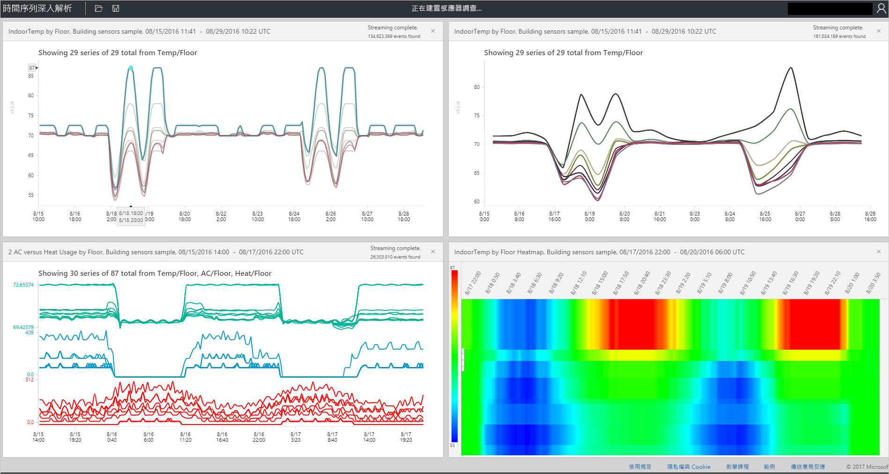

# Azure 時間序列深入解析總管

這篇文章描述的功能和選項 Azure 時間序列深入解析的一般可用性[總管 web 應用程式](https://insights.timeseries.azure.com/)。 時間序列深入解析會示範服務所提供的功能強大的資料視覺效果功能，而且可以存取您自己的環境內。

Azure 時間序列深入解析是完全受控的分析、儲存體及視覺效果服務，讓您可輕易同時探索及分析數十億筆的 IoT 事件。 它可為您提供資料的全域檢視，從而讓您快速驗證 IoT 解決方案，並避免關鍵任務裝置成本高昂的停機時間。 您可以幾近即時地探索隱藏趨勢、找出異常狀況，並進行根本原因分析。 時間序列深入解析總管目前處於公開預覽狀態。

> [!TIP]
> 如的引導式的完整教學課程示範環境，請參閱[Azure Time Series Insights 快速入門](time-series-quickstart.md)。

## 影片

### 深入了解使用時間序列深入解析總管來查詢資料。  

> [!VIDEO https://www.youtube.com/embed/SHFPZvrR71s]

>[!NOTE]
>請參閱上述的影片<a href="https://www.youtube.com/watch?v=6ehNf6AJkFo">「 開始使用 Time Series Insights 藉由使用 Azure IoT 解決方案加速器。 」</a>

## 必要條件

在使用時間序列深入解析總管之前，您必須先：

- 建立時間序列深入解析環境。 如需詳細資訊，請參閱 <<c0> [ 如何開始使用 Time Series Insights](./time-series-insights-get-started.md)。
- [提供存取](time-series-insights-data-access.md)您環境中的帳戶。
- 新增[IoT 中樞](time-series-insights-how-to-add-an-event-source-iothub.md)或是[事件中樞](time-series-insights-how-to-add-an-event-source-eventhub.md)給它的事件來源。

## 探索及查詢資料

在將事件來源連線至時間序列深入解析環境的幾分鐘內，您可以探索並查詢時間序列資料。

1. 若要開始，開啟[時間序列深入解析總管](https://insights.timeseries.azure.com/)web 瀏覽器中。 在視窗的左側，選取環境。 您可以存取的所有環境都會依字母順序列出。

1. 選取一個環境之後，請使用**從**並**到**組態在頂端，或按一下並拖曳您想要的時間範圍。 選取右上角的放大鏡，或所選時間範圍上按一下滑鼠右鍵並選取**搜尋**。

1. 您也可以自動重新整理可用性每隔一分鐘即可**自動開啟** 按鈕。 **自動開啟**按鈕只適用於可用性圖表，而不是主要的視覺效果的內容。

1. Azure 雲端圖示會帶您前往 Azure 入口網站中您的環境。

   

1. 接下來，您會看到一個圖表，顯示所選時間範圍期間所有事件的計數。 這裡您有許多控制項：

    - **字詞編輯器面板**:字詞空間是您用來查詢環境的位置。 在畫面左邊找到：
      - **量值**：此下拉式清單會顯示所有數值資料行 (**雙精度浮點數**)。
      - **分割依據**：此下拉式清單會顯示類別資料行 (**字串**)。
      - 您可以啟用步驟插補、 顯示最小和最大值和調整控制項台中 y 軸旁**量值**。 您也可以調整所顯示的資料是否計數、 平均值或總和的資料。
      - 您可以新增最多五個詞彙以檢視相同的 x 軸上。 使用**copy-down**按鈕以新增其他字詞，或選取**新增**來新增新的字詞。

        

      - **述詞**：您可以使用 述詞來快速篩選事件，使用下表所列的運算元集。 如果您選取，或按一下進行搜尋，述詞會自動更新為基礎的搜尋。 支援的運算元類型包括：

         |作業  |支援的類型  |注意  |
         |---------|---------|---------|
         |`<`, `>`, `<=`, `>=`     |  Double、DateTime、TimeSpan       |         |
         |`=`, `!=`, `<>`     | String、Bool、Double、DateTime、TimeSpan、NULL        |         |
         |IN     | String、Bool、Double、DateTime、TimeSpan、NULL        |  所有的運算元都應該是相同的類型或是 NULL 常數。        |
         |HAS     | String        |  只有常數字串常值可以在右側。 不允許空字串和 NULL。       |

      - **查詢的範例**

         

1. 您可以使用**間隔大小**滑桿工具，透過相同的時間範圍縮放間隔。 滑桿會提供更精確地控制大型配量的時間顯示向下配量的平滑趨勢，小至毫秒，可讓您查看資料的細微、 高解析度切割之間移動資料。 滑桿的預設起始點設定為 [最佳] 檢視的資料從您的選取範圍解析度、 查詢速度與資料粒度之間取得平衡。

1. **時間筆刷**工具可讓您輕鬆地從一個時間範圍瀏覽至另一個。

1. 使用**儲存**命令來儲存目前的查詢，並與環境的其他使用者共用。 當您使用**開啟**，您可以看到所有已儲存的查詢以及您可以存取的環境中的其他使用者的任何共用的查詢。

   

## 顯現資料

1. 使用**透視圖**同時檢視最多四個唯一的查詢工具。 **透視圖**是圖表的右上角的按鈕。

   

1. 檢視圖表以視覺化方式探索您的資料，並使用**圖表**工具：

    - **選取** 或是**按一下**特定時間範圍或單一資料序列。
    - 時間範圍選取範圍內，您可以放大或探索事件。
    - 在資料序列內，您可以由另一個資料行分割序列、將序列新增為新的字詞、只顯示選取的序列、排除選取的序列、釘選該序列或從選取的序列探索事件。
    - 在圖表左側的篩選區域，您可以查看所有顯示的資料數列，並值或名稱，藉以重新排序。 您也可以檢視所有的資料數列或任何已釘選或取消釘選的序列。 您可以選取單一資料序列和由另一個資料行分割序列、 將序列新增為新的字詞、 只顯示所選的序列、 排除選取的序列、 釘選該序列或從選取的序列探索事件。
    - 當您同時檢視多個詞彙時，您可以堆疊、 取消堆疊、 查看其他相關資料數列時，資料和跨所有字詞使用相同的 y 軸。 使用圖表右上角的按鈕。

    

1. 使用**熱度圖**快速發現在特定的查詢中的 唯一或異常的資料數列。 只有一個搜尋字詞可視覺化為熱度圖。

    

1. 當您選取，或以滑鼠右鍵按一下，會在探索事件時，則**事件**面板可供使用。 在這裡，您可以看到所有未經處理的事件，並將您的事件匯出為 JSON 或 CSV 檔案。 時間序列深入解析儲存所有未經處理的資料。

    

1. 選取  **STATS**索引標籤上之後您瀏覽事件，以公開模式和資料行統計資料。

    - **模式**:這項功能會主動顯示所選的資料區域中最具統計顯著性的模式。 您不需要查看數千個事件，以了解何種模式需要最多時間和精力。 使用 Time Series Insights，您可以直接跳至這些具統計顯著性的模式，以繼續進行分析。 這項功能對於事後調查歷史資料也很有幫助。
    - **資料行統計資料**：資料行統計資料會提供圖表和所選時間範圍內從選取的資料數列的每個資料行的資料加以分割的資料表。

      

現在您已了解的各種功能和可用時間序列深入解析總管 web 應用程式中的選項。

## 後續步驟

- 了解如何[診斷並解決問題](time-series-insights-diagnose-and-solve-problems.md)Time Series Insights 環境中。
- 引導式採取[Azure Time Series Insights 快速入門](time-series-quickstart.md)教學課程。
