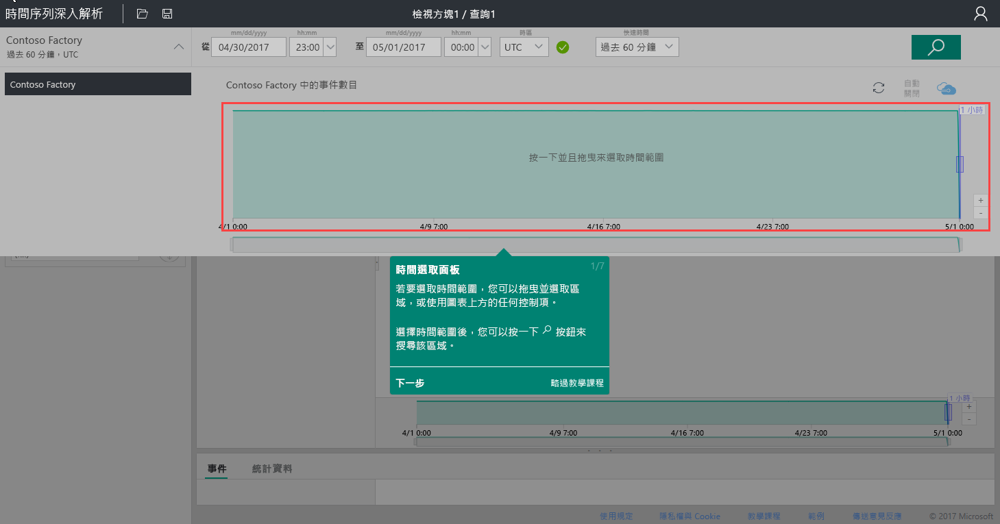
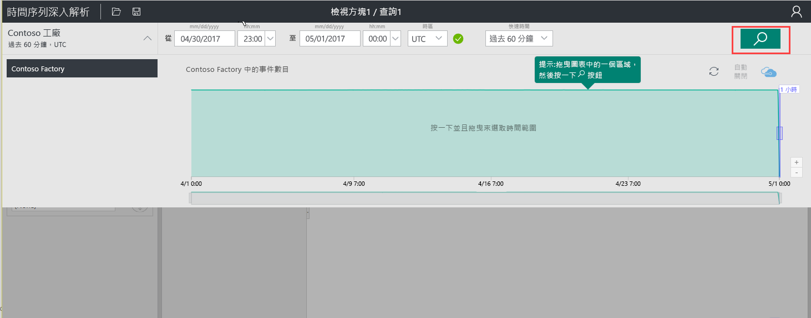
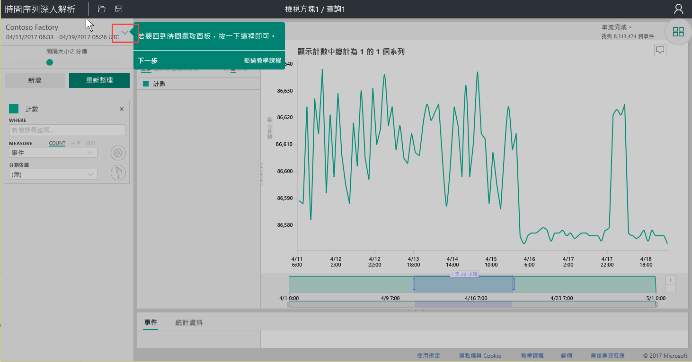
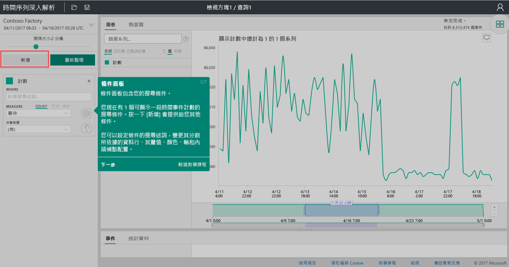
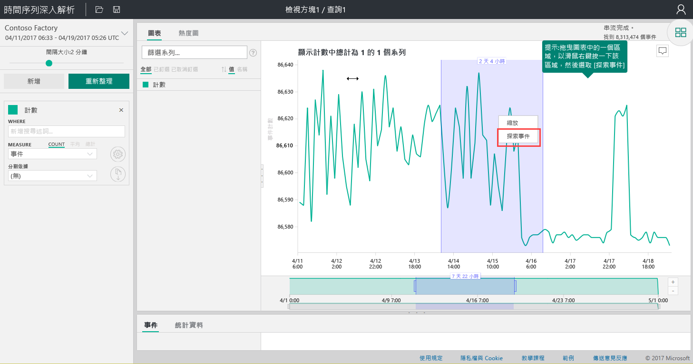
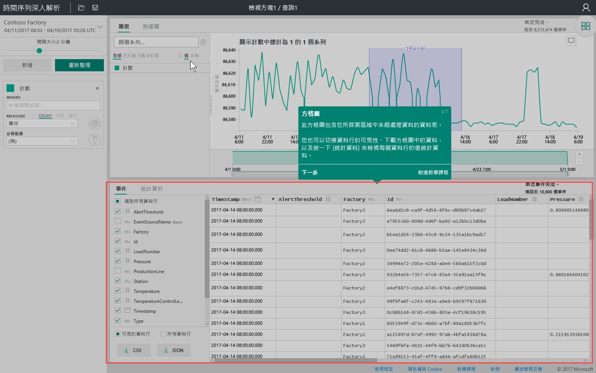
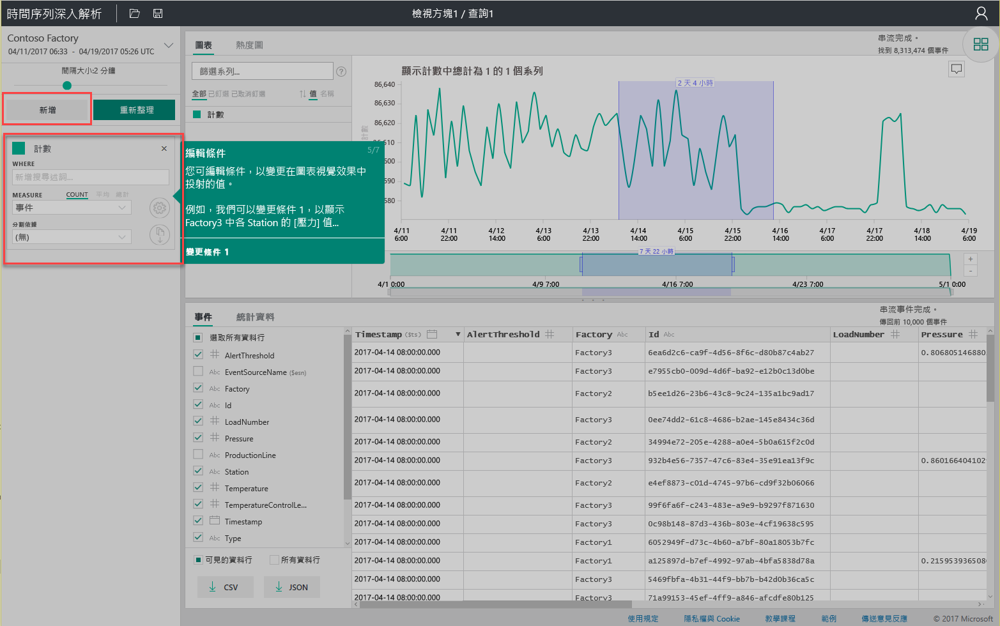
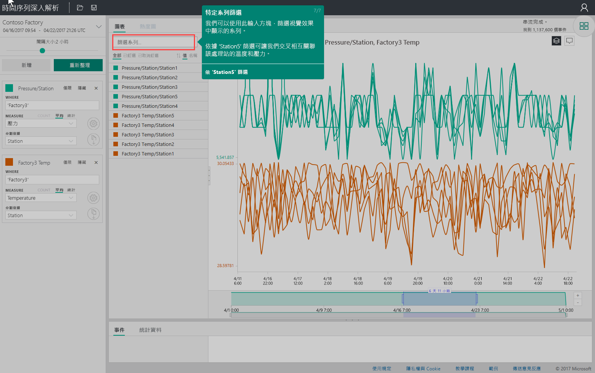

# 快速入門：探索 Azure 時間序列深入解析
本快速入門會示範如何在可用的示範環境中開始使用 Azure 時間序列深入解析。 您會了解如何使用網頁瀏覽器來視覺化大量的 IoT 資料，並導覽時間序列深入解析的主要功能。 

Azure Time Series Insights 是完整受管理的分析、儲存體及視覺效果服務，讓您可輕易同時探索及分析數十億筆的 IoT 事件。 您能以全域方式檢視資料，這可協助您探索隱藏的趨勢、找出異常狀況及近乎即時執行根本原因分析，進而快速驗證 IoT 解決方案並避免代價高昂的任務關鍵性裝置停機。  如果您要建置的應用程式需要存放或查詢時間序列資料，您可以時間序列深入解析 REST API 進行開發。

如果您沒有 Azure 訂用帳戶，請在開始前建立[免費 Azure 帳戶](https://azure.microsoft.com/free/?ref=microsoft.com&utm_source=microsoft.com&utm_medium=docs&utm_campaign=visualstudio)。

## 在示範環境中來探索時間序列深入解析

1. 在瀏覽器中，瀏覽至 [https://insights.timeseries.azure.com/demo](https://insights.timeseries.azure.com/demo)。 

2. 如果出現提示，請使用您的 Azure 帳戶認證登入時間序列深入解析。 
 
3. 時間序列深入解析快速導覽頁面隨即出現。 按 [下一步] 開始快速導覽。

   ![按一下 [下一步]](media/quickstart/quickstart1.png)

4. [時間選取面板] 隨即出現。 您可以使用這個面板來選取要視覺化的時間範圍。

   

5. 在區域中按一下並拖曳，然後按一下 [搜尋] 按鈕。
 
    

   時間序列深入解析會顯示您所指定之時間範圍的圖表視覺效果。 您可以在折線圖內執行各種動作，例如篩選、釘選、排序和堆疊。 

   若要返回 [時間選取面板]，請按一下向下箭號，如下所示：

   

6. 按一下 [字詞面板] 中的 [新增] 以新增新的搜尋字詞。

   

7. 在圖表中，您可以選取區域、以滑鼠右鍵按一下區域，並選取 [探索事件]。
 
   

   您探索的區域中會顯示未經處理資料的格線：

   

8. 編輯您的字詞以變更圖表中的值，並新增另一個字詞來交叉關聯不同類型的值：

   

9. 在 [篩選條件序列...] 方塊中輸入篩選條件字詞，以進行臨機操作序列篩選。 針對快速入門，請輸入 **Station5** 來交叉關聯該站台的溫度和壓力。
 
   

在您完成快速入門之後，可以使用範例資料集進行實驗，以建立不同的視覺效果。 

### 後續步驟
您已準備好建立自己的時間序列深入解析環境：
> [!div class="nextstepaction"]
> [規劃時間序列深入解析環境](time-series-insights-environment-planning.md)
