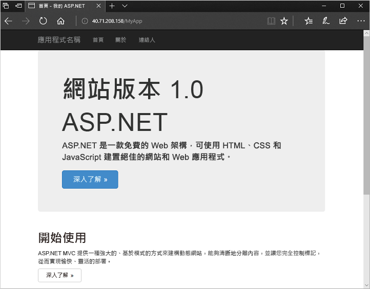

# <a name="quickstart-create-a-virtual-machine-scale-set-with-azure-powershell"></a>快速入門：使用 Azure PowerShell 建立虛擬機器擴展集


虛擬機器擴展集可讓您部署和管理一組相同、自動調整的虛擬機器。 您可以手動調整擴展集中的 VM 數目，或定義規則以根據 CPU、記憶體需求或網路流量等資源使用量進行自動調整。 其後，Azure 負載平衡器會將流量分配到擴展集中的多個 VM 執行個體。 在此快速入門中，您會使用 Azure PowerShell 建立虛擬機器擴展集，並部署範例應用程式。

如果您沒有 Azure 訂用帳戶，請在開始前建立 [免費帳戶](https://azure.microsoft.com/free/?WT.mc_id=A261C142F) 。

[!INCLUDE [cloud-shell-powershell.md](../../includes/cloud-shell-powershell.md)]


## <a name="create-a-scale-set"></a>建立擴展集
使用 [New-AzVmss](/powershell/module/az.compute/new-azvmss) 建立虛擬機器擴展集。 下列範例會建立使用 Windows Server 2016 資料中心平台映像，名為 myScaleSet 的擴展集。 系統會自動建立虛擬網路、公用 IP 位址和負載平衡器的 Azure 網路資源。 出現提示時，您可以為擴展集中的 VM 執行個體設定自己的系統管理認證：

```azurepowershell-interactive
New-AzVmss `
  -ResourceGroupName "myResourceGroup" `
  -Location "EastUS" `
  -VMScaleSetName "myScaleSet" `
  -VirtualNetworkName "myVnet" `
  -SubnetName "mySubnet" `
  -PublicIpAddressName "myPublicIPAddress" `
  -LoadBalancerName "myLoadBalancer" `
  -UpgradePolicyMode "Automatic"
```

建立及設定所有擴展集資源和 VM 需要幾分鐘的時間。


## <a name="deploy-sample-application"></a>部署範例應用程式
若要測試您的擴展集，請安裝基本的 Web 應用程式。 您可以使用 Azure 自訂指令碼延伸模組來下載及執行會在 VM 執行個體上安裝 IIS 的指令碼。 此擴充功能適用於部署後組態、軟體安裝或其他任何組態/管理工作。 如需詳細資訊，請參閱[自訂指令碼延伸模組概觀](../virtual-machines/windows/extensions-customscript.md)。

使用自訂指令碼延伸模組安裝基本的 IIS Web 伺服器。 套用安裝 IIS 的自訂指令碼延伸模組，如下所示：

```azurepowershell-interactive
# Define the script for your Custom Script Extension to run
$publicSettings = @{
    "fileUris" = (,"https://raw.githubusercontent.com/Azure-Samples/compute-automation-configurations/master/automate-iis.ps1");
    "commandToExecute" = "powershell -ExecutionPolicy Unrestricted -File automate-iis.ps1"
}

# Get information about the scale set
$vmss = Get-AzVmss `
            -ResourceGroupName "myResourceGroup" `
            -VMScaleSetName "myScaleSet"

# Use Custom Script Extension to install IIS and configure basic website
Add-AzVmssExtension -VirtualMachineScaleSet $vmss `
    -Name "customScript" `
    -Publisher "Microsoft.Compute" `
    -Type "CustomScriptExtension" `
    -TypeHandlerVersion 1.8 `
    -Setting $publicSettings

# Update the scale set and apply the Custom Script Extension to the VM instances
Update-AzVmss `
    -ResourceGroupName "myResourceGroup" `
    -Name "myScaleSet" `
    -VirtualMachineScaleSet $vmss
```

## <a name="allow-traffic-to-application"></a>允許流量流向應用程式

 若要允許存取基本 Web 應用程式，請使用 [New-AzNetworkSecurityRuleConfig](/powershell/module/az.network/new-aznetworksecurityruleconfig) 和 [New-AzNetworkSecurityGroup](/powershell/module/az.network/new-aznetworksecuritygroup) 建立網路安全性群組。 如需詳細資訊，請參閱 [Azure 虛擬機器擴展集的網路功能](virtual-machine-scale-sets-networking.md)。

 ```azurepowershell-interactive
 # Get information about the scale set
 $vmss = Get-AzVmss `
             -ResourceGroupName "myResourceGroup" `
             -VMScaleSetName "myScaleSet"

 #Create a rule to allow traffic over port 80
 $nsgFrontendRule = New-AzNetworkSecurityRuleConfig `
   -Name myFrontendNSGRule `
   -Protocol Tcp `
   -Direction Inbound `
   -Priority 200 `
   -SourceAddressPrefix * `
   -SourcePortRange * `
   -DestinationAddressPrefix * `
   -DestinationPortRange 80 `
   -Access Allow

 #Create a network security group and associate it with the rule
 $nsgFrontend = New-AzNetworkSecurityGroup `
   -ResourceGroupName  "myResourceGroup" `
   -Location EastUS `
   -Name myFrontendNSG `
   -SecurityRules $nsgFrontendRule

 $vnet = Get-AzVirtualNetwork `
   -ResourceGroupName  "myResourceGroup" `
   -Name myVnet

 $frontendSubnet = $vnet.Subnets[0]

 $frontendSubnetConfig = Set-AzVirtualNetworkSubnetConfig `
   -VirtualNetwork $vnet `
   -Name mySubnet `
   -AddressPrefix $frontendSubnet.AddressPrefix `
   -NetworkSecurityGroup $nsgFrontend

 Set-AzVirtualNetwork -VirtualNetwork $vnet

 # Update the scale set and apply the Custom Script Extension to the VM instances
 Update-AzVmss `
     -ResourceGroupName "myResourceGroup" `
     -Name "myScaleSet" `
     -VirtualMachineScaleSet $vmss
 ```

## <a name="test-your-scale-set"></a>測試您的擴展集
若要查看有效的擴展集，請在網頁瀏覽器中存取範例 Web 應用程式。 使用 [Get-AzPublicIpAddress](/powershell/module/az.network/get-azpublicipaddress) 取得負載平衡器的公用 IP 位址。 下列範例會顯示 myResourceGroup 資源群組中建立的 IP 位址：

```azurepowershell-interactive
Get-AzPublicIpAddress -ResourceGroupName "myResourceGroup" | Select IpAddress
```

將負載平衡器的公用 IP 位址輸入網頁瀏覽器中。 負載平衡器會將流量散發至您的其中一個 VM 執行個體，如下列範例所示：




## <a name="clean-up-resources"></a>清除資源
若不再需要，您可以使用 [Remove-AzResourceGroup](/powershell/module/az.resources/remove-azresourcegroup) 移除資源群組、擴展集和所有相關資源，如下所示。 `-Force` 參數會確認您想要刪除資源，而不另外對您提示將要進行此作業。 `-AsJob` 參數不會等待作業完成，就會將控制項傳回給提示字元。

```azurepowershell-interactive
Remove-AzResourceGroup -Name "myResourceGroup" -Force -AsJob
```


## <a name="next-steps"></a>後續步驟
在此快速入門中，您建立了基本的擴展集，並使用自訂指令碼延伸模組，在 VM 執行個體上安裝基本的 IIS Web 伺服器。 若要深入了解，請繼續執行有關於如何建立和管理 Azure 虛擬機器擴展集的教學課程。

> [!div class="nextstepaction"]
> [建立和管理 Azure 虛擬機器擴展集](tutorial-create-and-manage-powershell.md)
