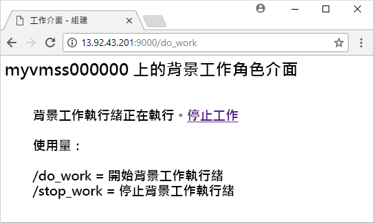

# <a name="create-a-virtual-machine-scale-set-with-the-azure-cli-20"></a>使用 Azure CLI 2.0 建立虛擬機器擴展集
虛擬機器擴展集可讓您部署和管理一組相同、自動調整的虛擬機器。 您可以手動調整擴展集中的 VM 數目，或定義規則以根據如 CPU、記憶體需求或網路流量的資源使用量來自動調整。 在本使用者入門文章中，您要使用 Azure Resource Manager 範本來建立虛擬機器擴展集。 您還可以使用 [Azure CLI 2.0](quick-create-cli.md)、[Azure PowerShell](quick-create-powershell.md) 或 [Azure 入口網站](quick-create-portal.md)來建立擴展集。


## <a name="overview-of-templates"></a>範本的概觀
Azure Resource Manager 範本可讓您部署相關資源的群組。 範本是以 JavaScript Object Notation (JSON) 所撰寫，且會定義您應用程式的整個 Azure 基礎結構環境。 在單一範本中，您可以建立虛擬機器擴展集、安裝應用程式，並設定自動縮放規則。 使用變數和參數，就可以重複使用此範本來更新現有的、或建立其他的擴展集。 您可以透過 Azure 入口網站、Azure CLI 2.0 或 Azure PowerShell 來部署範本，以及從持續整合 / 持續傳遞 (CI/CD) 管線呼叫它們。

如需範本的詳細資訊，請參閱 [Azure Resource Manager 概觀](https://docs.microsoft.com/azure/azure-resource-manager/resource-group-overview#template-deployment)


## <a name="define-a-scale-set"></a>定義擴展集
範本可定義每個資源類型的設定。 虛擬機器擴展集資源類型與個別 VM 相似。 虛擬機器擴展集資源類型的核心部分是：

| 屬性                     | 屬性描述                                  | 範例範本值                    |
|------------------------------|----------------------------------------------------------|-------------------------------------------|
| type                         | 要建立的 Azure 資源類型                            | Microsoft.Compute/virtualMachineScaleSets |
| name                         | 擴展集名稱                                       | myScaleSet                                |
| location                     | 要建立擴展集的位置                     | 美國東部                                   |
| sku.name                     | 每個擴展集執行個體的 VM 大小                  | Standard_A1                               |
| sku.capacity                 | 最初要建立的 VM 執行個體數目           | 2                                         |
| upgradePolicy.mode           | 發生變更時的 VM 執行個體升級模式              | 自動                                 |
| imageReference               | 要用於 VM 執行個體的平台或自訂映像 | Canonical Ubuntu Server 16.04-LTS         |
| osProfile.computerNamePrefix | 每個 VM 執行個體的名稱前置詞                     | myvmss                                    |
| osProfile.adminUsername      | 每個 VM 執行個體的使用者名稱                        | azureuser                                 |
| osProfile.adminPassword      | 每個 VM 執行個體的密碼                        | P@ssw0rd!                                 |

 下列程式碼片段示範範本中的核心擴展集資源定義。 為保持範例簡短，並不會顯示虛擬網路介面卡 (NIC) 設定。 若要自訂擴展集範本，您可以變更 VM 大小或初始容量，或使用不同的平台或自訂映像。

```json
{
  "type": "Microsoft.Compute/virtualMachineScaleSets",
  "name": "myScaleSet",
  "location": "East US",
  "apiVersion": "2016-04-30-preview",
  "sku": {
    "name": "Standard_A1",
    "capacity": "2"
  },
  "properties": {
    "upgradePolicy": {
      "mode": "Automatic"
    },
    "virtualMachineProfile": {
      "storageProfile": {
        "osDisk": {
          "caching": "ReadWrite",
          "createOption": "FromImage"
        },
        "imageReference":  {
          "publisher": "Canonical",
          "offer": "UbuntuServer",
          "sku": "16.04-LTS",
          "version": "latest"
        }
      },
      "osProfile": {
        "computerNamePrefix": "myvmss",
        "adminUsername": "azureuser",
        "adminPassword": "P@ssw0rd!"
      }
    }
  }
}
```


## <a name="install-an-application"></a>升級應用程式
當您部署擴展集時，VM 延伸模組可以提供後置部署設定和自動化工作，例如安裝應用程式。 您可以從 Azure 儲存體或 GitHub 下載指令碼，或是在擴充功能執行階段將指令碼提供給 Azure 入口網站。 若要將延伸模組套用至擴展集，請將 extensionProfile 區段新增至上述資源範例。 延伸模組設定檔通常會定義下列屬性：

- 延伸模組類型
- 延伸模組發行者
- 延伸模組版本
- 設定或安裝指令碼的位置
- 在 VM 執行個體上執行的命令

讓我們看看可安裝應用程式與延伸模組的兩種方式 - 利用自訂指令碼延伸模組在 Linux 上安裝 Python 應用程式，或是利用 PowerShell DSC 延伸模組在 Windows 上安裝 ASP.NET 應用程式。

### <a name="python-http-server-on-linux"></a>Linux 上的 Python HTTP 伺服器
[Linux 上的 Python HTTP 伺服器](https://github.com/Azure/azure-quickstart-templates/tree/master/201-vmss-bottle-autoscale)會使用自訂指令碼延伸模組來安裝 [Bottle](http://bottlepy.org/docs/dev/)、Python web 架構，以及簡單的 HTTP 伺服器。 

fileUris 中定義的兩個指令碼  -  installserver.sh 和 workserver.py。 會從 GitHub 下載這些檔案，然後 commandToExecute 會針對要安裝和設定的應用程式定義 `bash installserver.sh`：

```json
"extensionProfile": {
  "extensions": [
    {
      "name": "AppInstall",
      "properties": {
        "publisher": "Microsoft.Azure.Extensions",
        "type": "CustomScript",
        "typeHandlerVersion": "2.0",
        "autoUpgradeMinorVersion": true,
        "settings": {
          "fileUris": [
            "https://raw.githubusercontent.com/Azure/azure-quickstart-templates/master/201-vmss-bottle-autoscale/installserver.sh",
            "https://raw.githubusercontent.com/Azure/azure-quickstart-templates/master/201-vmss-bottle-autoscale/workserver.py"
          ],
          "commandToExecute": "bash installserver.sh"
        }
      }
    }
  ]
}
```

### <a name="aspnet-application-on-windows"></a>Windows 上的 ASP.NET 應用程式
[Windows 上的 ASP.NET 應用程式](https://github.com/Azure/azure-quickstart-templates/tree/master/201-vmss-windows-webapp-dsc-autoscale)範例範本會使用 PowerShell DSC 延伸模組來安裝 IIS 中執行的 ASP.NET MVC 應用程式。 

會從 GitHub 下載安裝指令碼，如 url 中所定義。 然後，延伸模組會從 IISInstall.ps1 指令碼執行 InstallIIS，如函式和指令碼中所定義。 ASP.NET 應用程式本身會依 Web Deploy 套件提供，也是從 GitHub 下載，如 WebDeployPackagePath 中所定義：

```json
"extensionProfile": {
  "extensions": [
    {
      "name": "Microsoft.Powershell.DSC",
      "properties": {
        "publisher": "Microsoft.Powershell",
        "type": "DSC",
        "typeHandlerVersion": "2.9",
        "autoUpgradeMinorVersion": true,
        "forceUpdateTag": "1.0",
        "settings": {
          "configuration": {
            "url": "https://raw.githubusercontent.com/Azure/azure-quickstart-templates/master/201-vmss-windows-webapp-dsc-autoscale/DSC/IISInstall.ps1.zip",
            "script": "IISInstall.ps1",
            "function": "InstallIIS"
          },
          "configurationArguments": {
            "nodeName": "localhost",
            "WebDeployPackagePath": "https://raw.githubusercontent.com/Azure/azure-quickstart-templates/master/201-vmss-windows-webapp-dsc-autoscale/WebDeploy/DefaultASPWebApp.v1.0.zip"
          }
        }
      }
    }
  ]
}
```

## <a name="deploy-the-template"></a>部署範本
若要部署 [Linux 上的 Python HTTP 伺服器](https://github.com/Azure/azure-quickstart-templates/tree/master/201-vmss-bottle-autoscale)或 [Windows 上的 ASP.NET MVC 應用程式](https://github.com/Azure/azure-quickstart-templates/tree/master/201-vmss-windows-webapp-dsc-autoscale)範本，最簡單的方式就是使用 GitHub 讀我檔案中的 [部署至 Azure] 按鈕。  您也可以使用 PowerShell 或 Azure CLI 來部署範本範例。

### <a name="azure-cli-20"></a>Azure CLI 2.0
您可以使用 Azure CLI 2.0 在 Linux 上安裝 Python HTTP 伺服器，如下所示：

```azurecli-interactive
# Create a resource group
az group create --name myResourceGroup --location EastUS

# Deploy template into resource group
az group deployment create \
    --resource-group myResourceGroup \
    --template-uri https://raw.githubusercontent.com/Azure/azure-quickstart-templates/master/201-vmss-bottle-autoscale/azuredeploy.json
```

若要查看作用中的應用程式，可使用 [az network public-ip list](/cli/azure/network/public-ip#az_network_public_ip_show) 取得負載平衡器的公用 IP 位址，如下所示：

```azurecli-interactive
az network public-ip list \
    --resource-group myResourceGroup \
    --query [*].ipAddress -o tsv
```

以 http://<publicIpAddress>:9000/do_work 格式，將負載平衡器的公用 IP 位址輸入網頁瀏覽器中。 負載平衡器會將流量散發至您的其中一個 VM 執行個體，如下列範例所示：




### <a name="azure-powershell"></a>Azure PowerShell
您可以使用 Azure PowerShell，在 Windows 上安裝 ASP.NET 應用程式，如下所示：

```azurepowershell-interactive
# Create a resource group
New-AzureRmResourceGroup -Name myResourceGroup -Location EastUS

# Deploy template into resource group
New-AzureRmResourceGroupDeployment `
    -ResourceGroupName myResourceGroup `
    -TemplateFile https://raw.githubusercontent.com/Azure/azure-quickstart-templates/master/201-vmss-windows-webapp-dsc-autoscale/azuredeploy.json
```

若要查看作用中的 IIS 網站，可使用 [Get-AzureRmPublicIpAddress](/powershell/module/azurerm.network/get-azurermpublicipaddress) 取得負載平衡器的公用 IP 位址，如下所示：

```azurepowershell-interactive
Get-AzureRmPublicIpAddress -ResourceGroupName myResourceGroup | Select IpAddress
```

以 http://<publicIpAddress>/MyApp 格式，將負載平衡器的公用 IP 位址輸入網頁瀏覽器中。 負載平衡器會將流量散發至您的其中一個 VM 執行個體，如下列範例所示：


## <a name="clean-up-resources"></a>清除資源
若不再需要，您可以使用 [az group delete](/cli/azure/group#az_group_delete) 來移除資源群組、擴展集和所有相關資源，如下所示：

```azurecli-interactive 
az group delete --name myResourceGroup
```


## <a name="next-steps"></a>後續步驟
