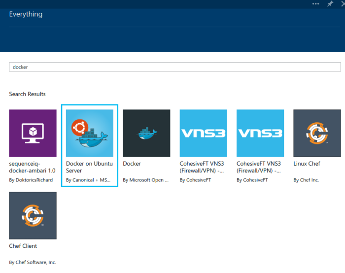
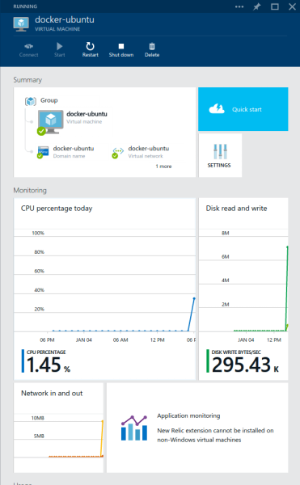

<properties 
	pageTitle="如何透過 Ubuntu-Docker VM 映像快速使用 Docker" 
	description="說明並示範如何直接從 Azure 映像庫快速使用 Docker on Ubuntu Server" 
	services="virtual-machines" 
	documentationCenter="" 
	authors="squillace" 
	manager="timlt" 
	editor="tysonn"/>

<tags 
	ms.service="virtual-machines" 
	ms.devlang="na" 
	ms.topic="article" 
	ms.tgt_pltfrm="vm-linux" 
	ms.workload="infrastructure" 
	ms.date="02/02/2015" 
	ms.author="rasquill"/>

<!--The next line, with one pound sign at the beginning, is the page title--> 
# 如何快速地開始使用 Azure Marketplace 中的 Docker 

要開始使用 [Docker]，最快速的方式是前往 Azure Marketplace，並搭配使用 [Canonical] 所建立的 **Docker on Ubuntu Server** 映像範本和 [MSOpenTech] 建立 VM。這會建立 Ubuntu Server VM，並自動安裝 [Docker VM 延伸模組](http://azure.microsoft.com/documentation/articles/virtual-machines-docker-vm-extension/)，且在 Azure 上預先安裝並執行**最新的** Docker 引擎。  

您可以立即使用 SSH 連接到 VM，並直接開始使用 Docker 執行工作，無須執行其他動作。 

> [AZURE.NOTE]Azure Marketplace 範本所建立的 VM 並未裝載遠端 Docker 用戶端管理所需的 Docker 遠端 API。若要啟用從遠端在此 VM 上控制 Docker 主機的功能，請參閱[使用 HTTPS 執行 Docker](https://docs.docker.com/articles/https/)，或依照[從 Azure 入口網站使用 Docker VM 延伸模組](http://azure.microsoft.com/documentation/articles/virtual-machines-docker-with-portal/)或[從 azure-cli 使用 Docker VM 延伸模組](http://azure.microsoft.com/documentation/articles/virtual-machines-docker-with-xplat-cli/)中的步驟進行操作。如果您想要與眾不同，您可以從 Github 建置 [Windows Docker Client](https://github.com/ahmetalpbalkan/Docker.DotNet) 並加以試用 (或僅從 [nuget](https://www.nuget.org/packages/Docker.DotNet/) 加以擷取)。 

本主題內容：

- [登入入口網站]
- [使用 Docker 映像從 Canonical 和 MSOpenTech 建立 VM]
- [使用 SSH 連線，即可開始使用]

## <a id='logon'>登入入口網站</a>

這部分很簡單，除非您沒有 Azure 帳戶。[即使沒有，也可以輕鬆地免費取得](http://azure.microsoft.com/pricing/free-trial/)！

## <a id='createvm'>使用 Docker 映像從 Canonical 和 MSOpenTech 建立 VM</a>

1. 現在當您登入時，請按一下位於左下角的 [**新建**]，以建立新 VM 映像。您可能會立即在橫幅中看到適當的映像：

> 

2. 但如果沒有，請在映像庫中加以搜尋： 

> 

3. 提供執行個體的使用者名稱和密碼或 **.pem** 檔案，以使用憑證啟用 SSH。(下圖顯示指定使用者名稱和密碼的組合。)然後，按位於底部的 [**建立**]。

> 

4. 等待作業開始執行。此作業不需要太多時間。

> 

## <a id='havingfun'>使用 SSH 連線，即可開始使用</a>

現在好戲正要上演。您可以使用 SSH 立即連接到 VM：

> 

並且開始發出 Docker 命令，切記，此 Azure VM 上的預設組態需要 **`sudo`**：

> 

<!--Every topic should have next steps and links to the next logical set of content to keep the customer engaged-->
## 後續步驟

你會想要開始使用 [Docker]！ 

<!--Anchors-->
[登入入口網站]: #logon
[使用 Docker 映像從 Canonical 和 MSOpenTech 建立 VM]: #createvm
[使用 SSH 連線，即可開始使用]: #havingfun
[後續步驟]: #next-steps

[Docker]: https://www.docker.com/
[BusyBox]: http://en.wikipedia.org/wiki/BusyBox
[Docker Scratch 映像]: https://docs.docker.com/articles/baseimages/#creating-a-simple-base-image-using-scratch
[Canonical]: http://www.canonical.com/
[MSOpenTech]: http://msopentech.com/

<!--HONumber=47-->
