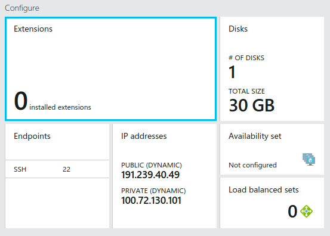

<properties
	pageTitle="在 Azure 上使用 Linux 的 Docker VM 擴充程式"
	description="說明 Docker 和 Azure 虛擬機器擴充程式，並說明如何以程式設計的方式，使用 azure-cli 命令介面從命令列在 Azure 上建立 Docker 主機的虛擬機器。"
	services="virtual-machines"
	documentationCenter=""
	authors="squillace"
	manager="timlt"
	editor="tysonn"/>

<tags
	ms.service="virtual-machines"
	ms.devlang="multiple"
	ms.topic="article"
	ms.tgt_pltfrm="vm-linux"
	ms.workload="infrastructure-services"
	ms.date="05/25/2015"
	ms.author="rasquill"/>


# 搭配使用 Docker VM 擴充程式與 Azure 入口網站

[Docker](https://www.docker.com/) 是最常用的虛擬化方式之一，它不使用虛擬機器，而是使用 [Linux 容器](http://en.wikipedia.org/wiki/LXC)作為在共用資源上獨立資料和執行計算的方法。您可以使用 [Azure Linux 代理程式]所管理的 Docker VM 延伸模組，如此可在 Azure 上建立 Docker VM 來託管任何數量的應用程式容器。

> [AZURE.NOTE]本主題說明如何從 Azure 入口網站建立 Docker VM。若要查看如何在命令列建立 Docker VM，請參閱[如何從 Azure 命令列介面 (Azure CLI) 使用 Docker VM 擴充程式]。若要查看容器及其優點的高層級討論，請參閱 [Docker 高層級白板](http://channel9.msdn.com/Blogs/Regular-IT-Guy/Docker-High-Level-Whiteboard) (英文)。

## 從映像庫建立新的 VM
第一個步驟需要可支援 Docker VM 擴充程式的 Linux 映像提供 Azure VM，使用映像庫的 Ubuntu 14.04 LTS 映像作為範例伺服器映像，且 Ubuntu 14.04 Desktop 作為用戶端。在入口網站中，按一下左下角的 [新增] 以建立新的 VM 執行個體，並從可用選項或從完整映像庫中選取 Ubuntu 14.04 LTS 映像，如下所示。

> [AZURE.NOTE]目前來說，只有 2014 年 7 月之後推出的 Ubuntu 14.04 LTS 映像才支援 Docker VM 擴充程式。


## 建立 Docker 憑證

在建立 VM 之後，請確定您的用戶端電腦已安裝 Docker。(如需詳細資訊，請參閱 [Docker 安裝指示](https://docs.docker.com/installation/#installation) (英文)。)

根據[使用 https 執行 Docker] (英文) 來建立 Docker 通訊的憑證和金鑰檔案，並將他們置於用戶端電腦上的 **`~/.docker`** 目錄。

> [AZURE.NOTE]入口網站中的 Docker VM 延伸模組目前需要 base64 編碼的認證。

在命令列中，使用 **`base64`** 或其他慣用的編碼工具來建立 base64 編碼的主題。使用一組簡單的憑證和金鑰檔案來執行此作業，看起來會如下所示：

```
 ~/.docker$ l
 ca-key.pem  ca.pem  cert.pem  key.pem  server-cert.pem  server-key.pem
 ~/.docker$ base64 ca.pem > ca64.pem
 ~/.docker$ base64 server-cert.pem > server-cert64.pem
 ~/.docker$ base64 server-key.pem > server-key64.pem
 ~/.docker$ l
 ca64.pem    ca.pem    key.pem            server-cert.pem   server-key.pem
 ca-key.pem  cert.pem  server-cert64.pem  server-key64.pem
```

## 新增 Docker VM 擴充程式
若要新增 Docker VM 擴充程式，找到您所建立的 VM 執行個體，並向下捲動至 [擴充程式]，然後按一下 [擴充程式] 以開啟 VM 擴充程式，如下所示。
> [AZURE.NOTE]僅預覽入口網站支援此功能：https://portal.azure.com/


### 新增擴充程式
按一下 [新增] 以顯示可新增至此 VM 的可用 VM 擴充程式。


### 選取 Docker VM 擴充程式
選擇 Docker VM 擴充程式，這會開啟 Docker 說明和重要連結，然後按一下底部的 [建立] 以開始安裝程序。


### 新增憑證和金鑰檔案：

在表單欄位中，輸入 base64 編碼版本的 CA 憑證、伺服器憑證及伺服器金鑰，如下圖所示。


> [AZURE.NOTE]請注意，(如先前影像所示) 依預設已填入 4243。您可以在此輸入任何端點，但下一個步驟會是開啟相符的端點。如果您變更預設值，請確定在下一個步驟中開啟相符的端點。

## 新增 Docker 通訊端點
當在您所建立的資源群組中檢視 VM 時，您可以向下捲動並按一下 [端點] 以檢視 VM 上的端點，如下所示。


按一下 [新增] 以新增其他端點，在預設案例中，輸入端點的名稱 (在此範例中為 **docker**)，在私人和公用連接埠中輸入 4243。保留顯示 **TCP** 的通訊協定值，並按一下 [確定] 以建立端點。


## 測試 Docker 用戶端和 Azure Docker 主機
尋找並複製 VM 的網域名稱，並在用戶端電腦的命令列中，輸入 `docker --tls -H tcp://`*dockerextension*`.cloudapp.net:4243 info` (其中 *dockerextension* 會被您的 VM 子網域取代)。

結果應該如下所示：

```
$ docker --tls -H tcp://dockerextension.cloudapp.net:4243 info
Containers: 0
Images: 0
Storage Driver: devicemapper
 Pool Name: docker-8:1-131214-pool
 Pool Blocksize: 65.54 kB
 Data file: /var/lib/docker/devicemapper/devicemapper/data
 Metadata file: /var/lib/docker/devicemapper/devicemapper/metadata
 Data Space Used: 305.7 MB
 Data Space Total: 107.4 GB
 Metadata Space Used: 729.1 kB
 Metadata Space Total: 2.147 GB
 Library Version: 1.02.82-git (2013-10-04)
Execution Driver: native-0.2
Kernel Version: 3.13.0-36-generic
WARNING: No swap limit support
```

完成上述步驟後，您現在已在 Azure VM 上執行功能完整的 Docker 主機，並設定為讓其他用戶端從遠端連接。

<!--Every topic should have next steps and links to the next logical set of content to keep the customer engaged-->
## 後續步驟

您已準備好開始移至 [Docker 使用者指南]，並使用 Docker VM。如果您想透過命令列介面在 Azure VM 上自動建立 Docker主機，請參閱[如何從 Azure 命令列介面 (Azure CLI) 使用 Docker VM 延伸模組]

<!--Anchors-->
[Create a new VM from the Image Gallery]: #createvm
[Create Docker Certificates]: #dockercerts
[Add the Docker VM Extension]: #adddockerextension
[Test Docker Client and Azure Docker Host]: #testclientandserver
[Next steps]: #next-steps

<!--Image references-->
[StartingPoint]: ./media/StartingPoint.png
[StartingPoint]: ./media/StartingPoint.png
[StartingPoint]: ./media/StartingPoint.png
[StartingPoint]: ./media/StartingPoint.png
[StartingPoint]: ./media/StartingPoint.png
[StartingPoint]: ./media/StartingPoint.png
[StartingPoint]: ./media/StartingPoint.png
[StartingPoint]: ./media/StartingPoint.png
[6]: ./media/markdown-template-for-new-articles/pretty49.png
[7]: ./media/markdown-template-for-new-articles/channel-9.png


<!--Link references-->
[如何從 Azure 命令列介面 (Azure CLI) 使用 Docker VM 延伸模組]: http://azure.microsoft.com/documentation/articles/virtual-machines-docker-with-xplat-cli/
[如何從 Azure 命令列介面 (Azure CLI) 使用 Docker VM 擴充程式]: http://azure.microsoft.com/documentation/articles/virtual-machines-docker-with-xplat-cli/
[Azure Linux 代理程式]: virtual-machines-linux-agent-user-guide.md
[Link 3 to another azure.microsoft.com documentation topic]: storage-whatis-account.md

[使用 https 執行 Docker]: http://docs.docker.com/articles/https/
[Docker 使用者指南]: https://docs.docker.com/userguide/

<!---HONumber=58-->