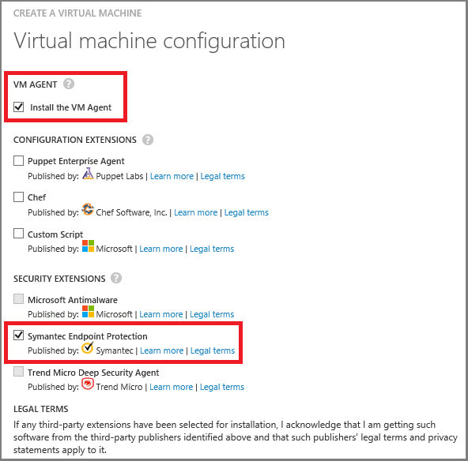

<properties 
	pageTitle="如何在 Azure VM 上安裝和設定 Symantec Endpoint Protection" 
	description="說明如何在 Azure 的新的或現有的 VM 上，安裝和設定 Symantec Endpoint Protection 安全性延伸模組" 
	services="virtual-machines" 
	documentationCenter="" 
	authors="KBDAzure" 
	manager="timlt" 
	editor=""/>

<tags 
	ms.service="virtual-machines" 
	ms.workload="infrastructure-services" 
	ms.tgt_pltfrm="vm-multiple" 
	ms.devlang="na" 
	ms.topic="article" 
	ms.date="02/24/2015" 
	ms.author="kathydav"/>

#如何在 Azure VM 上安裝和設定 Symantec Endpoint Protection

本文說明如何在執行 Windows Server 的新或現有虛擬機器 (VM) 上，安裝和設定 Symantec Endpoint Protection 用戶端。這是包括服務 (例如病毒和間諜軟體防護、防火牆及入侵防禦) 的完整用戶端。 

透過使用 VM 代理程式，用戶端會安裝為安全性延伸模組。在新的虛擬機器上，您將安裝代理程式與端點用戶端。在沒有代理程式的現有虛擬機器上，您必須先下載與安裝代理程式。本文將探討這兩種狀況。

如果您已有 Symantec 的內部部署解決方案現有訂閱，您可以用它來保護 Azure 虛擬機器的安全。如果您還不是 Trend 的客戶，您可以註冊試用訂閱。如需此解決方案的詳細資訊，請參閱 [Microsoft Azure 平台上的 Symantec Endpoint Protection](http://go.microsoft.com/fwlink/p/?LinkId=403942)。如果您已經是 Symantec 客戶，此頁面還提供授權資訊的連結，以及安裝用戶端的替代指示。

##在新的虛擬機器上安裝 Symantec Endpoint Protection

當您使用 [**From Gallery**] 選項來建立虛擬機器時，[Azure 管理入口網站](http://manage.windowsazure.com)可讓您安裝 VM 代理程式和 Symantec 安全性延伸模組。如果您打算建立單一虛擬機器，使用此方法可輕易地新增 Symantec 的防護。 

這個 [**從組件庫**] 選項會開啟可協助您設定虛擬機器的精靈。您可以使用精靈的最後一個頁面，來安裝 VM 代理程式和 Symantec 安全性延伸模組。 

如需一般指示，請參閱 [建立執行 Windows Server 的虛擬機器](virtual-machines-windows-tutorial.md)。當您進入精靈的最後一個頁面時：

1.	在 VM 代理程式下，[**安裝 VM 代理程式**] 應已勾選。

2.	在 [安全性延伸模組] 下，勾選 [**Symantec Endpoint Protection**]。

	

3.	按一下頁面底部的核取記號來建立虛擬機器。

## 在現有虛擬機器上安裝 Symantec Endpoint Protection

在開始之前，您將需要下列項目：

- Azure PowerShell 模組 0.8.2 版或更新版本。您可以使用 **Get-Module azure | format-table version** 命令來檢查已安裝的 Azure PowerShell 版本。如需最新版本的指示與連結，請參閱[如何安裝和設定 Azure PowerShell](install-configure-powershell.md)。  

- VM 代理程式。 

首先，確認已安裝 VM 代理程式。填寫雲端服務名稱和虛擬機器名稱，然後在系統管理員層級 Azure PowerShell 命令提示字元上執行下列命令。取代括弧內的所有項目，包括 < 和 > 字元。

	$CSName = "<cloud service name>"
	$VMName = "<virtual machine name>"
	$vm = Get-AzureVM -ServiceName $CSName -Name $VMName 
	write-host $vm.VM.ProvisionGuestAgent

如果您不知道雲端服務和虛擬機器名稱，請執行 **Get-AzureVM** 以顯示目前訂閱中所有虛擬機器的該項資訊。

如果 **write-host** 命令顯示 **True**，則會安裝 VM 代理程式。如果顯示 **False**，請參閱 Azure 部落格文章 [VM 代理程式與延伸模組 - 第 2 部分](http://go.microsoft.com/fwlink/p/?LinkId=403947) 中的指示和下載連結。

如果已安裝 VM 代理程式，請執行下列命令來安裝 Symantec Endpoint Protection 代理程式。

	$Agent = Get-AzureVMAvailableExtension -Publisher Symantec -ExtensionName SymantecEndpointProtection
	Set-AzureVMExtension -Publisher Symantec -Version $Agent.Version -ExtensionName SymantecEndpointProtection -VM $vm | Update-AzureVM

若要確認 Symantec 安全性延伸模組已安裝且是最新的：

1.	登入虛擬機器。如需詳細資訊，請參閱 [如何登入執行 Windows Server 的虛擬機器](virtual-machines-log-on-windows-server.md)。
2.	在 Windows Server 2008 R2 中，依序按一下 [**開始 > Symantec Endpoint Protection**]。在 Windows Server 2012 或 Windows Server 2012 R2 的 [開始] 畫面中，輸入 **Symantec**，然後按一下 [**Symantec Endpoint Protection**]。
3.	在 [**狀態 - Symantec Endpoint Protection**] 視窗的 [**狀態**] 索引標籤中，套用更新或視需要重新啟動。

## 其他資源

[如何登入執行 Windows Server 的虛擬機器](virtual-machines-log-on-windows-server.md)

[管理延伸模組](https://msdn.microsoft.com/library/dn606311.aspx)

<!--HONumber=47-->
