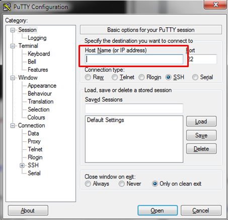

<properties urlDisplayName="Use SSH" pageTitle="使用 SSH 連接到 Azure 中的 Linux 虛擬機器" metaKeywords="Azure SSH keys Linux, Linux vm SSH" description="Learn how to generate and use SSH keys with a Linux virtual machine on Azure." metaCanonical="" services="virtual-machines" documentationCenter="" title="How to Use SSH with Linux on Azure" authors="szarkos" solutions="" manager="timlt" editor="" />

<tags ms.service="virtual-machines" ms.workload="infrastructure-services" ms.tgt_pltfrm="vm-linux" ms.devlang="na" ms.topic="article" ms.date="10/15/2014" ms.author="szarkos" />

#如何對 Azure 上的 Linux 使用 SSH

目前版本的 Azure 管理入口網站僅接受封裝於 X509 憑證中的 SSH 公開金鑰。請遵循下列步驟，產生 SSH 金鑰並用於 Azure。

## 在 Linux 中產生 Windows Azure 的相容金鑰 ##

1. 若有需要，請安裝 'openssl' 公用程式：

	**CentOS / Oracle Linux**

		# sudo yum install openssl

	**Ubuntu**

		# sudo apt-get install openssl

	**SLES 及 openSUSE**

		# sudo zypper install openssl

2. 使用 'openssl' 以 2048 位元 RSA 金鑰組來產生 X509 憑證。請回答 'openssl' 提示的一些問題 (您也可以將這些問題保留空白)。平台並未使用這些欄位的內容：

		# openssl req -x509 -nodes -days 365 -newkey rsa:2048 -keyout myPrivateKey.key -out myCert.pem

3.	變更私密金鑰的權限來保護私密金鑰。

		# chmod 600 myPrivateKey.key

4.	建立 Linux 虛擬機器時上傳 `myCert.pem`。佈建程序會針對虛擬機器中的指定使用者，自動將此憑證中的公開金鑰安裝至 `authorized_keys` 檔案中。

5.	如果您將直接使用 API，而不使用管理入口網站，請使用下列命令，將 `myCert.pem` 轉換為 `myCert.cer` (DER 編碼的 X509 憑證)：

		# openssl  x509 -outform der -in myCert.pem -out myCert.cer

## 從現有 OpenSSH 相容金鑰產生金鑰
上一個範例說明如何建立用於 Windows Azure 的新金鑰。在某些情況下，您可能已經有現有的 OpenSSH 相容公用與私密金鑰組，並希望對 Windows Azure 使用相同的金鑰。

'openssl' 公用程式可以直接讀取 OpenSSH 私密金鑰。下列命令將使用現有的 SSH 私密金鑰 (在下例中為 id_rsa) 建立 Windows Azure 需要的 '.pem' 公開金鑰：

	# openssl req -x509 -key ~/.ssh/id_rsa -nodes -days 365 -newkey rsa:2048 -out myCert.pem

**myCert.pem** 檔案是之後可用來在 Windows Azure 上佈建 Linux 虛擬機器的公開金鑰。在佈建期間，'.pem' 檔案將轉譯為 'openssh' 相容的公開金鑰，並放在 `~/.ssh/authorized_keys` 中。

## 從 Linux 連線到 Windows Azure 虛擬機器

1. 在某些情況下，Linux 虛擬機器的 SSH 端點可能會針對預設連接埠 22 以外的連接埠而設定。在管理入口網站中，您可以在 VM 的 [儀表板] 上找到正確的連接埠號碼 (在 [SSH 詳細資料] 下)。

2.	使用 'ssh] 連接到 Linux 虛擬機器。第一次登入時，將提示您接受主機公開金鑰的指紋。

		# ssh -i  myPrivateKey.key -p <port> username@servicename.cloudapp.net

3.	(選用) 您可以將 `myPrivateKey.key` 複製到 `~/.ssh/id_rsa`，以便 openssh 用戶端能夠自動選擇該金鑰，而不需要使用 '-i' 選項。

## 在 Windows 上取得 OpenSSL ##
### 使用 msysgit ###

1.	從下列位置下載並安裝 msysgit：[http://msysgit.github.com/](http://msysgit.github.com/)
2.	從安裝目錄 (例如 c:\msysgit\msys.exe) 執行 `msys`
3.	輸入 `cd bin` 切換至 `bin` 目錄

###使用 GitHub for Windows###

1.	從下列位置下載並安裝 GitHub for Windows：[http://windows.github.com/](http://windows.github.com/)
2.	從 [開始] 功能表 > [所有程式] > [GitHub, Inc] 執行 Git Shell

###使用 cygwin###

1.	從下列位置下載並安裝 Cygwin：[http://cygwin.com/](http://cygwin.com/)
2.	確定已安裝 OpenSSL 封裝及其所有的相依性。
3.	執行 `cygwin`

## 在 Windows 上建立私密金鑰 ##

1.	遵循以上的其中一組指示，以便執行 'openssl.exe'
2.	輸入以下命令：

		# openssl.exe req -x509 -nodes -days 365 -newkey rsa:2048 -keyout myPrivateKey.key -out myCert.pem

3.	畫面應該如下所示：

	

4.	回答提出的問題。
5.	它會建立兩個檔案：`myPrivateKey.key` 和 `myCert.pem`。
6.	如果您將直接使用 API，而不使用管理入口網站，請使用下列命令，將 `myCert.pem` 轉換為 `myCert.cer` (DER 編碼的 X509 憑證)：

		# openssl.exe  x509 -outform der -in myCert.pem -out myCert.cer

## 建立 Putty 的 PPK ##

1. 從下列位置下載並安裝 Puttygen：[http://www.chiark.greenend.org.uk/~sgtatham/putty/download.html](http://www.chiark.greenend.org.uk/~sgtatham/putty/download.html)

2. Puttygen 可能無法讀取稍早建立的私密金鑰 (`myPrivateKey.key`)。執行下列命令以將它轉譯成 Puttygen 可認得的 RSA 私密金鑰：

		# openssl rsa -in ./myPrivateKey.key -out myPrivateKey_rsa
		# chmod 600 ./myPrivateKey_rsa

	上述命令應會產生一個名為 myPrivateKey_rsa 的新私密金鑰。

3. 執行 `puttygen.exe`

4. 按一下功能表：[File] > [Load a Private Key]

5. 找出您的私密金鑰，也就是上述命名為 `myPrivateKey_rsa` 的金鑰。您將需要變更檔案篩選，才能顯示**所有檔案 (\*.\*)**

6. 按一下 [**開啟**]。您將看見提示，看起來如下所示：

	

7. 按一下 [**確定**]

8. 按一下以下螢幕擷取畫面強調顯示的 [**儲存私密金鑰**]：

	

9. 將檔案儲存為 PPK。

## 使用 Putty 連線到 Linux 機器 ##

1.	從下列位置下載並安裝 putty：[http://www.chiark.greenend.org.uk/~sgtatham/putty/download.html](http://www.chiark.greenend.org.uk/~sgtatham/putty/download.html)
2.	執行 putty.exe
3.	使用管理入口網站的 IP 來填入主機名稱：

	

4.	選取 [**開啟**] 之前，請按一下 [連線] > [SSH] > [驗證] 索引標籤來選擇您的金鑰。請參閱以下螢幕擷取畫面，以了解要填入的欄位：

	

5.	按一下 [**開啟**] 以連接到您的虛擬機器

<!--HONumber=35.1-->
