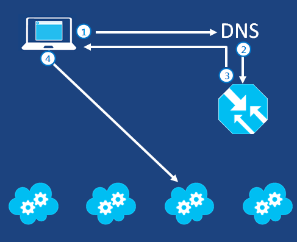

<properties 
	pageTitle="Azure 基礎結構服務的負載平衡" 
	description="說明 Azure 支援的兩個不同負載平衡類型：適用於雲端服務的負載平衡器，以及適用於用戶端流量的 Azure 流量管理員。" 
	services="virtual-machines" 
	documentationCenter="" 
	authors="cherylmc" 
	manager="adinah" 
	editor=""/>

<tags 
	ms.service="virtual-machines" 
	ms.workload="infrastructure-services" 
	ms.tgt_pltfrm="na" 
	ms.devlang="na" 
	ms.topic="article" 
	ms.date="05/12/2015" 
	ms.author="cherylmc"/>

# Azure 基礎結構服務的負載平衡#

Azure 基礎結構服務提供兩種負載平衡層級︰

- **DNS 層級**：平衡流往位於不同資料中心之不同雲端服務或不同 Azure 網站的流量負載，或是流往外部端點的流量負載。這項工作由 Traffic Manager 及循環配置資源負載平衡方法完成。
- **網路層級**：平衡雲端服務之不同虛擬機器的網際網路連入流量負載，或是平衡雲端服務或虛擬網路中虛擬機器間的流量負載。這項工作由 Azure 負載平衡器所完成。

## 雲端服務及網站的 Traffic Manager 負載平衡##

Azure Traffic Manager 讓您可以控制使用者流量分配至端點，包括雲端服務、網站、外部網站及其他 Traffic Manager 設定檔。Traffic Manager 的運作方式是在您的網際網路資源網域名稱的網域名稱系統 (DNS) 查詢上套用情報原則引擎。您的雲端服務或網站可以在世界各地不同的資料中心間執行。

您必須使用 REST 或 Windows PowerShell 來設定外部端點或將 Traffic Manager 設定檔設定為端點。

Azure Traffic Manager 使用三種不同的負載平衡方法來分配流量︰

- **容錯移轉**：當您想要針對所有流量使用主要端點時才可使用此方法，但請提供備份，以便在主要端點無法使用時使用。
- **效能**：當您的端點位於不同地理位置，且您為了取得最低延遲而要求用戶端使用「最靠近」的端點時，才可使用此方法。
- **循環配置資源**：在您想要在相同資料中心的一組雲端服務上，或在不同資料中心的雲端服務或網站上分配負載時，才可使用此方法。

如需詳細資訊，請參閱[關於 Traffic Manager 負載平衡方法](http://msdn.microsoft.com/library/azure/dn339010.aspx)。

下圖顯示在不同雲端服務間使用循環配置資源負載平衡方法分配流量的範例。

基礎程序如下︰

1.	一個網際網路用戶端查詢對應至一個網路服務的網域名稱。
2.	DNS 轉送名稱查詢要求至 Traffic Manager 。
3.	流量管理員選擇循環配置資源中的下一個雲端服務，並傳回 DNS 名稱。網際網路用戶端的 DNS 伺服器將該名稱解析為 IP 位址，並傳送至網際網路用戶端。
4.	網際網路用戶端連線到流量管理員選擇的雲端服務。

如需詳細資訊，請參閱 [Traffic Manager](http://msdn.microsoft.com/library/azure/hh745750.aspx)。

## 虛擬機器的 Azure 負載平衡 ##

相同雲端服務或虛擬網路中的虛擬機器都可以與其他使用其私人 IP 位址的虛擬機器直接進行通訊。雲端服務或虛擬網路之外的電腦與服務僅能與具有設定的端點之雲端服務或虛擬網路中的虛擬機器進行通訊。端點是公用 IP 位址和連接埠與 Azure 雲端服務的虛擬機器或網站角色私人 IP 位置與連接埠的對應。

Azure 負載平衡器會隨機分配稱為負載平衡集之組態中的多個虛擬機器或服務的特定類型連入流量。例如，您可以將 Web 要求的流量負載分散在多個 Web 伺服器或 Web 角色。

下圖顯示在三部虛擬機器中共用，且公用和私人 TCP 連接埠均為 80 的標準 (未加密) Web 流量負載平衡端點。這三部虛擬機器均位在負載平衡集合中。

如需詳細資訊，請參閱 [Azure 負載平衡器](http://msdn.microsoft.com/library/azure/dn655058.aspx)。如須建立負載平衡集的步驟，請參閱[設定負載平衡集](http://msdn.microsoft.com/library/azure/dn655055.aspx)。

Azure 也可在雲端服務或虛擬網路中進行負載平衡。這稱為內部負載平衡，可用於以下方式︰

- 在多層式應用程式中的不同階層進行負載平衡 (例如，在網站與資料庫層之間)。
- 在需要額外負載平衡器硬體或軟體之 Azure 代管的企業營運系統 (LOB) 應用程式中進行負載平衡。 
- 包括流量經負載平衡之電腦集合的內部部署伺服器。

與 Azure 負載平衡相似，內部負載平衡透過設定內部負載平衡集而受惠。

下圖顯示企業營運系統 (LOB) 應用程式之內部負載平衡端點的範例，該應用程式由跨部署虛擬網路中的三部虛擬機器所共用。

## 後續步驟

如須建立負載平衡集的步驟，請參閱[設定內部負載平衡集](http://msdn.microsoft.com/library/azure/dn690125.aspx)。

如需負載平衡器的詳細資訊，請參閱[內部負載平衡](http://msdn.microsoft.com/library/azure/dn690121.aspx)。

<!-- LINKS -->

<!---HONumber=58-->