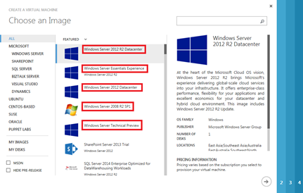

<properties 
	pageTitle="使用 Azure PowerShell 建立和預先設定以 Windows 為基礎的虛擬機器" 
	description="了解如何使用 Azure PowerShell 在 Azure 建立和預先設定以 Windows 為基礎的虛擬機器。" 
	services="virtual-machines" 
	documentationCenter="" 
	authors="JoeDavies-MSFT" 
	manager="timlt" 
	editor=""/>

<tags 
	ms.service="virtual-machines" 
	ms.workload="infrastructure-services" 
	ms.tgt_pltfrm="na" 
	ms.devlang="na" 
	ms.topic="article" 
	ms.date="03/05/2015" 
	ms.author="josephd"/>

#使用 Azure PowerShell 建立和預先設定以 Windows 為基礎的虛擬機器

下列步驟將示範如何使用建置組塊自訂一組 Azure PowerShell 命令，建立和預先設定以 Windows 為基礎的 Azure 虛擬機器。您可以使用此程序，對於以 Windows 為基礎的新虛擬機器建立命令集合，並擴充現有部署，或建立快速建置自訂開發/測試或 IT 專業環境的多個命令集。

這些步驟遵循建立 Azure PowerShell 命令集合的填空方法。如果您剛使用 PowerShell 或只想知道可指定哪些值來成功設定組態，這個方法相當實用。進階的 PowerShell 使用者可以使用命令並取代本身的變數值 (以「$」為開頭的行)。

關於設定以 Linux 為基礎的虛擬機器的系列主題，請參閱 [使用 Azure PowerShell 建立和預先設定以 Linux 為基礎的虛擬機器](http://azure.microsoft.com/documentation/articles/virtual-machines-ps-create-preconfigure-linux-vms/)。

##步驟 1：安裝 Azure PowerShell

如果您尚未這樣做，請使用 [如何安裝和設定 Azure PowerShell 在本機電腦安裝 Azure PowerShell](install-configure-powershell.md) 中的指示。然後，開啟 Azure PowerShell 命令提示字元。

##步驟 2：設定您的訂閱和儲存體帳戶

在 Azure PowerShell 命令提示字元下執行這些命令，設定您的 Azure 訂閱帳戶和儲存體帳戶。以正確的名稱取代括號中的所有內容，包括 < 和 > 字元。

	$subscr="<subscription name>"
	$staccount="<storage account name>"
	Select-AzureSubscription -SubscriptionName $subscr -Current
	Set-AzureSubscription -SubscriptionName $subscr -CurrentStorageAccountName $staccount

您可以從 **Get-AzureSubscription** 命令輸出的 SubscriptionName 內容取得正確的訂閱帳戶名稱。您發出 **Select-azuresubscription** 命令後，可以從輸出的 **Get AzureStorageAccount**命令輸出的 Label 內容取得正確的儲存體帳戶名稱。您也可以將這些命令儲存在文字檔中，以供日後使用。

##步驟 3：決定 ImageFamily

接著，您必須對於與要建立的 Azure 虛擬機器相對應的特定映像決定 ImageFamily 或 Label 值。以下是 Azure 管理入口網站中組件庫的一些範例。

 
您可以使用這個命令取得可用 ImageFamily 值的清單。

	Get-AzureVMImage | select ImageFamily -Unique

以下是以 Windows 為基礎的電腦本身 ImageFamily 值的一些範例：

- Windows Server 2012 R2 Datacenter 
- Windows Server 2008 R2 SP1 
- Windows Server Technical Preview 
- SQL Server 2012 SP1 Enterprise on Windows Server 2012 

如果您找到所尋找的映像，請開啟所選文字編輯器的新執行個體，並將下列內容複製到新的文字檔，以取代 ImageFamily 值。 

	$family="<ImageFamily value>"
	$image=Get-AzureVMImage | where { $_.ImageFamily -eq $family } | sort PublishedDate -Descending | select -ExpandProperty ImageName -First 1

在某些情況下，映像名稱是在 Label 內容中，而非在 ImageFamily 值中。如果無法使用 ImageFamily 找出所尋找的映像，請使用這個命令按照 Label 內容列出映像。

	Get-AzureVMImage | select Label -Unique

如果您使用這個命令找到正確的映像，請開啟所選文字編輯器的新執行個體，並將下列內容複製到新的文字檔，以取代 Label 值。 

	$label="<Label value>"
	$image = Get-AzureVMImage | where { $_.Label -eq $label } | sort PublishedDate -Descending | select -ExpandProperty ImageName -First 1

##步驟 4：建置命令集

將下列適當的區塊集合複製到新的文字檔，然後填入變數的值，並移除 < 和 > 字元，以建置命令集的其餘部分。請參閱本文結尾的這兩個 [範例](#examples) 了解最終產生的結果。

選擇兩個命令區塊的其中一個，啟動命令集 (必要)。

選項 1：指定虛擬機器名稱和大小。

	$vmname="<machine name>"
	$vmsize="<Specify one: Small, Medium, Large, ExtraLarge, A5, A6, A7, A8, A9>"
	$vm1=New-AzureVMConfig -Name $vmname -InstanceSize $vmsize -ImageName $image

選項 2：指定名稱、大小和可用性設定組名稱。

	$vmname="<machine name>"
	$vmsize="<Specify one: Small, Medium, Large, ExtraLarge, A5, A6, A7, A8, A9>"
	$availset="<set name>"
	$vm1=New-AzureVMConfig -Name $vmname -InstanceSize $vmsize -ImageName $image -AvailabilitySetName $availset

關於 D、DS 或 G 系列虛擬機器的 InstanceSize 值，請參閱 [Azure 的虛擬機器和雲端服務大小](https://msdn.microsoft.com/library/azure/dn197896.aspx)。

對於獨立 Windows 電腦，也可選擇指定本機系統管理員帳戶和密碼。

	$localadminusername="<local administrator account name>"
	$localadminpassword="<local administrator account password>"
	$vm1 | Add-AzureProvisioningConfig -Windows -AdminUsername $localadminusername -Password $localadminpassword

(選擇性) 若要將 Windows 電腦加入現有的 Active Directory 網域，請指定本機系統管理員帳戶和密碼、網域，以及網域帳戶的名稱和密碼。

	$localadminusername="<local administrator account name>"
	$localadminpassword="<local administrator account password>"
	$domaindns="<FQDN of the domain that the machine is joining>"
	$domacctdomain="<domain of the account that has permission to add the machine to the domain>"
	$domacctname="<domain account name that has permission to add the machine to the domain>"
	$domacctpassword="<password of the domain account that has permission to add the machine to the domain>"
	$vm1 | Add-AzureProvisioningConfig -AdminUserName $localadminusername -Password $localadminpassword -WindowsDomain -Domain $domacctdomain -DomainUserName $domacctname -DomainPassword $domacctpassword -JoinDomain $domaindns

請注意，這兩個選項都需要您指定帳戶名稱和密碼。如果您要將產生的命令集儲存在檔案中，請將檔案儲存於安全之處加以保護。

如需以 Windows 為基礎的虛擬機器其他的預先組態選項，請參閱 [Add-AzureProvisioningConfig](https://msdn.microsoft.com/library/azure/dn495299.aspx) 中的 **Windows** 和 **WindowsDomain** 參數集語法。

也可選擇將特定 IP 位址 (稱為靜態 DIP) 指派給虛擬機器。

	$vm1 | Set-AzureStaticVNetIP -IPAddress <IP address>

您可以確認特定 IP 位址可用於：

	Test-AzureStaticVNetIP -VNetName <VNet name> -IPAddress <IP address>

也可選擇將虛擬機器指派給 Azure 虛擬網路中的特定子網路。

	$vm1 | Set-AzureSubnet -SubnetNames "<name of the subnet>"

也可選擇將單一資料磁碟加入至虛擬機器。 

	$disksize=<size of the disk in GB>
	$disklabel="<the label on the disk>"
	$lun=<Logical Unit Number (LUN) of the disk>
	$hcaching="<Specify one: ReadOnly, ReadWrite, None>"
	$vm1 | Add-AzureDataDisk -CreateNew -DiskSizeInGB $disksize -DiskLabel $disklabel -LUN $lun -HostCaching $hcaching

對於 Active Directory 網域控制站，請將 $hcaching 設定為「None」。

也可選擇將虛擬機器加入至外部流量的現有負載平衡集。

	$prot="<Specify one: tcp, udp>"
	$localport=<port number of the internal port>
	$pubport=<port number of the external port>
	$endpointname="<name of the endpoint>"
	$lbsetname="<name of the existing load-balanced set>"
	$probeprotocol="<Specify one: tcp, udp>"
	$probeport=<TCP or UDP port number of probe traffic>
	$probepath="<URL path for probe traffic>"
	$vm1 | Add-AzureEndpoint -Name $endpointname -Protocol $prot -LocalPort $localport -PublicPort $pubport -LBSetName $lbsetname -ProbeProtocol $probeprotocol -ProbePort $probeport -ProbePath $probepath

最後，選擇下列其中一個命令區塊，啟動虛擬機器建立程序 (必要)。

選項 1：在新的雲端服務中建立虛擬機器。 

	New-AzureVM -Location "<An Azure location, such as US West>" -VMs $vm1

選項 2：在現有的雲端服務中建立虛擬機器。 

	New-AzureVM -ServiceName "<short name of the cloud service>" -VMs $vm1

雲端服務的簡短名稱是 Azure 管理入口網站的雲端服務清單或 Azure Preview 入口網站的資源群組清單中顯示的名稱。 

選項 3：在現有的雲端服務和虛擬網路中建立虛擬機器。

	$svcname="<short name of the cloud service>"
	$vnetname="<name of the virtual network>"
	New-AzureVM -ServiceName $svcname -VMs $vm1 -VNetName $vnetname

##步驟 5：執行命令集

檢閱在步驟 4 中使用文字編輯器以多個命令區塊建立的 Azure PowerShell 命令集。確定您已指定所需的所有變數，並且這些變數具有正確的值。也確定已移除所有 < 和 > 字元。

將命令集複製到剪貼簿，然後以滑鼠右鍵按一下 [開啟 Azure PowerShell 命令提示字元]。這將發出命令集作為一系列的 PowerShell 命令，並建立 Azure 虛擬機器。

如果您將再次建立這個虛擬機器或類似的虛擬機器，您可以： 

- 將這個命令集儲存為文字檔或 PowerShell 指令碼檔 (*.ps1)
- 在 Azure 管理入口網站的 **自動化** 區段中，將這個命令集儲存為 Azure 自動化 Runbook。 

##範例

以下是使用上述步驟建置 Azure PowerShell 命令集的兩個範例，這些命令集將建立以 Windows 為基礎的 Azure 虛擬機器。

###範例 1

我需要 PowerShell 命令設定建立 Active Directory 網域控制站的初始虛擬機器：

- 使用 Windows Server 2012 R2 Datacenter 映像
- 名稱為 AZDC1 
- 是獨立的電腦
- 有 20 GB 的額外資料磁碟
- 靜態 IP 位址為 192.168.244.4
- 在 AZDatacenter 虛擬網路的後端子網路中
- 在 Azure TailspinToys 雲端服務中

以下是建立這個虛擬機器的相對應 Azure PowerShell 命令集，各個區塊之間均有空白行，以求編排清晰。

	$family="Windows Server 2012 R2 Datacenter"
	$image=Get-AzureVMImage | where { $_.ImageFamily -eq $family } | sort PublishedDate -Descending | select -ExpandProperty ImageName -First 1
	$vmname="AZDC1"
	$vmsize="Medium"
	$vm1=New-AzureVMConfig -Name $vmname -InstanceSize $vmsize -ImageName $image

	$localadminusername="DCLocalAdmin"
	$localadminpassword="DCeq7294*"
	$vm1 | Add-AzureProvisioningConfig -Windows -AdminUsername $localadminusername -Password $localadminpassword

	$vm1 | Set-AzureSubnet -SubnetNames "BackEnd"

	$vm1 | Set-AzureStaticVNetIP -IPAddress 192.168.244.4

	$disksize=20
	$disklabel="DCData"
	$lun=0
	$hcaching="None"
	$vm1 | Add-AzureDataDisk -CreateNew -DiskSizeInGB $disksize -DiskLabel $disklabel -LUN $lun -HostCaching $hcaching

	$svcname="Azure-TailspinToys"
	$vnetname="AZDatacenter"
	New-AzureVM -ServiceName $svcname -VMs $vm1 -VNetName $vnetname

###範例 2

我需要 PowerShell 命令集建立企業營運伺服器的虛擬機器：

- 使用 Windows Server 2012 R2 Datacenter 映像
- 名稱為 LOB1
- 是 corp.contoso.com 網域的成員
- 有 200 GB 的額外資料磁碟 
- 在 AZDatacenter 虛擬網路的前端子網路中
- 在 Azure TailspinToys 雲端服務中

以下是建立這個虛擬機器的相對應 Azure PowerShell 命令集。

	$family="Windows Server 2012 R2 Datacenter"
	$image=Get-AzureVMImage | where { $_.ImageFamily -eq $family } | sort PublishedDate -Descending | select -ExpandProperty ImageName -First 1
	$vmname="LOB1"
	$vmsize="Large"
	$vm1=New-AzureVMConfig -Name $vmname -InstanceSize $vmsize -ImageName $image

	$localadminusername="LOBLocalAdmin"
	$localadminpassword="LOBmx7137*"
	$domacctdomain="CORP"
	$domacctname="admin7"
	$domacctpassword="frank0987&"
	$domaindns="corp.contoso.com"
	$vm1 | Add-AzureProvisioningConfig -AdminUserName $localadminusername -Password $ localadminpassword -WindowsDomain -Domain $domacctdomain -DomainUserName $domacctname -DomainPassword $domacctpassword -JoinDomain $domaindns

	$vm1 | Set-AzureSubnet -SubnetNames "FrontEnd"

	$disksize=200
	$disklabel="LOBData"
	$lun=0
	$hcaching="ReadWrite"
	$vm1 | Add-AzureDataDisk -CreateNew -DiskSizeInGB $disksize -DiskLabel $disklabel -LUN $lun -HostCaching $hcaching

	$svcname="Azure-TailspinToys"
	$vnetname="AZDatacenter"
	New-AzureVM -ServiceName $svcname -VMs $vm1 -VNetName $vnetname

##其他資源

[虛擬機器文件](http://azure.microsoft.com/documentation/services/virtual-machines/)

[Azure 虛擬機器常見問題集](http://msdn.microsoft.com/library/azure/dn683781.aspx)

[Azure 虛擬機器的概觀](http://msdn.microsoft.com/library/azure/jj156143.aspx)

[如何安裝和設定 Azure PowerShell](install-configure-powershell.md)

[使用 Azure PowerShell 建立和預先設定以 Linux 為基礎的虛擬機器](virtual-machines-ps-create-preconfigure-linux-vms.md)

<!--HONumber=47-->
