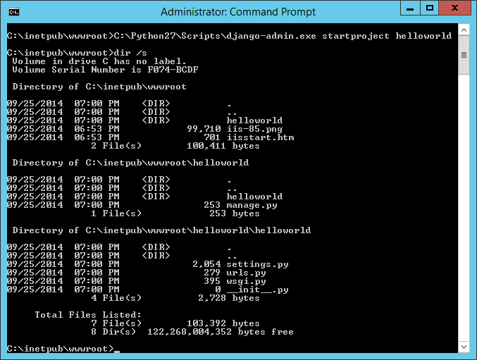

<properties 
	pageTitle="搭配 Django 的 Python Web 應用程式 - Azure 教學課程" 
	description="本教學課程會教您如何使用執行 Windows Server 2012 R2 Datacenter 的虛擬機器，在 Azure 上裝載 Django 型網站。" 
	services="virtual-machines" 
	documentationCenter="python" 
	authors="huguesv" 
	manager="wpickett" 
	editor=""/>

<tags 
	ms.service="virtual-machines" 
	ms.workload="web" 
	ms.tgt_pltfrm="vm-windows" 
	ms.devlang="python" 
	ms.topic="article" 
	ms.date="09/25/2014" 
	ms.author="huvalo"/>

# Django Hello World Web 應用程式

<a href="/zh-tw/develop/python/tutorials/web-app-with-django/" title="Windows" class="current">Windows</a><a href="/zh-tw/develop/python/tutorials/django-hello-world-(maclinux)/" title="MacLinux">Mac/Linux</a>

本教學課程說明如何裝載 Microsoft 上的 Django 型網站 
使用 Windows Server 虛擬機器的 Azure。本教學課程假設您先前沒有使用 Azure 的經驗。完成本指南之後，您將在雲端啟動並執行 Django 型應用程式。

您將了解如何：

* 設定 Azure 虛擬機器以裝載 Django。雖然本教學課程說明如何在 **Windows Server** 下完成這項程序，不過使用 Azure 中裝載的 Linux VM 也可以完成相同的程序。 
* 從 Windows 建立新的 Django 應用程式。

依照本教學課程的步驟，您將建置一個簡單的 Hello World Web 
應用程式。該應用程式將裝載於 Azure 虛擬機器中。

完成之應用程式的螢幕擷取畫面如下：

![A browser window displaying the hello world page on Azure][1]

[AZURE.INCLUDE [create-account-and-vms-note](../includes/create-account-and-vms-note.md)]

## 建立及設定 Azure 虛擬機器以裝載 Django

1. 按照[此處][portal-vm]提供的指示建立  *Windows Server 2012 R2 Datacenter* 發佈的 Azure 虛擬機器。

1. 指示 Azure 將連接埠 **80** 的流量從 Web 導向虛擬機器上的連接埠 **80**：
 - 在 Azure 入口網站中瀏覽至新建立的虛擬機器，並按一下 [端點] 索引標籤。
 - 按一下畫面底部的 [加入] 按鈕。
	

 - 開啟 [TCP] 通訊協定的 [公用連接埠 80]，比照 [私人連接埠 80] 。
![][port80]
1. 在 [儀表板] 索引標籤中按一下 [連接]，使用 [遠端桌面] 來遠端登入新建立的 Azure 虛擬機器。  

**重要注意事項：**以下所有指示皆假設您已正確登入虛擬機器，並且是在該處發出命令，而不是在本機電腦上發出命令！

## 設定 Python 和 Django

**注意：**為了要使用 Internet Explorer 進行下載，您可能必須設定 IE ESC 設定 ([開始]/[系統管理工具]/[伺服器管理員]/[本機伺服器]，然後按一下  [IE 增強式安全性設定]，將其設為 [關閉])。

1. 安裝 [Web Platform Installer][]。
1. 使用 Web Platform Installer 安裝 Python 和WFastCGI。這將會在您的 Python 指令碼資料夾中安裝 wfastcgi.py。
	1.啟動 Web Platform Installer。
	1.在搜尋列中輸入 WFastCGI。 
	1.在您要使用的 Python 版本 (2.7 或 3.4) 中選取 WFactCGI 項目。請注意，這會將 Python 作為 WFastCGI 的相依性安裝。 
1. 如果您已安裝 Python 2.7，則請[遵循這些指示手動安裝 pip](https://pip.pypa.io/en/latest/installing.html) (Python 3.4 內含已安裝的 pip)。
1. 使用 pip 安裝 Django。

    Python 2.7：

        c:\python27\scripts\pip install django

    Python 3.4：

        c:\python34\scripts\pip install django

## 設定含 FastCGI 的 IIS

1. 安裝含 FastCGI 支援的 IIS。執行的時間可能需要幾分鐘。

		start /wait %windir%\System32\\PkgMgr.exe /iu:IIS-WebServerRole;IIS-WebServer;IIS-CommonHttpFeatures;IIS-StaticContent;IIS-DefaultDocument;IIS-DirectoryBrowsing;IIS-HttpErrors;IIS-HealthAndDiagnostics;IIS-HttpLogging;IIS-LoggingLibraries;IIS-RequestMonitor;IIS-Security;IIS-RequestFiltering;IIS-HttpCompressionStatic;IIS-WebServerManagementTools;IIS-ManagementConsole;WAS-WindowsActivationService;WAS-ProcessModel;WAS-NetFxEnvironment;WAS-ConfigurationAPI;IIS-CGI

### Python 2.7

只有當您使用 Python 2.7 時才能執行這些命令。

1. 設定 Python 快速 CGI 處理常式。

		%windir%\system32\inetsrv\appcmd set config /section:system.webServer/fastCGI "/+[fullPath='c:\Python27\python.exe', arguments='C:\Python27\Scripts\wfastcgi.py']"

1. 登錄此網站的處理常式。

		%windir%\system32\inetsrv\appcmd set config /section:system.webServer/handlers "/+[name='Python_via_FastCGI',path='*',verb='*',modules='FastCgiModule',scriptProcessor='c:\Python27\python.exe|C:\Python27\Scripts\wfastcgi.py',resourceType='Unspecified']"

1. 設定處理常式以執行您的 Django 應用程式。

		%windir%\system32\inetsrv\appcmd.exe set config -section:system.webServer/fastCgi /+"[fullPath='C:\Python27\python.exe', arguments='C:\Python27\Scripts\wfastcgi.py'].environmentVariables.[name='DJANGO_SETTINGS_MODULE',value='helloworld.settings']" /commit:apphost

1. 設定 PYTHONPATH，讓 Python 解譯器能夠找到您的 Django 應用程式。

		%windir%\system32\inetsrv\appcmd.exe set config -section:system.webServer/fastCgi /+"[fullPath='C:\Python27\python.exe', arguments='C:\Python27\Scripts\wfastcgi.py'].environmentVariables.[name='PYTHONPATH',value='C:\inetpub\wwwroot\helloworld']" /commit:apphost

1. 告訴 FastCGI 到 WSGI 的閘道要使用哪個 WSGI 處理常式。

		%windir%\system32\inetsrv\appcmd.exe set config -section:system.webServer/fastCgi /+"[fullPath='C:\Python27\python.exe', arguments='C:\Python27\Scripts\wfastcgi.py'].environmentVariables.[name='WSGI_HANDLER',value='django.core.handlers.wsgi.WSGIHandler()']" /commit:apphost

1. 您應該會看見下列內容：

	 

### Python 3.4

只有當您使用 Python 3.4 時才能執行這些命令。

1. 設定 Python 快速 CGI 處理常式。

		%windir%\system32\inetsrv\appcmd set config /section:system.webServer/fastCGI "/+[fullPath='c:\Python34\python.exe', arguments='C:\Python34\Scripts\wfastcgi.py']"

1. 登錄此網站的處理常式。

		%windir%\system32\inetsrv\appcmd set config /section:system.webServer/handlers "/+[name='Python_via_FastCGI',path='*',verb='*',modules='FastCgiModule',scriptProcessor='c:\Python34\python.exe|C:\Python34\Scripts\wfastcgi.py',resourceType='Unspecified']"

1. 設定處理常式以執行您的 Django 應用程式。

		%windir%\system32\inetsrv\appcmd.exe set config -section:system.webServer/fastCgi /+"[fullPath='C:\Python34\python.exe', arguments='C:\Python34\Scripts\wfastcgi.py'].environmentVariables.[name='DJANGO_SETTINGS_MODULE',value='helloworld.settings']" /commit:apphost

1. 設定 PYTHONPATH，讓 Python 解譯器能夠找到您的 Django 應用程式。

		%windir%\system32\inetsrv\appcmd.exe set config -section:system.webServer/fastCgi /+"[fullPath='C:\Python34\python.exe', arguments='C:\Python34\Scripts\wfastcgi.py'].environmentVariables.[name='PYTHONPATH',value='C:\inetpub\wwwroot\helloworld']" /commit:apphost

1. 告訴 FastCGI 到 WSGI 的閘道要使用哪個 WSGI 處理常式。

		%windir%\system32\inetsrv\appcmd.exe set config -section:system.webServer/fastCgi /+"[fullPath='C:\Python34\python.exe', arguments='C:\Python34\Scripts\wfastcgi.py'].environmentVariables.[name='WSGI_HANDLER',value='django.core.handlers.wsgi.WSGIHandler()']" /commit:apphost

1. 您應該會看見下列內容：

	 

## 建立新的 Django 應用程式

1.  從  *C:\inetpub\wwwroot*，輸入下列命令以建立新的 Django 專案：

    Python 2.7：

		C:\Python27\Scripts\django-admin.exe startproject helloworld

    Python 3.4：

		C:\Python34\Scripts\django-admin.exe startproject helloworld
    
	

1.  **django-admin** 命令會為 Django 型網站產生一個基本結構：
    
  -   **helloworld\manage.py** 可協助您開始裝載及停止裝載 Django 型網站。
  -   **helloworld\helloworld\settings.py** 包含應用程式的 Django 設定。
  -   **helloworld\helloworld\urls.py** 包含每個 URL 與其檢視之間的對應碼。

1.  在  *C:\inetpub\wwwroot\helloworld\helloworld* 目錄中建立名為 **views.py** 的新檔案。這將包含轉譯 "hello world" 頁面的檢視。啟動您的編輯器並輸入下列程式碼：
		
		from django.http import HttpResponse
		def home(request):
    		html = "<html><body>Hello World!</body></html>"
    		return HttpResponse(html)

1.  使用下列程式碼取代 **urls.py** 檔案的內容：

		from django.conf.urls import patterns, url
		urlpatterns = patterns('',
			url(r'^$', 'helloworld.views.home', name='home'),
		)

1. 最後，在您的瀏覽器中載入網頁。

![A browser window displaying the hello world page on Azure][1]

## 關閉 Azure 虛擬機器

完成本教學課程時，請關閉並/或移除新建立的 Azure 虛擬機器釋出資源供其他教學課程使用，並避免產生 Azure 使用的費用。

[1]: ./media/virtual-machines-python-django-web-app-windows-server/django-helloworld-browser-azure.png

[port80]: ./media/virtual-machines-python-django-web-app-windows-server/django-helloworld-port80.png

[portal-vm]: /zh-tw/manage/windows/tutorials/virtual-machine-from-gallery/

[Web Platform Installer]: http://www.microsoft.com/web/downloads/platform.aspx

<!--HONumber=42-->
