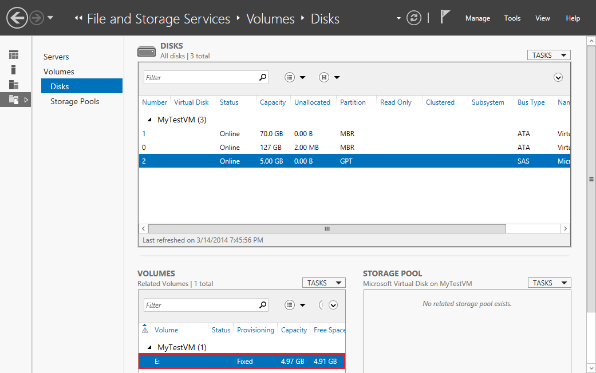

<properties 
	pageTitle="在 Azure 中建立執行 Windows 的虛擬機器" 
	description="了解如何在 Azure 中建立執行 Windows 的虛擬機器 (VM)，然後登入並附加資料磁碟" 
	services="virtual-machines" 
	documentationCenter="" 
	authors="KBDAzure" 
	manager="timlt" 
	editor="tysonn"/>

<tags 
	ms.service="virtual-machines" 
	ms.workload="infrastructure-services" 
	ms.tgt_pltfrm="vm-windows" 
	ms.devlang="na" 
	ms.topic="article" 
	ms.date="01/20/2015" 
	ms.author="kathydav"/>

# 建立執行 Windows 的虛擬機器 #

<a href="/zh-tw/documentation/articles/virtual-machines-windows-tutorial/" title="Azure Portal" class="current">Azure 入口網站</a><a href="/zh-tw/documentation/articles/virtual-machines-windows-tutorial-azure-preview/" title="Azure Preview Portal">Azure Preview 入口網站</a>

本教學課程示範建立 Azure 虛擬機器 (VM) 有多麼容易。它使用 Windows Server 映像，不過這是透過 Azure 提供的許多映像之一。這包括 Windows 作業系統、以 Linux 為基礎的作業系統和預先安裝應用程式的影像。您可以選擇的映像取決於您擁有的訂閱類型。例如，桌面映像可能可供 MSDN 訂閱者使用。

> [AZURE.NOTE] 您不需要使用 Azure VM 的任何經驗來完成此教學課程，但您的確需要 Azure 帳戶。只需要幾分鐘的時間，您就可以建立免費試用帳戶。如需詳細資訊，請參閱 [建立 Azure 帳戶](http://azure.microsoft.com/develop/php/tutorials/create-a-windows-azure-account/)。 

本教學課程將說明：

- [如何建立虛擬機器](#createvirtualmachine)
- [如何在建立虛擬機器之後登入](#logon)
- [如何將資料磁碟連接至新的虛擬機器](#attachdisk)

如果您要深入了解，請參閱 [虛擬機器](http://go.microsoft.com/fwlink/p/?LinkID=271224)。

##如何建立虛擬機器##

本節說明如何在管理入口網站中使用 [**從組件庫**] 選項建立虛擬機器。此選項提供的組態選擇比 [**快速建立**] 選項還多。例如，如果您要將虛擬機器加入虛擬網路中，您必須使用 [**從組件庫**] 選項。

> [AZURE.NOTE] 您也可以使用更豐富而可自訂的 [Azure 預覽入口網站](https://portal.azure.com) 建立虛擬機器、將多機器應用程式範本的部署自動化、使用增強的 VM 監控和診斷功能，並且執行其他作業。兩個入口網站中的可用 VM 組態選項有許多重疊之處，但並不完全相同。  

[AZURE.INCLUDE [virtual-machines-create-WindowsVM](../includes/virtual-machines-create-WindowsVM.md)]

## 如何在建立虛擬機器之後登入 ##

本節為您說明如何登入虛擬機器，以管理其設定和將在虛擬機器上執行的應用程式。

[AZURE.INCLUDE [virtual-machines-log-on-win-server](../includes/virtual-machines-log-on-win-server.md)]

## 如何將資料磁碟連接至新的虛擬機器 ##

本節說明如何將空的資料磁碟連接至虛擬機器。如需詳細資訊，包括如何連接現有磁碟，請參閱 [連接資料磁碟教學課程](http://azure.microsoft.com/documentation/articles/storage-windows-attach-disk/)。

1. 登入 Azure [管理入口網站](http://manage.windowsazure.com)。

2. 按一下 [**虛擬機器**]，然後選取 [**MyTestVM**] 虛擬機器。

	
	
3. 您可能會先看見 [快速入門] 頁面。若是如此，請選取頂端的 [**儀表板**]。

	

4. 在命令列上按一下 [**連接**]，然後在 [**連接空的磁碟**] 蹦現時加以點選。

		

5. 系統已為您定義 [**虛擬機器名稱**]、[**儲存位置**]、[**檔案名稱**] 和 [**主機快取喜好設定**]。您只需要指定磁碟的大小。例如，在 [**大小**] 欄位中輸入 **5**。按一下核取記號連接該磁碟。

	>[AZURE.NOTE] 所有磁碟都是從 Azure 儲存體中的 .vhd 檔案建立而成。**檔案名稱** 可讓您命名磁碟使用的 .vhd 檔案，而不是磁碟名稱。Azure 會自動指派磁碟的名稱。 

		
	
	>[AZURE.NOTE] .vhd 檔案會儲存在 Azure 儲存體中成為分頁 Blob。在 Azure 外，虛擬硬碟可以使用 VHD 或 VHDX 格式。您也可以固定、動態擴充或差異化虛擬硬碟。Azure 支援 VHD 格式的固定磁碟。如需詳細資訊，請參閱 [關於 Azure 中的 VHD](http://msdn.microsoft.com/library/azure/dn790344.aspx)  

6. 返回儀表板，驗證空的資料磁碟已成功連接至虛擬機器。它應該會出現在 **磁碟** 清單中，列在作業系統磁碟之後。

	

	您連接資料磁碟時，磁碟為離線且未初始化。您必須登入虛擬機器並初始化磁碟，才能使用磁碟來儲存資料。

7. 使用上一節 [如何在建立虛擬機器之後登入] 中的步驟，連線並登入虛擬機器 (#logon)。

8. 登入虛擬機器之後，開啟 [**伺服器管理員**]。在左窗格中，選取 [**檔案和存放服務**]。

	

9. 從展開的功能表中選取 [**磁碟**]。

		
	
10.	[**磁碟**] 區段會列出磁碟 0、磁碟 1 和磁碟 2。磁碟 0 是 OS 磁碟、磁碟 1 是暫存資源磁碟 (不應用於資料儲存體)，磁碟 2 是您已連接至虛擬機器的資料磁碟。資料磁碟的容量是 5 GB，端視您連接磁碟時指定的容量而定。請以滑鼠右鍵按一下磁碟 2，並選取 [**初始化**]。

	

11. 按一下 [**是**]。

	

12. 再次以滑鼠右鍵按一下磁碟 2，然後選取 [**新增磁碟區**]。 

	

13. 使用預設值完成精靈。精靈完成時，[**磁碟區**] 區段會列出新的磁碟區。磁碟此時將上線，可用來儲存資料。 

	
	
##後續步驟 

若要深入了解如何在 Azure 上設定 Windows 虛擬機器，請參閱：

[如何連接雲端服務中的虛擬機器](http://azure.microsoft.com/documentation/articles/cloud-services-connect-virtual-machine/)

[如何建立和上傳包含 Windows Server 作業系統的個人虛擬硬碟](http://azure.microsoft.com/documentation/articles/virtual-machines-create-upload-vhd-windows-server/)

[管理虛擬機器的可用性](http://azure.microsoft.com/documentation/articles/manage-availability-virtual-machines/)

[關於 Azure VM 組態設定](http://msdn.microsoft.com/library/azure/dn763935.aspx)

[視訊：開始使用 VHD - 探究真相](http://azure.microsoft.com/documentation/videos/getting-started-with-azure-virtual-machines)

[視訊：Mark Russinovich 的常見問題集 - Windows Azure 是否可執行 Windows？](http://azure.microsoft.com/documentation/videos/mark-russinovich-windows-on-azure)

[視訊：透過製作可重複使用的映像，將新的虛擬機器新增至 Web 伺服陣列](http://azure.microsoft.com/documentation/videos/adding-virtual-machines-web-farm)

[視訊：新增虛擬硬碟、儲存體帳戶和可擴充虛擬機器](http://azure.microsoft.com/documentation/videos/adding-drives-scaling-virtual-machines)

[視訊：Scott Guthrie 開始使用虛擬機器](http://azure.microsoft.com/documentation/videos/virtual-machines-scottgu)

[視訊：Azure 虛擬機器上的儲存體和磁碟基本概念](http://azure.microsoft.com/documentation/videos/storage-and-disks-virtual-machines)

[關於 Azure 中的虛擬機器]: #virtualmachine
[如何建立虛擬機器]: #custommachine
[如何在建立虛擬機器之後登入]: #logon
[如何將資料磁碟連接至新的虛擬機器]: #attachdisk
[如何設定與虛擬機器的通訊]: #endpoints

<!--HONumber=45--> 
