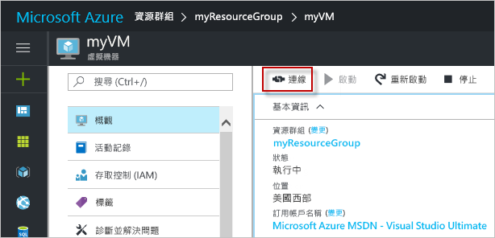

# <a name="create-a-linux-virtual-machine-with-the-azure-portal"></a>使用 Azure 入口網站建立 Linux 虛擬機器

您可以透過 Azure 入口網站建立 Azure 虛擬機器。 此方法可提供以瀏覽器為基礎的使用者介面，以便建立和設定虛擬機器，以及所有相關的資源。 本快速入門會逐步說明如何使用 Azure 入口網站建立虛擬機器。

如果您沒有 Azure 訂用帳戶，請在開始前建立 [免費帳戶](https://azure.microsoft.com/en-us/free/?WT.mc_id=A261C142F) 。

## <a name="create-ssh-key-pair"></a>建立 SSH 金鑰組

您需要有 SSH 金鑰組才能完成本快速入門。 如果現有的 SSH 金鑰組，則可略過此步驟。 如果您使用 Windows 電腦，請依照[這裡](ssh-from-windows.md)的指示操作。 

從 Bash 殼層，執行此命令並遵循畫面上的指示操作。 命令輸出包含公開金鑰檔案的檔案名稱。 建立虛擬機器時需要此檔案的內容。

```bash
ssh-keygen -t rsa -b 2048
```

## <a name="log-in-to-azure"></a>登入 Azure 

登入 Azure 入口網站，網址是 http://portal.azure.com/。

## <a name="create-virtual-machine"></a>Create virtual machine

1. 按一下 Azure 入口網站左上角的 [新增] 按鈕。

2. 選取 [新增] 刀鋒視窗中的 [計算]，選取 [計算] 刀鋒視窗中的 [Ubuntu Server 16.04 LTS]，然後按一下 [建立] 按鈕。

3. 填寫虛擬機器 [基本資訊] 表單。 針對 [驗證類型] 選取 [SSH]。 貼上 [SSH 公開金鑰] 時，請謹慎地移除任何前置或尾端的空白字元。 對於 [資源群組]，建立新的資源群組。 資源群組是在其中建立和共同管理 Azure 資源的邏輯容器。 完成時，按一下 [確定]。

      

4. 選擇 VM 的大小。 若要查看更多大小，請選取 [檢視全部] 或變更 [支援的磁碟類型] 篩選條件。 

      

5. 在 [設定] 刀鋒視窗中，選取 [使用受控磁碟] 之下的 [是]，保留其餘設定的預設值，然後按一下 [確定]。

6. 在 [摘要] 頁面上，按一下 [確定] 來啟動虛擬機器部署。

7. 若要監視部署狀態，請按一下虛擬機器。 在 Azure 入口網站儀表板上，或藉由選取左側功能表的 [虛擬機器]，即可找到此 VM。 建立 VM 後，狀態會從 [部署中] 變更為 [執行中]。


## <a name="open-port-80-for-web-traffic"></a>針對 Web 流量開啟連接埠 80 

依預設只能透過 SSH 連線至 Azure 中部署的 Linux 虛擬機器。 如果此 VM 即將成為 Web 伺服器，您需要對 Web 流量開啟連接埠 80。 此步驟會引導您建立網路安全性群組 (NSG) 規則，以允許連接埠 80 上的輸入連線。

1. 在虛擬機器刀鋒視窗的 [基本資訊] 區段中，按一下 [資源群組] 的名稱。
2. 在資源群組刀鋒視窗中，按一下資源清單中的 [網路安全性群組]。 NSG 名稱應該是 VM 名稱結尾附加 -nsg。
3. 按一下 [輸入安全性規則] 標題，以開啟輸入規則清單。 您應會看到清單中已經有 RDP 的規則。
4. 按一下 [+ 新增] 以開啟 [新增輸入安全性規則] 刀鋒視窗。
5. 在 [名稱] 中輸入 **nginx**。 確定 [連接埠範圍] 已設為 80 且 [動作] 已設為 [允許]。 按一下 [確定] 。


## <a name="connect-to-virtual-machine"></a>連線至虛擬機器

完成部署之後，建立與虛擬機器的 SSH 連線。

1. 按一下虛擬機器刀鋒視窗上的 [連線] 按鈕。 [連線] 按鈕顯示的 SSH 連接字串可用來連線至虛擬機器。

     

2. 執行以下命令來建立 SSH 工作階段。 以您從 Azure 入口網站複製的連接字串取代此連接字串。

```bash 
ssh <replace with IP address>
```

## <a name="install-nginx"></a>安裝 NGINX

使用下列 bash 指令碼來更新套件來源及安裝最新的 NGINX 套件。 

```bash 
#!/bin/bash

# update package source
apt-get -y update

# install NGINX
apt-get -y install nginx
```

## <a name="view-the-ngix-welcome-page"></a>檢視 NGIX 歡迎使用頁面

安裝 NGINX 後，現在經由網際網路在您的 VM 上開啟連接埠 80 - 您可以使用所選的網頁瀏覽器來檢視預設 NGINX 歡迎使用畫面。 請務必使用您記載的 `publicIpAddress` 來瀏覽預設網頁。 

 
## <a name="delete-virtual-machine"></a>刪除虛擬機器

若不再需要，可刪除資源群組、虛擬機器和所有相關資源。 若要這樣做，請選取虛擬機器刀鋒視窗中的資源群組，然後按一下 [刪除]。

## <a name="next-steps"></a>後續步驟

[建立高可用性的虛擬機器教學課程](create-cli-complete.md?toc=%2fazure%2fvirtual-machines%2flinux%2ftoc.json)

[瀏覽 VM 部署 CLI 範例](../windows/cli-samples.md?toc=%2fazure%2fvirtual-machines%2flinux%2ftoc.json)

