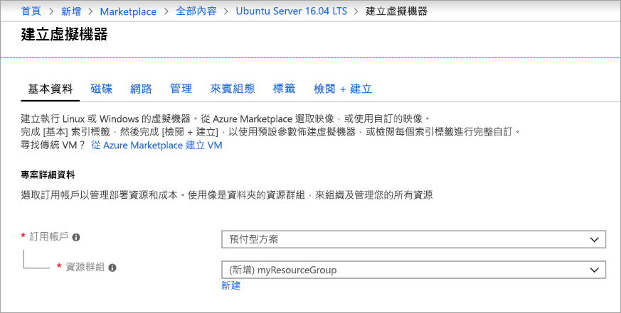
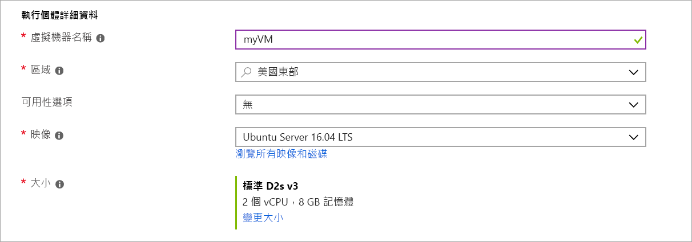
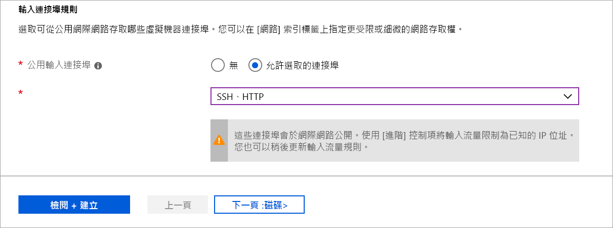

# <a name="quickstart-create-a-linux-virtual-machine-in-the-azure-portal"></a>快速入門：在 Azure 入口網站中建立 Linux 虛擬機器

您可以透過 Azure 入口網站建立 Azure 虛擬機器 (VM)。 此方法可提供以瀏覽器為基礎的使用者介面，以便建立 VM 及其相關聯的資源。 本快速入門說明如何使用 Azure 入口網站，在 Azure 中部署執行 Ubuntu 的 Linux 虛擬機器 (VM)。 若要查看作用中的 VM，接著要以 SSH 連線至 VM，並安裝 NGINX 網頁伺服器。

如果您沒有 Azure 訂用帳戶，請在開始前建立 [免費帳戶](https://azure.microsoft.com/free/?WT.mc_id=A261C142F) 。

## <a name="create-ssh-key-pair"></a>建立 SSH 金鑰組

您必須要有 SSH 金鑰組，才能完成本快速入門的操作。 如果現有的 SSH 金鑰組，則可略過此步驟。

若要建立 SSH 金鑰組並登入 Linux VM，請從 Bash 殼層執行下列命令，並依照螢幕上的指示操作。 例如，您可以使用 [Azure Cloud Shell](../../cloud-shell/overview.md) 或[適用於 Linux 的 Windows Substem](/windows/wsl/install-win10)。 命令輸出包含公開金鑰檔案的檔案名稱。 將公開金鑰檔案 (`cat ~/.ssh/id_rsa.pub`) 的內容複製到剪貼簿：

```bash
ssh-keygen -t rsa -b 2048
```

如需如何建立 SSH 金鑰的詳細資訊 (包括 PuTTy 的用法)，請參閱[對 Windows 使用 SSH 金鑰](ssh-from-windows.md)。

## <a name="log-in-to-azure"></a>登入 Azure

在 http://portal.azure.com 上登入 Azure 入口網站

## <a name="create-virtual-machine"></a>建立虛擬機器

1. 選擇 Azure 入口網站左上角的 [建立資源]。

1. 在 Azure Marketplace 資源清單上方的搜尋方塊中，依 Canonical 搜尋並選取**Ubuntu Server 16.04 LTS**，然後選擇 [建立]。

1. 在 [基本資料] 索引標籤中的 [專案詳細資料] 底下，確認已選取正確的訂用帳戶，然後在 [資源群組] 下方選擇 [新建]。 在快顯視窗中輸入 *myResourceGroup* 作為資源群組的名稱，然後選擇 [*確定]。 

    

1. 在 [執行個體詳細資料] 底下，輸入 myVM 作為 [虛擬機器名稱]，然後選擇 [美國東部] 作為您的 [區域]。 其他部分保留預設值。

    

1. 在 [系統管理員帳戶] 下方選取 [SSH 公開金鑰]，輸入您的使用者名稱，然後將您的公開金鑰貼到文字方塊中。 請移除公開金鑰中的任何前置或尾端的空白字元。

    

1. 在 [輸入連接埠規則] > [公用輸入連接埠] 下方，選擇 [允許選取的連接埠]，然後從下拉式清單中選取 [SSH (22)] 和 [HTTP (80)]。 

    

1. 保留其餘預設值，然後在頁面底部選取 [檢閱 + 建立] 按鈕。

    
## <a name="connect-to-virtual-machine"></a>連線至虛擬機器

建立與 VM 的 SSH 連線。

1. 在 VM 的 [概觀] 頁面上選取 [連線] 按鈕。 

    

2. 在 [連線至虛擬機器] 頁面中，保留以 DNS 名稱透過連接埠 22 進行連線的預設選項。 在**使用 VM 本機帳戶登入**中，會顯示連線命令。 按一下按鈕以複製該命令。 下列範例說明 SSH 連線命令的內容：

    ```bash
    ssh azureuser@myvm-123abc.eastus.cloudapp.azure.com
    ```

3. 將 SSH 連線命令貼到殼層中 (例如 Azure Cloud Shell 或 Windows 上 Ubuntu 的 Bash)，以建立連線。 

## <a name="install-web-server"></a>安裝 Web 伺服器

若要查看作用中的 VM，請安裝 NGINX 網頁伺服器。 若要更新套件來源並安裝最新的 NGINX 套件，請從 SSH 工作階段執行下列命令：

```bash
# update packages
sudo apt-get -y update

# install NGINX
sudo apt-get -y install nginx
```

完成時，請 `exit` SSH 工作階段並返回 Azure 入口網站中的 VM 屬性。


## <a name="view-the-web-server-in-action"></a>檢視作用中的網頁伺服器

安裝 NGINX 後，且連接埠 80 對您的 VM 開啟，即可立即從網際網路存取網頁伺服器。 開啟 Web 瀏覽器，並輸入 VM 的公用 IP 位址。 您可以在 VM 的 [概觀] 頁面找到公用 IP 位址，或在您新增輸入連接埠規則的 [網路] 頁面頂端找到。


## <a name="clean-up-resources"></a>清除資源

若不再需要，您可以刪除資源群組、虛擬機器和所有相關資源。 若要這樣做，請選取虛擬機器的資源群組，選取 [刪除]，然後確認要刪除的資源群組名稱。

## <a name="next-steps"></a>後續步驟

在此快速入門中，您已部署簡單的虛擬機器、建立網路安全性群組和規則，並已安裝基本的 Web 伺服器。 若要深入了解 Azure 虛擬機器，請繼續 Linux VM 的教學課程。

> [!div class="nextstepaction"]
> [Azure Linux 虛擬機器教學課程](./tutorial-manage-vm.md)
