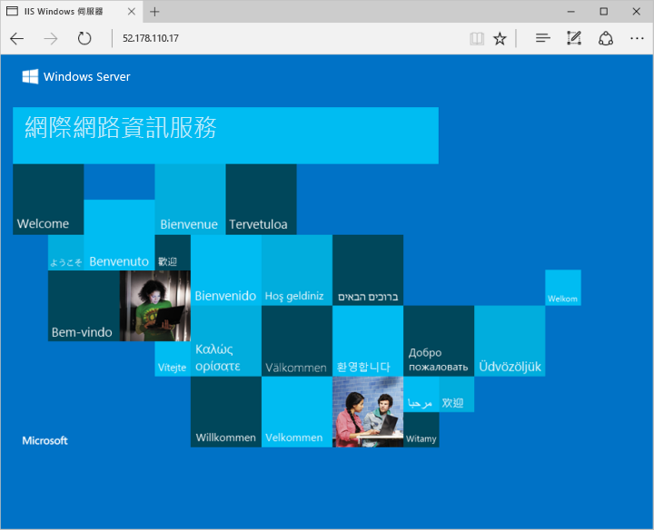

# <a name="create-a-windows-virtual-machine-with-powershell"></a>使用 PowerShell 建立 Windows 虛擬機器

Azure PowerShell 模組用於從 PowerShell 命令列或在指令碼中建立和管理 Azure 資源。 本快速入門詳細說明如何使用 PowerShell 來建立執行 Windows Server 2016 的 Azure 虛擬機器。 部署完成後，我們會連線至伺服器並安裝 IIS。  

如果您沒有 Azure 訂用帳戶，請在開始前建立 [免費帳戶](https://azure.microsoft.com/free/?WT.mc_id=A261C142F) 。

[!INCLUDE [cloud-shell-powershell.md](../../../includes/cloud-shell-powershell.md)]

如果您選擇在本機安裝和使用 PowerShell，本教學課程會要求使用 Azure PowerShell 模組版本 5.1.1 或更新版本。 執行 ` Get-Module -ListAvailable AzureRM` 以尋找版本。 如果您需要升級，請參閱[安裝 Azure PowerShell 模組](/powershell/azure/install-azurerm-ps)。 如果您在本機執行 PowerShell，則也需要執行 `Login-AzureRmAccount` 以建立與 Azure 的連線。


## <a name="create-resource-group"></a>建立資源群組

使用 [New-AzureRmResourceGroup](/powershell/module/azurerm.resources/new-azurermresourcegroup) 建立 Azure 資源群組。 資源群組是在其中部署與管理 Azure 資源的邏輯容器。 

```azurepowershell-interactive
New-AzureRmResourceGroup -Name myResourceGroup -Location EastUS
```


## <a name="create-virtual-machine"></a>Create virtual machine

使用 [New-AzureRmVM](/powershell/module/azurerm.compute/new-azurermvm) 建立虛擬機器。 您只需要提供每個資源的名稱，而 New-AzureRMVM cmdlet 會為您建立這些名稱 (不存在的話)。

執行此步驟時，系統會提示您輸入認證。 您輸入的值會設定為虛擬機器的使用者名稱和密碼。

```azurepowershell-interactive
New-AzureRmVm `
    -ResourceGroupName "myResourceGroup" `
    -Name "myVM" `
    -Location "East US" `
    -VirtualNetworkName "myVnet" `
    -SubnetName "mySubnet" `
    -SecurityGroupName "myNetworkSecurityGroup" `
    -PublicIpAddressName "myPublicIpAddress" `
    -OpenPorts 80,3389  
```

## <a name="connect-to-virtual-machine"></a>連線至虛擬機器

完成部署之後，建立與虛擬機器的遠端桌面連線。

使用 [Get-AzureRmPublicIpAddress](/powershell/module/azurerm.network/get-azurermpublicipaddress) 命令，以傳回虛擬機器的公用 IP 位址。 記下這個 IP 位址，您便可以使用瀏覽器進行連線，以在未來步驟中測試 Web 連線能力。

```azurepowershell-interactive
Get-AzureRmPublicIpAddress -ResourceGroupName myResourceGroup | Select IpAddress
```

在本機電腦上使用下列命令，建立使用虛擬機器的遠端桌面工作階段。 以虛擬機器的 publicIPAddress 取代 IP 位址。 出現提示時，請輸入您在建立虛擬機器時所使用的認證。

```
mstsc /v:<publicIpAddress>
```

## <a name="install-iis-via-powershell"></a>透過 PowerShell 安裝 IIS

您現已登入 Azure VM，可使用一行 PowerShell 來安裝 IIS，並啟用本機防火牆規則以允許 Web 流量通過。 在 VM 上開啟 PowerShell 提示字元並執行下列命令：

```azurepowershell
Install-WindowsFeature -name Web-Server -IncludeManagementTools
```

## <a name="view-the-iis-welcome-page"></a>檢視 IIS 歡迎使用頁面

安裝 IIS 後，現在經由網際網路在您的 VM 上開啟連接埠 80 - 您可以使用所選的網頁瀏覽器來檢視預設 IIS 歡迎使用畫面。 請務必使用您上面記載的 publicIpAddress 來瀏覽預設網頁。 

 

## <a name="clean-up-resources"></a>清除資源

若不再需要，您可以使用 [Remove-AzureRmResourceGroup](/powershell/module/azurerm.resources/remove-azurermresourcegroup) 命令來移除資源群組、VM 和所有相關資源。

```azurepowershell-interactive
Remove-AzureRmResourceGroup -Name myResourceGroup
```

## <a name="next-steps"></a>後續步驟

在此快速入門中，您已部署簡單的虛擬機器、網路安全性群組規則，並已安裝 Web 伺服器。 若要深入了解 Azure 虛擬機器，請繼續 Windows VM 的教學課程。

> [!div class="nextstepaction"]
> [Azure Windows 虛擬機器教學課程](./tutorial-manage-vm.md)
