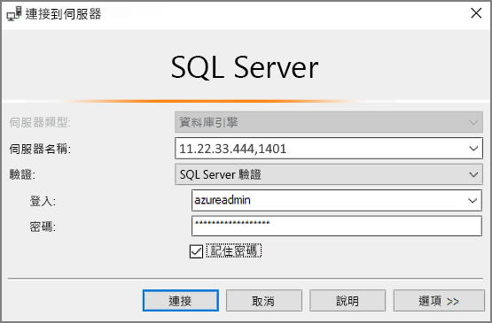

# 快速入門：在 Azure 入口網站中建立 SQL Server 2017 Windows 虛擬機器

> [!div class="op_single_selector"]
> * [Windows](quickstart-sql-vm-create-portal.md)
> * [Linux](../../linux/sql/provision-sql-server-linux-virtual-machine.md)

本快速入門會逐步說明如何在 Azure 入口網站中建立 SQL Server 虛擬機器。

> [!TIP]
> 本快速入門提供快速佈建及連線到 SQL VM 的途徑。 如需其他 SQL VM 佈建選項的詳細資訊，請參閱[在 Azure 入口網站中佈建 Windows SQL Server VM 的指南](virtual-machines-windows-portal-sql-server-provision.md)。

> [!TIP]
> 如果您有 SQL Server 虛擬機器的相關問題，請參閱[常見問題集](virtual-machines-windows-sql-server-iaas-faq.md)。

##  取得 Azure 訂用帳戶

如果您沒有 Azure 訂用帳戶，請在開始前建立 [免費帳戶](https://azure.microsoft.com/free/?WT.mc_id=A261C142F) 。

##  選取 SQL Server VM 映像

1. 使用您的帳戶登入 [Azure 入口網站](https://portal.azure.com) 。

1. 在 Azure 入口網站中，按一下 [建立資源]。 

1. 在搜尋方塊中輸入 **Windows Server 2016 上的 SQL Server 2017 Developer**，然後按 ENTER。

1. 選取 [免費 SQL Server 授權︰Windows Server 2016 上的 SQL Server 2017 Developer] 映像。

   

   > [!TIP]
   > 本教學課程中使用 Developer 版本，因為它是免費供開發測試使用的 SQL Server 完整功能版。 您只需支付執行 VM 的費用。 如需完整的定價考量，請參閱 [SQL Server Azure VM 的定價指導方針](virtual-machines-windows-sql-server-pricing-guidance.md)。

1. 按一下頁面底部的 [新增] 。

##  提供基本詳細資料

在 [基本概念]  視窗中提供下列資訊：

1. 在 [名稱] 欄位中，輸入唯一的虛擬機器名稱。 

1. 在 [使用者名稱] 欄位中，輸入 VM 上本機系統管理員帳戶的使用者名稱。

1. 提供強式 [密碼] 。

1. 輸入新的**資源群組**名稱。 此群組有助於管理與虛擬機器相關聯的所有資源。

1. 確認其他預設值，然後按一下 [確定] 以繼續。

   

## 選擇虛擬機器大小

1. 在 [大小] 步驟上，請在 [選擇大小] 視窗中選擇虛擬機器大小。

   在此快速入門中選取 [D2S_V3]。 入口網站顯示持續使用 (不包括 SQL Server 授權成本) 的每月預估機器成本。 請注意，Developer 版本沒有 SQL Server 的額外授權成本。 如需特定的定價詳細資訊，請參閱[頁面](https://azure.microsoft.com/pricing/details/virtual-machines/windows/)。

   > [!TIP]
   > **D2S_V3** 機器大小在測試時可以節省金錢。 但對於生產工作負載，請參閱 [Azure 虛擬機器中的 SQL Server 效能最佳做法](virtual-machines-windows-sql-performance.md)中建議的機器大小和組態。

1. 按一下 [選取] 以繼續操作。

## 設定選用功能

1. 在 [設定] 視窗中，如果您要從遠端桌面進入 VM，請選取 [選取公用輸入連接埠] 清單中的 [RDP (3389)] 連接埠。

   

   > [!NOTE]
   > 您可以選取 [MS SQL (1433)] 連接埠，以從遠端存取 SQL Server。 但這並非必要動作，因為 **SQL Server 設定**步驟也會提供此選項。 如果您在此步驟中選取連接埠 1433，則無論您在 **SQL Server 設定**步驟中進行了哪些選取，該連接埠都會開啟。

1. 按一下 [確定]  以儲存變更並繼續。

## SQL Server 設定

在 [SQL Server 設定] 視窗中，設定下列選項。

1. 在 [SQL 連線能力] 下拉式清單中，選取 [公用 (網際網路)]。 這可讓 SQL Server 透過網際網路連線。

1. 將**連接埠**變更至 **1401** 以避免使用公用環境中常用的連接埠名稱。

1. 在 [SQL 驗證] 下，按一下 [啟用]。 SQL 登入設定為您對 VM 設定的相同使用者名稱和密碼。

1. 如有需要可變更任何其他設定，然後按一下 [確定] 以完成 SQL Server VM 的設定。

   

## 建立 SQL Server VM

在 [摘要] 視窗上檢閱摘要，然後按一下 [購買] 來建立為此 VM 指定的 SQL Server、資源群組及資源。

您可以從 Azure 入口網站監視部署。 畫面頂端的 [通知]  按鈕會顯示基本的部署狀態。

> [!TIP]
> 部署 Windows SQL Server VM 可能需要幾分鐘的時間。

## 連接到 SQL Server

1. 在入口網站中，在虛擬機器內容的 [概觀] 區段中尋找 VM 的 [公用 IP 位址]。

1. 在已連線網際網路的其他電腦上開啟 SQL Server Management Studio (SSMS)。

   > [!TIP]
   > 如果您沒有 SQL Server Management Studio，您可以在[這裡](https://docs.microsoft.com/sql/ssms/download-sql-server-management-studio-ssms)下載。

1. 在 [連接到伺服器] 或 [連接到 Database Engine] 對話方塊中，編輯 [伺服器名稱] 值。 輸入您 VM 的公用 IP 位址。 然後加入一個逗號，並加入我們在您設定新的 VM 時所指定的自訂連接埠 **1401**。 例如： `11.22.33.444,1401`。

1. 在 [驗證] 方塊中，選取 [SQL Server 驗證]。

1. 在 [登入]  方塊中，輸入有效的 SQL 登入名稱。

1. 在 [密碼]  方塊中，輸入登入的密碼。

1. 按一下 [ **連接**]。

    

##  從遠端登入 VM

使用下列步驟，透過遠端桌面連線到 SQL Server 虛擬機器︰

[!INCLUDE [Connect to SQL Server VM with remote desktop](../../../../includes/virtual-machines-sql-server-remote-desktop-connect.md)]

連線到 SQL Server 虛擬機器之後，您可以啟動 SQL Server Management Studio，然後使用您的本機系統管理員認證透過「Windows 驗證」進行連線。 如果您已啟用 SQL Server 驗證，您也可以使用您在佈建期間所設定的 SQL 登入和密碼以 SQL 驗證連線。

存取電腦可讓您根據您的需求直接變更電腦和 SQL Server 設定。 例如，您可以設定防火牆設定或變更 SQL Server 組態設定。

## 清除資源

如果您不需要持續執行 SQL VM，您可以在不使用時將其停止，以避免不必要的費用。 您也可以藉由在入口網站中刪除與虛擬機器相關聯的資源群組，永久刪除與其相關聯的所有資源。 這也會永久刪除虛擬機器，因此請小心使用此命令。 如需詳細資訊，請參閱[透過入口網站管理 Azure 資源](../../../azure-resource-manager/resource-group-portal.md)。

## 後續步驟

在本快速入門中，您已在 Azure 入口網站中建立了 SQL Server 2017 虛擬機器。 若要深入了解如何將您的資料移轉至新的 SQL Server，請參閱下列文章。

> [!div class="nextstepaction"]
> [將資料庫移轉至 SQL VM](virtual-machines-windows-migrate-sql.md)
