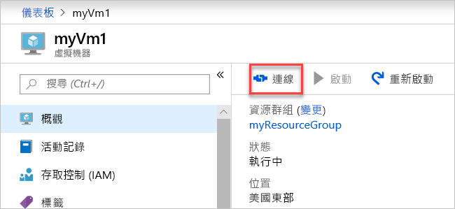

# <a name="quickstart-create-a-virtual-network-using-the-azure-portal"></a>快速入門：使用 Azure 入口網站建立虛擬網路

虛擬網路可讓 Azure 資源 (例如虛擬機器 (VM)) 彼此及與網際網路進行私密通訊。 在此快速入門中，您將了解如何建立虛擬網路。 建立虛擬網路之後，您需將兩個 VM 部署至虛擬網路中。 接著，您需從網際網路連線至其中一個 VM，然後在兩個 VM 之間進行私密通訊。

如果您沒有 Azure 訂用帳戶，請立即建立[免費帳戶](https://azure.microsoft.com/free/?WT.mc_id=A261C142F)。

## <a name="sign-in-to-azure"></a>登入 Azure

登入 [Azure 入口網站](https://portal.azure.com)。

## <a name="create-a-virtual-network"></a>建立虛擬網路

1. 在畫面的左上方，選取 [建立資源] > [網路] > [虛擬網路]。

1. 在 [建立虛擬網路] 中，輸入或選取這項資訊：

    | 設定 | 值 |
    | ------- | ----- |
    | Name | 輸入 *myVirtualNetwork*。 |
    | 位址空間 | 輸入 *10.1.0.0/16*。 |
    | 訂用帳戶 | 選取您的訂用帳戶。|
    | 資源群組 | 選取 [新建]，輸入 *myResourceGroup*，然後選取 [確定]。 |
    | 位置 | 選取 [美國東部]。|
    | 子網路 - 名稱 | 輸入 *myVirtualSubnet*。 |
    | 子網路 - 位址範圍 | 輸入 *10.1.0.0/24*。 |

1. 保留其餘的預設值，然後選取 [建立]。

## <a name="create-virtual-machines"></a>建立虛擬機器

在虛擬網路內建立兩個 VM：

### <a name="create-the-first-vm"></a>建立第一個 VM

1. 畫面的左上方，選取 [建立資源] > [計算] > [Windows Server 2016 Datacenter]。

1. 在 [建立虛擬機器 - 基本] 中，輸入或選取這項資訊：

    | 設定 | 值 |
    | ------- | ----- |
    | **專案詳細資料** | |
    | 訂用帳戶 | 選取您的訂用帳戶。 |
    | 資源群組 | 選取 **MyResourceGroup**。 您已在上一節建立它。 |
    | **執行個體詳細資料** |  |
    | 虛擬機器名稱 | 輸入 *myVm1*。 |
    | 區域 | 選取 [美國東部]。 |
    | 可用性選項 | 保留預設值 [不需要基礎結構備援]。 |
    | 映像 | 保留預設值 [Windows Server 2016 Datacenter]。 |
    | 大小 | 保留預設值 [標準 DS1 v2]。 |
    | **系統管理員帳戶** |  |
    | 使用者名稱 | 輸入您選擇的使用者名稱。 |
    | 密碼 | 輸入您選擇的密碼。 密碼長度至少必須有 12 個字元，而且符合[定義的複雜度需求](../virtual-machines/windows/faq.md?toc=%2fazure%2fvirtual-network%2ftoc.json#what-are-the-password-requirements-when-creating-a-vm)。|
    | 確認密碼 | 再次輸入密碼。 |
    | **輸入連接埠規則** |  |
    | 公用輸入連接埠 | 保留預設值 [無]。 |
    | **節省費用** |  |
    | 已經有 Windows 授權？ | 保留預設值 [否]。 |

1. 選取 [下一步:磁碟]。

1. 在 [建立虛擬機器 - 磁碟]，保留預設值並選取 [下一步:網路功能]。

1. 在 [建立虛擬機器 - 網路功能] 中，選取這項資訊：

    | 設定 | 值 |
    | ------- | ----- |
    | 虛擬網路 | 保留預設值 [myVirtualNetwork]。 |
    | 子網路 | 保留預設值 [myVirtualSubnet (10.1.0.0/24)]。 |
    | 公用 IP | 保留預設值 [(new) myVm-ip]。 |
    | 網路安全性連接埠 | 選取 [允許選取的連接埠]。 |
    | 選取輸入連接埠 | 選取 [HTTP] 和 [RDP]。

1. 選取 [下一步:管理]。

1. 在 [建立虛擬機器 - 管理] 中，針對 [診斷儲存體帳戶]，選取 [新建]。

1. 在 [建立儲存體帳戶] 中，輸入或選取這項資訊：

    | 設定 | 值 |
    | ------- | ----- |
    | Name | 輸入 *myvmstorageaccount*。 |
    | 帳戶類型 | 保留預設值 [儲存體 (一般用途 v1)]。 |
    | 效能 | 保留預設值 [標準]。 |
    | 複寫 | 保留預設值 [本地備援儲存體 (LRS)]。 |

1. 選取 [確定]

1. 選取 [檢閱 + 建立]。 您會移至 [檢閱 + 建立] 頁面，且 Azure 會驗證您的設定。

1. 當您看到 [驗證成功] 時，選取 [建立]。

### <a name="create-the-second-vm"></a>建立第二個 VM

1. 完成上述的步驟 1 到 9。

    > [!NOTE]
    > 在步驟 2 中，針對 [虛擬機器名稱] 輸入 *myVm2*。
    >
    > 在步驟 7 中，針對 [診斷儲存體帳戶]，務必選取 [myvmstorageaccount]。

1. 選取 [檢閱 + 建立]。 您會移至 [檢閱 + 建立] 頁面，且 Azure 會驗證您的設定。

1. 當您看到 [驗證成功] 時，選取 [建立]。

## <a name="connect-to-a-vm-from-the-internet"></a>從網際網路連線至 VM

在您建立 *myVm1* 之後，透過網際網路與其連線。

1. 在入口網站的搜尋列中，輸入 *myVm1*。

1. 選取 [連線]  按鈕。

    

    選取 [連線] 按鈕之後，隨即會開啟 [連線至虛擬機器]。

1. 選取 [下載 RDP 檔案]。 Azure 會建立一個「遠端桌面通訊協定」(*.rdp*) 檔案，並下載至您的電腦。

1. 開啟下載的 *.rdp* 檔案。

    1. 如果出現提示，請選取 [連接]。

    1. 輸入您在建立 VM 時指定的使用者名稱和密碼。

        > [!NOTE]
        > 您可能需要選取 [其他選擇] > [使用不同的帳戶]，以指定您在建立 VM 時輸入的認證。

1. 選取 [確定] 。

1. 您可能會在登入過程中收到憑證警告。 如果您收到憑證警告，請選取 [是] 或 [繼續]。

1. 當 VM 桌面出現之後，將它最小化以回到您的本機桌面。

## <a name="communicate-between-vms"></a>虛擬機器之間的通訊

1. 在 *myVm1* 的遠端桌面中，開啟 PowerShell。

1. 輸入 `ping myVm2` 。

    您會收到類似此訊息：

    ```powershell
    Pinging myVm2.0v0zze1s0uiedpvtxz5z0r0cxg.bx.internal.clouda
    Request timed out.
    Request timed out.
    Request timed out.
    Request timed out.

    Ping statistics for 10.1.0.5:
    Packets: Sent = 4, Received = 0, Lost = 4 (100% loss),
    ```

    `ping` 失敗，因為 `ping` 使用網際網路控制訊息通訊協定 (ICMP)。 根據預設，ICMP 不允許通過 Windows 防火牆。

1. 為了讓 *myVm2* 在稍後的步驟中可以 Ping *myVm1*，輸入此命令：

    ```powershell
    New-NetFirewallRule –DisplayName “Allow ICMPv4-In” –Protocol ICMPv4
    ```

    該命令可讓 ICMP 輸入通過 Windows 防火牆：

1. 關閉對 *myVm1* 的遠端桌面連線。

1. 再次完成[從網際網路連線至 VM](#connect-to-a-vm-from-the-internet) 中的步驟，但連線至 *myVm2*。

1. 從命令提示字元，輸入 `ping myvm1`。

    您會收到類似此訊息：

    ```powershell
    Pinging myVm1.0v0zze1s0uiedpvtxz5z0r0cxg.bx.internal.cloudapp.net [10.1.0.4] with 32 bytes of data:
    Reply from 10.1.0.4: bytes=32 time=1ms TTL=128
    Reply from 10.1.0.4: bytes=32 time<1ms TTL=128
    Reply from 10.1.0.4: bytes=32 time<1ms TTL=128
    Reply from 10.1.0.4: bytes=32 time<1ms TTL=128

    Ping statistics for 10.1.0.4:
        Packets: Sent = 4, Received = 4, Lost = 0 (0% loss),
    Approximate round trip times in milli-seconds:
        Minimum = 0ms, Maximum = 1ms, Average = 0ms
    ```

    您會從 *myVm1* 收到回覆，因為您在先前的步驟中允許 ICMP 通過 *myVm1* VM 上的 Windows 防火牆。

1. 關閉對 *myVm2* 的遠端桌面連線。

## <a name="clean-up-resources"></a>清除資源

當您完成使用虛擬網路和 VM 時，可以刪除資源群組以及其包含的所有資源：

1. 在入口網站頂端的 [搜尋] 方塊中，輸入 myResourceGroup。

1. 當您在搜尋結果中看到 myResourceGroup 時，請加以選取。

1. 選取 [刪除資源群組]。

1. 針對 [輸入資源群組名稱] 輸入 *myResourceGroup*，然後選取 [刪除]。

## <a name="next-steps"></a>後續步驟

在此快速入門中，您建立了一個預設的虛擬網路和兩個 VM。 您從網際網路連線至其中一個 VM，然後在兩個 VM 之間進行私密通訊。 若要深入了解虛擬網路設定，請參閱[管理虛擬網路](manage-virtual-network.md)。

根據預設，Azure 允許 VM 之間進行無限制的私密通訊。 相對地，它只允許從網際網路連線到 Windows VM 的輸入遠端桌面連線。 若要深入了解設定不同類型的 VM 網路通訊，請移至[篩選網路流量](tutorial-filter-network-traffic.md)教學課程。