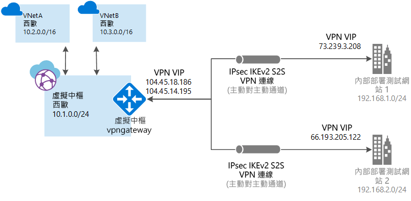

# 什麼是 Azure 虛擬 WAN？ (預覽)

Azure 虛擬 WAN 是一種網路服務，透過 Azure 提供最佳且自動化的分支對分支連線。 虛擬 WAN 可讓您連線，並設定與 Azure 通訊的分支裝置。 做法是以手動方式，或透過虛擬 WAN 合作夥伴使用慣用的提供者裝置。 使用慣用的提供者裝置可讓您易於使用、簡化連線和組態管理。 Azure WAN 的內建儀表板提供即時的疑難排解深入解析，可協助您節省時間，並可讓您輕鬆地檢視大規模的站對站連線。

> [!IMPORTANT]
> Azure 虛擬 WAN 目前為受控的公開預覽版本。 若要使用虛擬 WAN，您必須[註冊預覽版](#enroll)。
>
> 此公開預覽版是在沒有服務等級協定的情況下提供，不得用於生產工作負載。 可能不支援特定功能、可能已經限制功能，或者可能無法在所有 Azure 位置提供使用。 如需詳細資訊，請參閱 [Microsoft Azure 預覽專用的補充使用條款](https://azure.microsoft.com/support/legal/preview-supplemental-terms/)。

本文可讓您快速檢視 Azure 與非 Azure 工作負載的網路連線。 虛擬 WAN 提供下列優點：

* **中樞和輪輻中的整合式連線解決方案：** 各種來源 (包括虛擬 WAN 合作夥伴解決方案) 的內部部署網站與 Azure 中樞之間的自動站對站組態和連線。
* **自動化輪輻設定和組態：** 將您的虛擬網路和工作負載順暢地連線至 Azure 中樞。
* **直覺式疑難排解：** 您會看到 Azure 內的端對端流程，並使用此資訊來採取必要的動作。

## 與虛擬 WAN 合作夥伴合作

1. 分支裝置 (VPN/SDWAN) 控制器會進行驗證，使用 Azure 服務主體，將以網站為中心的資訊匯出至 Azure。
2. 分支裝置 (VPN/SDWAN) 控制器會取得 Azure 連線設定，並更新本機裝置。 這會將設定下載、編輯和更新內部部署 VPN 裝置等動作自動化。
3. 一旦裝置具有正確的 Azure 組態後，隨即建立與 Azure WAN 的站對站連線 (兩個使用中的通道)。 Azure 會要求分支 (VPN/SDWAN) 控制器支援 IKEv2。 BGP 為選擇性。

## 虛擬 WAN 資源

若要設定端對端虛擬 WAN，您可以建立下列資源：

* **virtualWAN：** virtualWAN 資源代表 Azure 網路的虛擬重疊，而且是多個資源的集合。 它包含所有您想要包含在虛擬 WAN 內虛擬中樞的連結。 虛擬 WAN 資源會互相隔離，且不能包含一般的中樞。 跨虛擬 WAN 的虛擬中樞不會互相通訊。

* **站台：** 稱為 vpnsite 的站台資源代表您的內部部署 VPN 裝置和其設定。 使用虛擬 WAN 合作夥伴，您將擁有內建的解決方案，會將這項資訊自動匯出至 Azure。

* **中樞：** 虛擬中樞是受 Microsoft 管理的虛擬網路。 中樞包含不同的服務端點，可啟用您內部部署網路 (vpnsite) 中的連線。 中樞是您在區域中的網路核心。 每個 Azure 區域只能有一個中樞。 當您使用 Azure 入口網站建立中樞時，它會自動建立虛擬中樞 VNet 和虛擬中樞 vpngateway。

  中樞閘道與您用於 ExpressRoute 與 VPN 閘道的虛擬網路閘道不同。 例如，當您使用虛擬 WAN 時，不用從您的內部部署網站直接建立與您 VNet 的站對站連線。 相反地，您要建立與中樞的站對站連線。 流量一律會傳送到中樞閘道。 這表示您的 VNet 不需要自己的虛擬網路閘道。 虛擬 WAN 可透過虛擬中樞和虛擬中樞閘道，讓您的 VNet 輕鬆地利用調整功能。 

* **中樞虛擬網路連線：** 您可以使用中樞虛擬網路連線資源，順暢地將中樞連線到您的虛擬網路。 在目前，您只能連線到相同中樞區域內的虛擬網路。

##在預覽版本中註冊

設定虛擬 WAN 之前，必須先在預覽版中註冊您的訂用帳戶。 否則，您將無法在入口網站中使用虛擬 WAN。 若要註冊，請將內含訂用帳戶識別碼的電子郵件傳送到 <azurevirtualwan@microsoft.com>。 當訂用帳戶註冊完成之後，您會收到電子郵件。

## 常見問題集

[!INCLUDE [Virtual WAN FAQ](../../includes/virtual-wan-faq-include.md)]

## 預覽意見反應

歡迎提供意見反應。 若要回報任何問題，或針對虛擬 WAN 提供意見反應 (正面或負面皆可)，請寄送電子郵件至 <azurevirtualwan@microsoft.com>。 請在主旨列中以 "[]" 包含您的公司名稱。 如果您要回報問題，請也包含您的訂用帳戶 ID。

## 後續步驟

若要使用虛擬 WAN 建立站對站連線，您可以前往[虛擬 WAN 夥伴](https://aka.ms/virtualwan)，或以手動方式建立連線。 若要以手動方式建立連線，請參閱[使用虛擬 WAN 建立站對站連線](virtual-wan-site-to-site-portal.md)。
