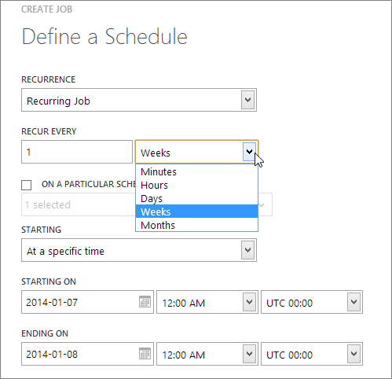
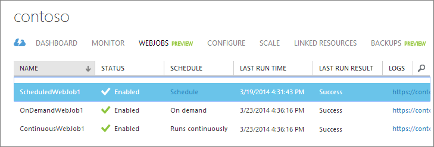
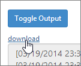
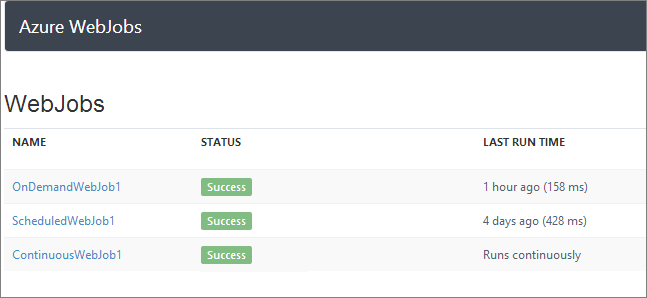

<properties  linkid="web-sites-create-web-jobs" urlDisplayName="How to create web jobs in Microsoft Azure" pageTitle="How to Create Web Jobs in Microsoft Azure Web Sites" metaKeywords="Microsoft Azure Web Sites, Web Jobs" description="Learn how to create web jobs in Microsoft Azure Web Sites." metaCanonical="" services="web-sites" documentationCenter="" title="How to Create Web Jobs in Microsoft Azure Web Sites" authors="timamm" solutions="" writer="timamm" manager="paulettm" editor="mollybos" />

# 如何使用 Microsoft Azure 網站的 WebJobs 功能

Microsoft Azure 網站可讓您利用以下三種方法中的任一種方法，在網站中執行程式或指令碼：隨選、連續或依照排程。除非您希望啟用本文章稍後描述的「永遠開啟」功能，否則不需要支付額外的費用即可使用 Microsoft Azure WebJobs。

## 目錄

* [可接受的指令碼檔案類型](#acceptablefiles)
* [建立隨選工作](#CreateOnDemand)
* [建立連續執行的工作](#CreateContinuous)
* [建立排程的工作](#CreateScheduled)
  * [排程的工作和 Azure 排程器](#Scheduler)

* [檢視工作歷程記錄](#ViewJobHistory)
* [注意事項](#WHPNotes)
* [後續步驟](#NextSteps)
  * [利用 Microsoft Azure WebJobs SDK 來實現更多可能](#WebJobsSDK)
  * [替代的部署方法](#AlternateDeployments)
  * [其他資源](#AdditionalResources)

## 可接受的指令碼檔案類型
以下檔案類型是接受的可執行指令碼：

.cmd、.bat、.exe (使用 Windows 命令提示字元)

.ps1 (使用 PowerShell)

.sh (使用 Bash)

.php (使用 PHP)

.py (使用 Python)

.js (使用 Node)

## 建立隨選工作

1.  在 **WebJobs** 頁面的命令列中按一下 **新增**。**新增工作** 對話方塊隨即出現。
    
    

2.  在 **名稱** 下方提供工作的名稱。名稱的開頭必須是字母或數字，而且不能含有 "-" 和 "_" 之外的任何特殊字元。

3.  在 **Content (Zip Files - 100MB Max)** 方塊中，瀏覽至含有指令碼的 zip 檔案。該 zip 檔案應包含您的可執行檔 (.exe .cmd .bat .sh .php .py .js)，以及執行程式或指令碼所需的任何支援檔案。

4.  在 **How to Run** 方塊中選擇 **Run on Demand**。

5.  勾選對話方塊右下角的核取方塊，將指令碼上傳到您的網站。您為工作指定的名稱會出現在清單中：
    
    

6.  若要執行指令碼，請在清單中選取名稱，然後在入口網站頁面底部的命令列中按一下 **執行一次**。
    
    

## 建立連續執行的工作

1.  若要建立連續執行的工作，請遵循建立執行一次之工作的步驟，但是 **How to Run** 方塊中選取 **連續執行**。
    
    

2.  若要啟動或停止連續執行的工作，請在清單中選取工作，然後在命令列中按一下 **啟動** 或 **停止**。

> [WACOM.NOTE] 如果您的網站執行多個執行個體，連續執行的工作會在所有執行個體上執行。隨選和排程的工作會在 Microsoft
> Azure 為負載平衡而選取的單一執行個體上執行。

> [WACOM.NOTE] 對於連續的工作，建議您在網站的 [設定]
> 頁面中啟用「永遠開啟」****。「永遠開啟」功能提供基本和標準兩種模式，它能預防網站遭到解除載入，即使網站閒置一段時間亦是如此。如果您的網站隨時處於載入狀態，連續執行之工作將能夠執行的更可靠。

## 建立排程工作

1.	若要建立排程工作，請遵循先前的步驟，但是 **How to Run** 方塊中選擇 **依排程執行**。

	![New Scheduled Job][NewScheduledJob]

1.  選擇工作的 **Scheduler Region**，然後按一下對話方塊右下角的箭頭以前往下一個畫面。

2.  在 **建立工作** 對話方塊中選擇所需的 **週期** 類型：**一次工作** 或 **週期性工作**。
    
    

3.  另請選擇 **開始** 時間：**現在** 或 **特定的時間**。
    
    

4.  如果您想要在特定時間開始，請在 **開始於** 下方選擇開始時間值。
    
    

5.  如果您選擇週期性工作，可以利用 **重複頻率** 選項來指定發生的頻率，以及利用 **結束於** 選項來指定結束時間。
    
    

6.  如果您選擇 **週**，可以選擇 **On a Particular Schedule** 方塊指定工作執行的工作日。
    
    

7.  如果您選擇 **月** 並選取 **On a Particular Schedule** 方塊，可以將工作設定為在每個月特定的 **日** 執行。
    
    

8.  如果您選擇 **工作天**，可以選擇要在哪一天或每個月的哪幾個工作天執行工作。
    
    

9.  最後，您還可以使用 **發生次數** 選項，選擇讓工作在每個月哪一週 (第一、第二、第三等) 的指定工作日執行。
    
    

10. 在建立一或多個工作之後，這些工作的名稱會連同狀態、排程類型及其他資訊一併顯示在 [WebJobs ] 索引標籤中。系統會保留前 30 個工作的歷程資訊。
    
    

### 您可以在 Azure
排程器入口網站中進一步設定排程工作和 Azure 排程器排程工作。

1.  在 **WebJobs] 頁面中，按一下工作的 [排程** 連結以瀏覽至 Azure 排程器入口網站頁面。
    
    

2.  在 [排程器] 頁面中按一下工作。
    
    ![[排程器]
    入口網站頁面中的工作](./media/web-sites-create-web-jobs/32SchedulerPortal.png)

3.  **工作動作** 頁面隨即開啟，您可以在其中進一步設定工作。
    
    

<!-- ================ ViewJobHistory ================= -->

## 檢視工作歷程記錄

1.	若要檢視工作的執行歷程記錄 (包括使用 WebJobs SDK 建立的工作)，請在 **記錄** 資料欄下按一下對應的連結。(如果需要，您可以使用剪貼簿圖示將記錄檔頁面的 URL 複製到剪貼簿。)

	![Logs Link][WebJobLogs]

1.  按一下連結可開啟工作的網站工作詳細資料。此頁面能顯示執行之命令的名稱、上次執行時間及成功或失敗。按一下 **Recent job runs** 下的時間可查看進一步的詳細資料。
    
    

2.  **WebJob 執行詳細資料** 頁面隨即出現。按一下 **切換輸出** 可查看記錄的文字內容。輸出記錄將會是文字格式。
    
    

3.  若要在個別的瀏覽器視窗中查看輸出文字，請按 **下載** 連結。若要下載文字本身，請以滑鼠右鍵按一下連結，然後使用瀏覽器選項來儲存檔案內容。
    
    

4.  頁面頂端的 **WebJobs** 連結可讓您以便利的方法在歷程記錄儀表板中取得網站工作的清單。
    
    
    
    
    
    按一下這些連結中的任一連結可帶您前往選取之工作的 [WebJob 詳細資料] 頁面。

## 注意事項

* 截至 2014 年 3 月為止，如果沒有對 scm (部署) 網站的要求，免費模式的網站可能會在 20 分鐘之後逾時，且 Azure 中的網站入口網站也不會開啟。對實際網站的要求將不會重設此項目。

* 連續工作的程式碼需經過撰寫，才能以無限迴圈的形式執行。

* 唯有當網站處於運作狀態時，連續工作才能連續執行。

* 基本和標準模式能提供「永遠開啟」功能，此功能在啟用後能預防網站進入閒置狀態。

## 後續步驟

### 利用 Microsoft Azure WebJobs SDK 來實現更多可能

 Microsoft Azure WebJobs SDK 能簡化將背景程序新增至 Microsoft Azure 網站的工作。SDK 能整合 Microsoft Azure 儲存體，進而在您將項目新增至佇列、Blob 及資料表時觸發程式中的功能。儀表板現已整合至 Azure 入口網站，它能針對您使用 SDK 撰寫的程式提供豐富的監控和診斷功能。監控和診斷功能內建於 SDK 中，因此您不需要在程式中新增任何特殊的程式碼。

如需詳細資訊，請參閱教學課程[開始使用 Microsoft Azure WebJobs SDK][1] (英文)。此教學課程提供 WebJobs SDK 的功能概觀，同時引導您逐步進行建立和執行簡易的 Hello World 背景程序。

若要查看使用 Microsoft Azure WebJobs SDK 建立之範例命令列應用程式的逐步解說，請參閱 [Windows Azure WebJobs 簡介][2] (英文)。

### 替代的部署方法
如果您不想使用 WebJobs 入口網站頁面來上傳指令碼，可以使用 FTP、git 或「Web 部署」。如需詳細資訊，請參閱[如何部署 Windows Azure WebJobs][3] (英文) 和[使用 Git 將 .NET 主控台應用程式部署到使用 WebJobs 的 Azure][4] (英文)。

### 其他資源

* 如需加入註解的 WebJobs 功能連結清單，請參閱[使用 Windows Azure 網站的 WebJobs 功能][5] (英文)。

* WebJobs 相關影片：
  
  [Azure WebJobs 101 - Basic WebJobs with Jamie Espinosa][6]
  
  [Azure WebJobs 102 - Scheduled WebJobs and the WebJobs Dashboard with
  Jamie Espinosa][7]
  
  [Azure Scheduler 101 - Kevin Lam explains how to schedule stuff][8]

<!-- LINKS -->
[PSonWebJobs]:http://blogs.msdn.com/b/nicktrog/archive/2014/01/22/running-powershell-web-jobs-on-azure-websites.aspx

[HanselIntro]:http://www.hanselman.com/blog/IntroducingWindowsAzureWebJobs.aspx

[AmitDeploy]:http://blog.amitapple.com/post/74215124623/deploy-azure-webjobs

[AmitConsole]:http://blog.amitapple.com/post/73574681678/git-deploy-console-app

[RickWebJobsCurah]:http://go.microsoft.com/fwlink/?LinkId=390226

<!-- IMAGES -->
[OnDemandWebJob]: ./media/web-sites-create-web-jobs/01aOnDemandWebJob.png
[WebJobsList]: ./media/web-sites-create-web-jobs/02aWebJobsList.png
[NewContinuousJob]: ./media/web-sites-create-web-jobs/03aNewContinuousJob.png
[NewScheduledJob]: ./media/web-sites-create-web-jobs/04aNewScheduledJob.png
[SchdRecurrence]: ./media/web-sites-create-web-jobs/05SchdRecurrence.png
[SchdStart]: ./media/web-sites-create-web-jobs/06SchdStart.png
[SchdStartOn]: ./media/web-sites-create-web-jobs/07SchdStartOn.png
[SchdRecurEvery]: ./media/web-sites-create-web-jobs/08SchdRecurEvery.png
[SchdWeeksOnParticular]: ./media/web-sites-create-web-jobs/09SchdWeeksOnParticular.png
[SchdMonthsOnPartDays]: ./media/web-sites-create-web-jobs/10SchdMonthsOnPartDays.png
[SchdMonthsOnPartWeekDays]: ./media/web-sites-create-web-jobs/11SchdMonthsOnPartWeekDays.png
[SchdMonthsOnPartWeekDaysOccurences]: ./media/web-sites-create-web-jobs/12SchdMonthsOnPartWeekDaysOccurences.png
[RunOnce]: ./media/web-sites-create-web-jobs/13RunOnce.png
[WebJobsListWithSeveralJobs]: ./media/web-sites-create-web-jobs/13WebJobsListWithSeveralJobs.png
[WebJobLogs]: ./media/web-sites-create-web-jobs/14WebJobLogs.png
[WebJobDetails]: ./media/web-sites-create-web-jobs/15WebJobDetails.png
[WebJobRunDetails]: ./media/web-sites-create-web-jobs/16WebJobRunDetails.png
[DownloadLogOutput]: ./media/web-sites-create-web-jobs/17DownloadLogOutput.png
[WebJobsLinkToDashboardList]: ./media/web-sites-create-web-jobs/18WebJobsLinkToDashboardList.png
[WebJobsListInJobsDashboard]: ./media/web-sites-create-web-jobs/19WebJobsListInJobsDashboard.png
[LinkToScheduler]: ./media/web-sites-create-web-jobs/31LinkToScheduler.png
[SchedulerPortal]: ./media/web-sites-create-web-jobs/32SchedulerPortal.png
[JobActionPageInScheduler]: ./media/web-sites-create-web-jobs/33JobActionPageInScheduler.png

[1]: http://asp.net/aspnet/overview/developing-apps-with-windows-azure/getting-started-with-windows-azure-webjobs
[2]: http://www.hanselman.com/blog/IntroducingWindowsAzureWebJobs.aspx
[3]: http://blog.amitapple.com/post/74215124623/deploy-azure-webjobs
[4]: http://blog.amitapple.com/post/73574681678/git-deploy-console-app
[5]: http://go.microsoft.com/fwlink/?LinkId=390226
[6]: http://www.windowsazure.com/en-us/documentation/videos/azure-webjobs-basics/
[7]: http://www.windowsazure.com/en-us/documentation/videos/azure-webjobs-schedule-and-dashboard/
[8]: http://www.windowsazure.com/en-us/documentation/videos/azure-scheduler-how-to/