<properties pageTitle="將使用成員資格、OAuth 和 SQL Database 的安全 ASP.NET Web Forms 應用程式部署至 Azure 網站" metaKeywords="Azure WebForms Hello World Tutorial, Azure Getting Started with WebForms Tutorial, Azure C# WebForms Hello World Tutorial, SQL Azure C# WebForms Tutorial" description="This tutorial shows you how to build a secure ASP.NET 4.5 Web Forms web app that incorporates a SQL Database and deploy the application to Azure." metaCanonical="" services="web-sites" documentationCenter=".NET" title="Deploy a secure ASP.NET 4.5 Web Forms app to an Azure Website" authors="erikre"  solutions="" manager="wpickett" editor="mollybos"  />

<tags ms.service="web-sites" ms.workload="web" ms.tgt_pltfrm="na" ms.devlang="dotnet" ms.topic="article" ms.date="09/25/2014" ms.author="erikre" />

# 將使用成員資格、OAuth 和 SQL Database 的安全 ASP.NET Web Forms 應用程式部署至 Azure 網站

本教學課程說明如何建置包含 SQL Database 的安全 ASP.NET 4.5 Web Forms Web 應用程式，並將應用程式部署至 Azure。 

>[WACOM.NOTE] 
如需本教學課程的 MVC 版本，請參閱 [將使用成員資格、OAuth 和 SQL Database 的安全 ASP.NET MVC 5 應用程式部署至 Azure 網站](http://azure.microsoft.com/zh-tw/documentation/articles/web-sites-dotnet-deploy-aspnet-mvc-app-membership-oauth-sql-database/)。

您可以免費申請 Azure 帳戶，而且如果您還沒有 Visual Studio 2013，SDK 會自動安裝 Visual Studio 2013 for Web Express。您可以開始免費進行 Azure 相關開發。

本教學課程假設您先前沒有使用 Microsoft Azure 的經驗。完成此教學課程後，您將會有一個已在雲端中啟動並執行、並使用雲端資料庫的 Web 應用程式。

您將了解：

- 如何建立 ASP.NET 4.5 Web Forms 專案，並將該專案發行至 Azure 網站。
- 如何使用 OAuth 與 ASP.NET 成員資格來確保您的應用程式安全。
- 如何將單一資料庫同時用於成員資格和應用程式資料。
- 如何使用 Web Forms Scaffolding 來建立可讓您修改資料的網頁。
- 如何使用新的成員資格 API 來新增使用者和角色。
- 如何使用 SQL 資料庫在 Azure 中儲存資料。

您將建立一個採用 ASP.NET 4.5 Web Forms，並使用 Entity Framework 存取資料庫的簡單連絡人清單 Web 應用程式。下圖顯示允許讀取與寫入資料庫的 Web Forms 頁面：

>[WACOM.NOTE] 
若要完成此教學課程，您需要 Azure 帳戶。如果您沒有這類帳戶，可以<a href="/zh-tw/pricing/member-offers/msdn-benefits-details/?WT.mc_id=A261C142F" target="_blank">啟用自己的 MSDN 訂戶權益</a>或是<a href="/zh-tw/pricing/free-trial/?WT.mc_id=A261C142F" target="_blank">申請免費試用</a>。

本教學課程包含下列小節：

- [設定開發環境](#set-up-the-development-environment)
- [設定 Azure 環境](#Set-up-the-Azure-environment)
- [建立 ASP.NET Web Forms 應用程式](#Create-an-ASP.NET-Web-Forms-Application)
- [新增資料庫至應用程式](#Add-a-Database-to-the-Application)
- [對專案啟用 SSL](#Enable-SSL-for-the-Project)
- [新增 OAuth 2.0 提供者](#Add-an-OAuth-2.0-Provider)
- [使用成員資格 API 來限制存取](#Use-the-Membership-API-to-Restrict-Access)
- [將使用資料庫的應用程式部署至 Azure](#Deploy-the-Application-with-the-Database-to-Azure)
- [檢閱資料庫](#Review-the-Database)
- [後續步驟](#Next-Steps)

##設定開發環境 
首先，安裝 Visual Studio 2013 和 Azure SDK for .NET 以設定您的開發環境。

1. 如果還沒有安裝 [Visual Studio 2013](http://go.microsoft.com/fwlink/?LinkId=306566)，請先安裝此軟體。  
2. 安裝 [Azure SDK for Visual Studio 2013](http://go.microsoft.com/fwlink/?linkid=324322&clcid=0x409)。本教學課程需要 Visual Studio 2013，才能安裝 Azure SDK for Visual Studio 2013。

	>[WACOM.NOTE]  
視您的電腦上有多少 SDK 相依性而定，安裝 SDK 可能需要很長的時間 (從數分鐘到半小時以上不等)。  

3. 如果系統提示您執行或儲存安裝可執行檔時，請按一下 [**執行**]。
4. 在 [**Web Platform Installer**] 視窗中，按一下 [**安裝**] 並繼續進行安裝。  
	  

	>[WACOM.NOTE]  
如果您已安裝 SDK，則待安裝的項目會為 0。[**Web Platform Installer**] 視窗的左下角會記錄待安裝的項目數。  

5. 如果您還沒有 **Visual Studio Update 2**，請下載並安裝 **[Visual Studio 2013 Update 2](http://www.microsoft.com/download/details.aspx?id=42666)** 或更高版本。  

	>[WACOM.NOTE]  
您必須安裝 Visual Studio 2013 Update 2 或更高版本，才能在不會出現警告的情況下，在本機使用 Goggle OAuth 2.0 和 SSL。此外，您需要 Update 2 才能使用 Web Forms Scaffolding。  

安裝完成時，您即可開始進行開發。

##設定 Azure 環境
在這一節中，您將利用在 Azure 中建立 Azure 網站和 SQL Database，來設定 Azure 環境。

###在 Azure 中建立網站和 SQL 資料庫 
在本教學課程中，您的 Azure 網站會在共用主控環境中執行，意即其會在與其他 Azure 網站共用的虛擬機器 (VM) 上執行。共用主控環境是一種在雲端中開始營運的低成本方法。因為應用程式是在專用 VM 上執行，所以如果日後您的 Web 流量增加，可依需求對應用程式進行延展。如果您需要更複雜的架構，可以移轉至 Azure 雲端服務。雲端服務是執行於您可視本身需求來設定的專用 VM 上。 

Azure SQL Database 是以 SQL Server 技術為基礎來建置的雲端型關聯式資料庫服務。工具和應用程式如果使用 SQL Server，同樣也可以使用 SQL Database。

1. 在 [Azure 管理入口網站](https://manage.windowsazure.com/) 中，按一下左側索引標籤中的 [**網站**]，然後按一下 [**新增**]。  
	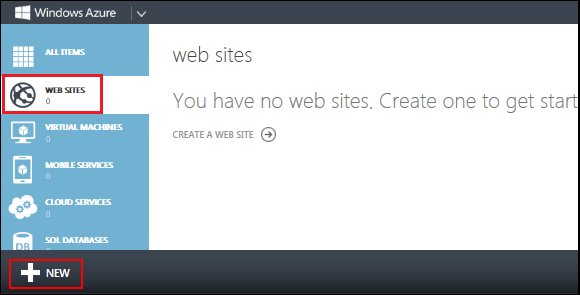
2. 依序按一下 [**網站**] 及 [**自訂建立**]。  
	  
[**新網站 - 自訂建立**] 精靈隨即開啟。  

3. 在精靈的 [**建立網站**] 步驟中，於 [**URL**] 方塊中輸入字串，做為您應用程式的唯一 URL。完整的 URL 將包含您在此處輸入的字串，加上您在文字方塊旁看到的尾碼。下圖顯示該 URL 可能已被佔用，因此**您必須選擇不同的 URL**。  
	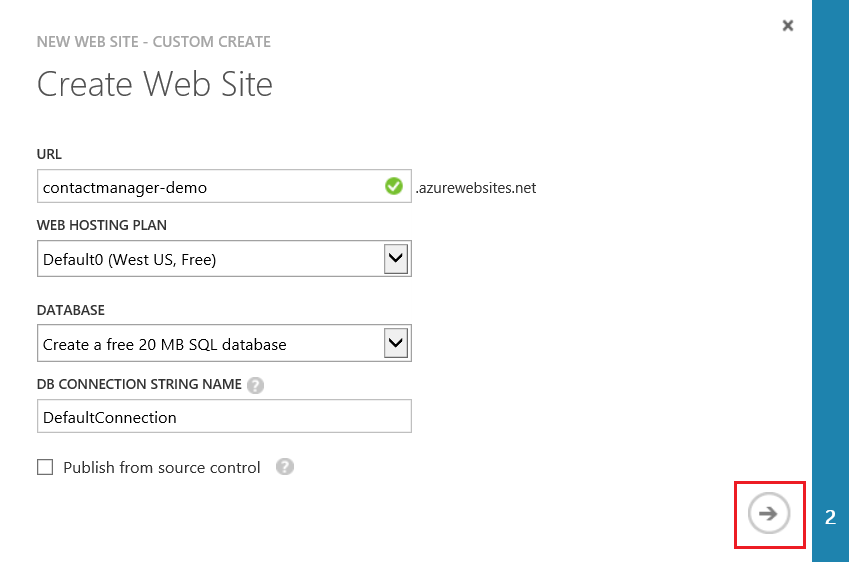  
4. 在 [Web 主控方案] 下拉式清單中，選擇最接近您所在位置的區域。此設定可指定 VM 將在哪個資料中心執行。
5. 在 [**資料庫**] 下拉式清單中，選擇 [**Create a free 20 MB SQL database**]。
6. 在 [**DB Connection String Name**] 方塊中，保留預設值 *DefaultConnection*。
7. 按一下方塊底部的箭頭。 
精靈隨即前進至 [**指定資料庫設定**] 步驟。
8. 在 [**名稱**] 方塊中輸入 *`ContactDB`*。  
	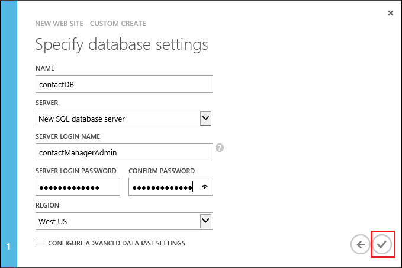  
9. 在 [**伺服器**] 方塊中，選取 [**New SQL Database**] 伺服器。
或者，如果您已建立 SQL Server 資料庫，可從下拉式清單控制項選取該 SQL Server。
10. 將 [**區域**] 設為您建立網站時的相同區域。
11. 輸入系統管理員**登入名稱**和**密碼**。 
如果選取 [**New SQL Database server**]，則不要在此處輸入現有的名稱和密碼，而是輸入新的名稱和密碼；您現在定義的名稱和密碼將供未來存取資料庫時使用。如果選取先前建立的 SQL Server，系統會提示您提供先前建立之 SQL Server 帳戶名稱的密碼。在本教學課程中，請不要勾選 [**進階**] 方塊。
12. 按一下方塊右下角的打勾記號來表示完成。

**Azure 管理入口網站**會回到 [**網站**] 頁面，且 [**狀態**] 欄會顯示網站已建立。不久之後 (通常不到一分鐘)，[**狀態**] 欄就會顯示建立網站成功。在左側的導覽列中，[**網站**] 圖示旁會出現您的帳戶中已有的網站數；[**SQL Database**] 圖示旁則會出現資料庫數目。
##建立 ASP.NET Web Forms 應用程式 
您已建立 Azure 網站，但網站中還沒有內容。接下來的步驟是建立要發佈到 Azure 的 Visual Studio Web 應用程式。
###建立專案 
1. 在 Visual Studio 的 [**檔案**] 功能表中，選取 [**新增專案**]。  
	  
2. 依序選取左側上的 [**範本**] -> [**Visual C#**] -> [**Web**] 範本群組。 
3. 選擇中間欄的 [**ASP.NET Web 應用程式**] 範本。
4. 將您的專案命名為 *ContactManager*，並按一下 [**確定**]。  
	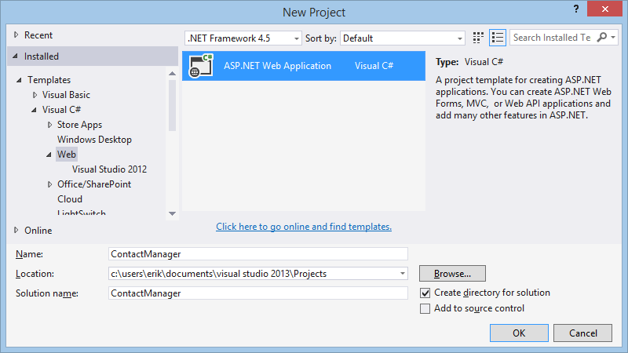  

	>[WACOM.NOTE]  
此教學課程系列中的專案名稱為 **ContactManager**。建議您使用完全相同的專案名稱，以便整個教學課程系列中所提供的程式碼可如預期般運作。  

5. 在 [**New ASP.NET Project**] 對話方塊中，選取 [**Web Forms**] 範本。取消核取 [**Host in the cloud**] 核取方塊 (若已選取)，然後按一下 [**確定**]。  
	  
	將建立 Web Forms 應用程式。
###更新主要頁面
在 ASP.NET Web Forms 中，主要頁面可用來建立應用程式中頁面的一致性版面配置。單一主要頁面可為應用程式中的所有頁面 (或頁面群組) 定義您想要的外觀與風格及標準行為。接著，您可以建立包含所需顯示內容的個別內容頁面。當使用者要求內容頁面時，ASP.NET 會將這些頁面與主要頁面合併，以產生結合主要頁面之配置與內容頁面之內容的輸出。
新的網站需要更新的應用程式名稱與連結。此連結將指向顯示連絡人詳細資料的頁面。若要進行這些變更，您需修改主要頁面上的 HTML。 

1. 在 [**方案總管**] 中，尋找並開啟 *Site.Master* 頁面。 
2. 如果頁面處於 [**設計**] 檢視模式，請切換至 [**來源**] 檢視。
3. 您可透過修改或新增標記 (以黃色強調顯示) 來更新主要頁面：

<pre class="prettyprint">
<%@ Master Language=&quot;C#&quot; AutoEventWireup=&quot;true&quot; CodeBehind=&quot;Site.master.cs&quot; Inherits=&quot;ContactManager.SiteMaster&quot; %>

<!DOCTYPE html>

<html lang=&quot;en&quot;>
<head runat=&quot;server&quot;>
    <meta charset=&quot;utf-8&quot; />
    <meta name=&quot;viewport&quot; content=&quot;width=device-width, initial-scale=1.0&quot; />
    <title><%: Page.Title %> - <mark>Contact Manager</mark></title>

    <asp:PlaceHolder runat=&quot;server&quot;>
        <%: Scripts.Render(&quot;~/bundles/modernizr&quot;) %>
    </asp:PlaceHolder>
    <webopt:bundlereference runat=&quot;server&quot; path=&quot;~/Content/css&quot; />
    <link href=&quot;~/favicon.ico&quot; rel=&quot;shortcut icon&quot; type=&quot;image/x-icon&quot; />

</head>
<body>
    <form runat=&quot;server&quot;>
        <asp:ScriptManager runat=&quot;server&quot;>
            <Scripts>
                <%--To learn more about bundling scripts in ScriptManager see http://go.microsoft.com/fwlink/?LinkID=301884 --%>
                <%--Framework Scripts--%>
                <asp:ScriptReference Name=&quot;MsAjaxBundle&quot; />
                <asp:ScriptReference Name=&quot;jquery&quot; />
                <asp:ScriptReference Name=&quot;bootstrap&quot; />
                <asp:ScriptReference Name=&quot;respond&quot; />
                <asp:ScriptReference Name=&quot;WebForms.js&quot; Assembly=&quot;System.Web&quot; Path=&quot;~/Scripts/WebForms/WebForms.js&quot; />
                <asp:ScriptReference Name=&quot;WebUIValidation.js&quot; Assembly=&quot;System.Web&quot; Path=&quot;~/Scripts/WebForms/WebUIValidation.js&quot; />
                <asp:ScriptReference Name=&quot;MenuStandards.js&quot; Assembly=&quot;System.Web&quot; Path=&quot;~/Scripts/WebForms/MenuStandards.js&quot; />
                <asp:ScriptReference Name=&quot;GridView.js&quot; Assembly=&quot;System.Web&quot; Path=&quot;~/Scripts/WebForms/GridView.js&quot; />
                <asp:ScriptReference Name=&quot;DetailsView.js&quot; Assembly=&quot;System.Web&quot; Path=&quot;~/Scripts/WebForms/DetailsView.js&quot; />
                <asp:ScriptReference Name=&quot;TreeView.js&quot; Assembly=&quot;System.Web&quot; Path=&quot;~/Scripts/WebForms/TreeView.js&quot; />
                <asp:ScriptReference Name=&quot;WebParts.js&quot; Assembly=&quot;System.Web&quot; Path=&quot;~/Scripts/WebForms/WebParts.js&quot; />
                <asp:ScriptReference Name=&quot;Focus.js&quot; Assembly=&quot;System.Web&quot; Path=&quot;~/Scripts/WebForms/Focus.js&quot; />
                <asp:ScriptReference Name=&quot;WebFormsBundle&quot; />
                <%--Site Scripts--%>
            </Scripts>
        </asp:ScriptManager>

        

            

                

                    <button type=&quot;button&quot; class=&quot;navbar-toggle&quot; data-toggle=&quot;collapse&quot; data-target=&quot;.navbar-collapse&quot;>
                        
                        
                        
                    </button>
                    <a class=&quot;navbar-brand&quot; runat=&quot;server&quot; <mark>id=&quot;ContactDemoLink&quot;</mark> href=&quot;~/<mark>Contacts/Default.aspx</mark>&quot;><mark>Contact Demo</mark></a>
                

                

                    <ul class=&quot;nav navbar-nav&quot;>
                        <li><a runat=&quot;server&quot; href=&quot;~/&quot;>Home</a></li>
                        <li><a runat=&quot;server&quot; href=&quot;~/About&quot;>About</a></li>
                        <li><a runat=&quot;server&quot; href=&quot;~/Contact&quot;>Contact</a></li>
                    </ul>
                    <asp:LoginView runat=&quot;server&quot; ViewStateMode=&quot;Disabled&quot;>
                        <AnonymousTemplate>
                            <ul class=&quot;nav navbar-nav navbar-right&quot;>
                                <li><a runat=&quot;server&quot; href=&quot;~/Account/Register&quot;>Register</a></li>
                                <li><a runat=&quot;server&quot; href=&quot;~/Account/Login&quot;>Log in</a></li>
                            </ul>
                        </AnonymousTemplate>
                        <LoggedInTemplate>
                            <ul class=&quot;nav navbar-nav navbar-right&quot;>
                                <li><a runat=&quot;server&quot; href=&quot;~/Account/Manage&quot; title=&quot;Manage your account&quot;>Hello, <%: Context.User.Identity.GetUserName()  %> !</a></li>
                                <li>
                                    <asp:LoginStatus runat=&quot;server&quot; LogoutAction=&quot;Redirect&quot; LogoutText=&quot;Log off&quot; LogoutPageUrl=&quot;~/&quot; OnLoggingOut=&quot;Unnamed_LoggingOut&quot; />
                                </li>
                            </ul>
                        </LoggedInTemplate>
                    </asp:LoginView>
                

            

        

        

            <asp:ContentPlaceHolder ID=&quot;MainContent&quot; runat=&quot;server&quot;>
            </asp:ContentPlaceHolder>
            

            <footer>
                
&copy; <%: DateTime.Now.Year %> - <mark>Contact Manager</mark>

            </footer>
        

    </form>
</body>
</html>
</pre>  

後續在本教學課程中，您將新增 Web Forms 樣板。Scaffolding 將建立上述 "Contact Demo" 連結的參考頁面。
###在本機執行應用程式 
1. 在 [**方案總管**] 中，以滑鼠右鍵按一下 *Default.aspx* 頁面，並選取 [**設定為起始頁**]。 
2. 接著，按 **CTRL+F5** 執行應用程式。  
	預設的瀏覽器視窗中會出現應用程式預設頁面。
	  

只需執行上述作業，即可建立稍後要部署至 Azure 的應用程式。稍後，您將新增資料庫功能，以及可顯示與編輯連絡人資料的必要頁面。
###將應用程式部署至 Azure
現在您已在本機建立與執行您的應用程式，是將應用程式部署至 Azure 的時候了。

1. 在 Visual Studio 的 [**方案總管**] 中以滑鼠右鍵按一下專案，再選取內容功能表中的 [**發佈**]。  
	  
[**發佈 Web**] 對話方塊隨即出現。  

2. 在 [**發佈 Web**] 對話方塊的 [**設定檔**] 索引標籤上，按一下 [**Azure 網站**]。  
	  
3. 如果您尚未登入，請按一下 [**選取現有網站**] 對話方塊中的 [**登入**] 按鈕。完成登入後，請選取您在本教學課程第一個部分中所建立的網站。按一下 [**確定**] 以繼續。  
	  
Visual Studio 將會下載您的發佈設定。
4. 在 [**發佈 Web**] 對話方塊中，按一下 [**發佈**]。  
	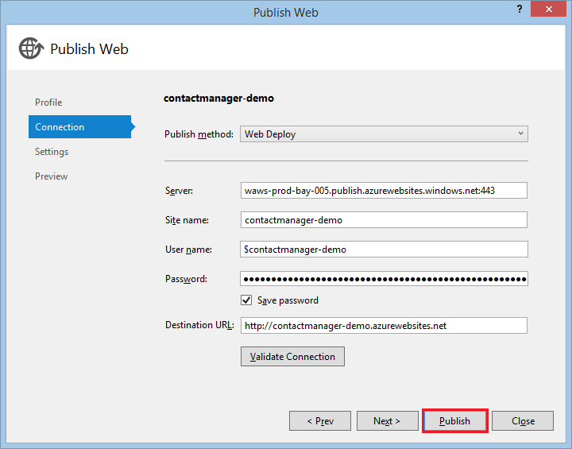  
您會在 Visual Studio 的 [**Web Publish Activity**] 視窗中，看到整體的發佈狀態。  
	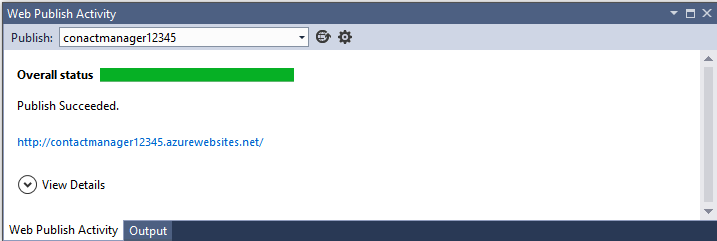  

您建立的應用程式現在正在雲端中執行。下次當您從 Visual Studio 部署應用程式時，只會部署變更的 (或新的) 檔案。  
	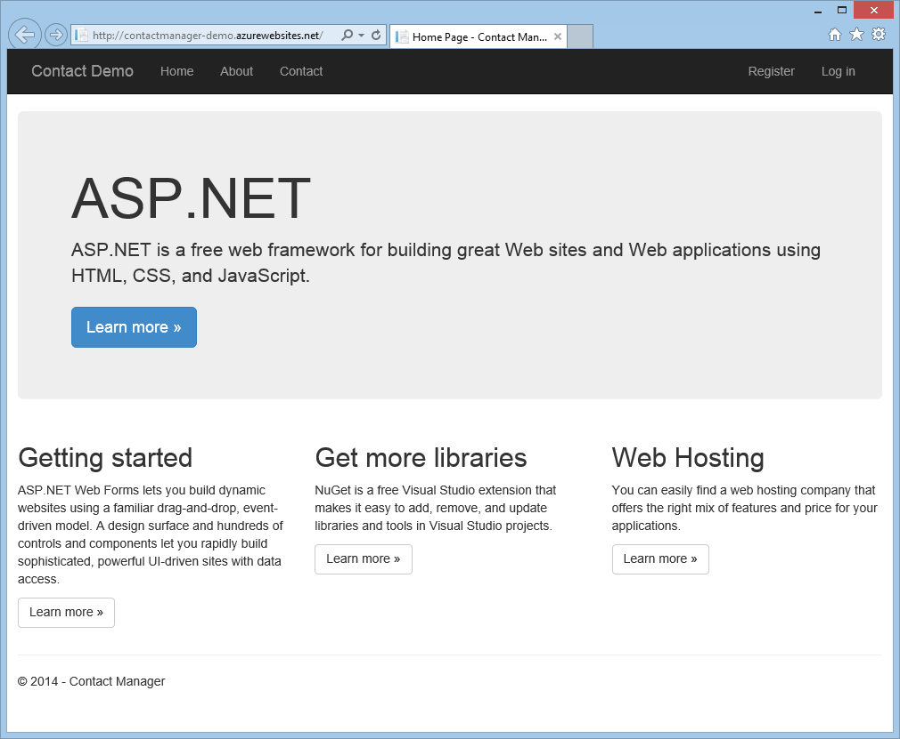  

>[WACOM.NOTE] 
如果您在發佈到已建立的網站時遇到錯誤，則您可以在加入新檔案之前先清除位置。  
重新發佈您的應用程式，但在 [**發佈 Web**] 對話方塊中，請選取 [**設定**] 索引標籤。接著，設定 [**偵錯**] 的組態，並選取 [**Remove additional files at destination**] 選項。選取 [**發佈**] 以重新部署您的應用程式。  
	  

##新增資料庫至應用程式 
接下來，您將更新 Web Forms 應用程式，在預設資料庫中新增顯示與更新連絡人，以及儲存資料的功能。建立 Web Forms 專案時，預設也會建立資料庫。應用程式將使用 Entity Framework，以存取資料庫以及讀取和更新資料庫中的資料。
###新增資料模型類別 
首先，使用程式碼建立簡單的資料模型。此資料模型會包含在名為 `Contacts` 的類別內。選擇 `Contacts` 類別名稱，是為了避免與根據 Web Forms 範本建立之 Contact.aspx.cs 檔案中所包含的 `Contact` 類別產生類別名稱衝突。  

1. 在 [**方案總管**] 中，以滑鼠右鍵按一下 *Models* 資料夾，然後依序選取 [**新增**] -> [**類別**]。  
	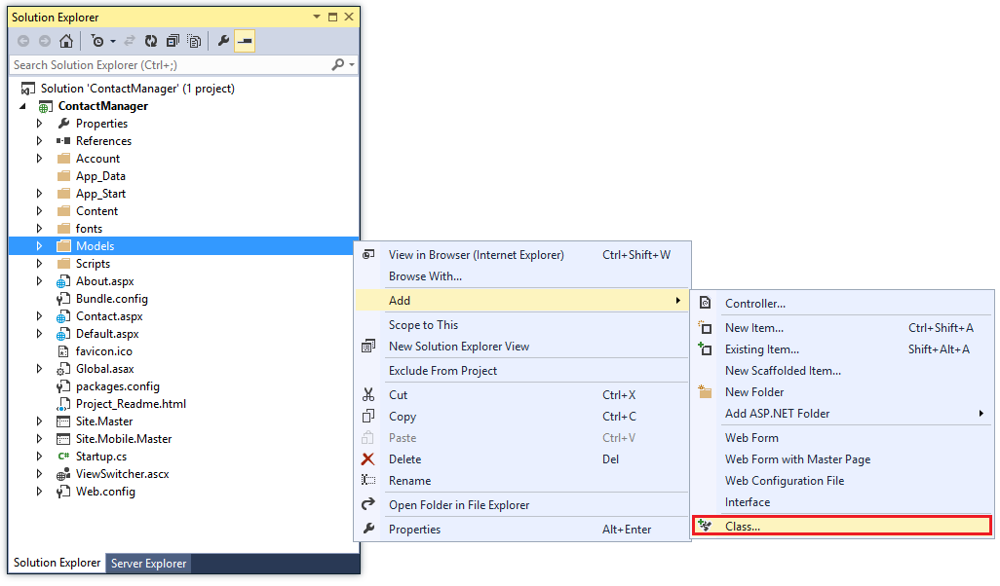  
[**加入新項目**] 對話方塊隨即出現。  

2. 將這個新類別命名為 *Contacts.cs*。  
	  
3. 使用下列程式碼來取代預設程式碼：  
	<pre class="prettyprint">
	using System.ComponentModel.DataAnnotations;
	using System.Globalization;
	
	namespace ContactManager.Models
	{
	    public class Contacts
	    {
	        [ScaffoldColumn(false)]
	        [Key]
	        public int ContactId { get; set; }
	        public string Name { get; set; }
	        public string Address { get; set; }
	        public string City { get; set; }
	        public string State { get; set; }
	        public string Zip { get; set; }
	        [DataType(DataType.EmailAddress)]
	        public string Email { get; set; }
	    }
	}
	</pre>

**Contacts** 類別會定義您將為每個連絡人儲存的資料，加上資料庫需要的主要索引鍵 (`ContactID`)。**Contacts** 類別代表將會顯示的連絡人資料。每個連絡人物件的執行個體會對應到關聯式資料庫資料表中的資料列，而每個連絡人類別的屬性會對應到關聯式資料庫資料表中的資料欄。後續在本教學課程中，您將檢閱資料庫中所包含的連絡人資料。

###Web Forms Scaffolding 
您已建立上述的 [**連絡人**] 模型類別。現在，您可以使用 Web Forms Scaffolder 來產生 [*清單*]、[*插入*]、[*編輯*] 和 [*刪除*] 頁面，以供使用此資料時使用。Web Forms Scaffolder 使用 Entity Framework、Bootstrap 和動態資料。依預設，使用 Visual Studio 2013 時，Web Forms Scaffolder 會以擴充功能的形式安裝在您的專案上，以作為專案範本的一部分。

您可透過下列步驟來使用 Web Forms Scaffolder。

1. 在 Visual Studio 中，從功能表列依序選取 [**工具**] -> [**擴充功能和更新**]。  
[**擴充功能和更新**] 對話方塊隨即出現。
2. 從對話方塊的左窗格中，依序選取 [**線上**] -> [**Visual Studio 組件庫**] -> [**工具**] -> [**樣板**]。
3. 如果您在清單中看不到 'Web Forms Scaffolding'，請在對話方塊右側的搜尋方塊中輸入 'Web Forms Scaffolding'。  
4. 如果未安裝 Web Forms Scaffolder，請選取 [**下載**]，以下載並安裝 Web Forms Scaffolding。如有需要，請重新啟動 Visual Studio。系統提出要求時，請務必將變更儲存至專案。  
	  
5. 建置專案 (**Ctrl+Shift+B**)。  
使用樣板機制前必須先建置專案。  
6. 在 [**方案總管**] 中，以滑鼠右鍵按一下 *project*，然後依序選取 [**新增**] -> [**New Scaffolded Item**]。  
[**Add Scaffold**] 對話方塊隨即出現。
7. 從左窗格中選取 [**Web Forms**]，並從中央窗格中選取 [**Web Forms Pages using Entity Framework**]。然後按一下 [**新增**]。  
	  
[**Add Web Forms Pages**] 對話方塊隨即出現。  

8. 在 [**Add Web Forms Pages**] 對話方塊中，將 [**模型類型**] 設為 `Contact (ContactManager.Models)`。將 [**資料內容類別**] 設為 `ApplicationDbContext (ContactManager.Models)`。然後按一下 [**新增**]。 
	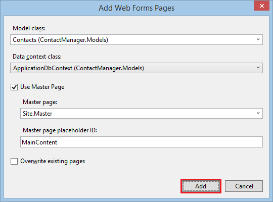  

Web Form Scaffolder 會新增包含 *Default.aspx*、*Delete.aspx*、*Edit.aspx* 和 *Insert.aspx* 等頁面的新資料夾。Web Forms Scaffolder 還會建立一個包含 *EntityTemplates* 資料夾和 *FieldTemplates* 資料夾的 *DynamicData* 資料夾。`ApplicationDbContext` 可同時用於成員資格資料庫和連絡人資料。

###設定應用程式以使用資料模型 
下一個工作是啟用 Code First 移轉功能，以便根據建立的資料模型建立資料庫。另外，您將新增範例資料和資料初始設定式。  

1. 在 [**工具**] 功能表中，依序選取 [**NuGet 封裝管理員**] 和 [**Package Manager Console**]。  
	  
2. 在 [Package Manager Console] 視窗中，輸入下列命令：  
	<pre class="prettyprint">
	enable-migrations
	</pre>  
enable-migrations 命令會建立 *Migrations* 資料夾，並在該資料夾中置入 *Configuration.cs* 檔案，您可以編輯該檔案來植入資料庫及設定資料移轉。  
3. 在 [**Package Manager Console**] 視窗中，輸入下列命令：  
	<pre class="prettyprint">
	add-migration Initial
	</pre>  
`add-migration Initial` 命令會在建立資料庫的 *Migrations* 資料夾中產生名為 <date_stamp>Initial 的檔案。第一個參數 ( Initial ) 是任意的，可用來建立檔案的名稱。您可以在 [**方案總管**] 中看到新的類別檔案。在 `Initial` 類別中，`Up` 方法會建立 `Contact` 資料表，`Down` 方法 (當您希望返回前個狀態時使用) 則會捨棄該資料表。  
4. 開啟 *Migrations\Configuration.cs* 檔案。 
5. 新增下列命名空間：  
	<pre class="prettyprint">
	using ContactManager.Models;
	</pre>  
6. 以下列程式碼取代 `Seed` 方法：  
	<pre class="prettyprint">
	protected override void Seed(ContactManager.Models.ApplicationDbContext context)
	{
	    context.Contacts.AddOrUpdate(p => p.Name,
	       new Contacts
	       {
	           ContactId = 1,
	           Name = "Ivan Irons",
	           Address = "One Microsoft Way",
	           City = "Redmond",
	           State = "WA",
	           Zip = "10999",
	           Email = "ivani@wideworldimporters.com",
	       },
	       new Contacts
	        {
	            ContactId = 2,
	            Name = "Brent Scholl",
	            Address = "5678 1st Ave W",
	            City = "Redmond",
	            State = "WA",
	            Zip = "10999",
	            Email = "brents@wideworldimporters.com",
	        },
	        new Contacts
	        {
	            ContactId = 3,
	            Name = "Terrell Bettis",
	            Address = "9012 State St",
	            City = "Redmond",
	            State = "WA",
	            Zip = "10999",
	            Email = "terrellb@wideworldimporters.com",
	        },
	        new Contacts
	        {
	            ContactId = 4,
	            Name = "Jo Cooper",
	            Address = "3456 Maple St",
	            City = "Redmond",
	            State = "WA",
	            Zip = "10999",
	            Email = "joc@wideworldimporters.com",
	        },
	        new Contacts
	        {
	            ContactId = 5,
	            Name = "Ines Burnett",
	            Address = "7890 2nd Ave E",
	            City = "Redmond",
	            State = "WA",
	            Zip = "10999",
	            Email = "inesb@wideworldimporters.com",
	        }
	        );
	}
	</pre>
此程式碼會以連絡人資訊來初始化 (植入) 該資料庫。如需植入資料庫的詳細資訊，請參閱[植入及偵錯 Entity Framework (EF) DB](http://blogs.msdn.com/b/rickandy/archive/2013/02/12/seeding-and-debugging-entity-framework-ef-dbs.aspx)。  
7. 在 [**Package Manager Console**] 中輸入下列命令：  
	<pre class="prettyprint">
	update-database
	</pre>  
`update-database` 會執行第一次移轉，使資料庫建立。根據預設，資料庫會以 SQL Server Express LocalDB 資料庫的形式建立。  
	  

###在本機執行應用程式並顯示資料 
現在就執行應用程式，了解如何檢視連絡人。

1. 首先，建置專案 (**Ctrl+Shift+B**)。  
2. 按 **Ctrl+F5** 執行應用程式。  
	瀏覽器便會開啟並顯示 *Default.aspx* 頁面。
3. 選取頁面頂端的 [**Contact Demo**] 連結，以顯示 [*連絡人清單*] 頁面。  
	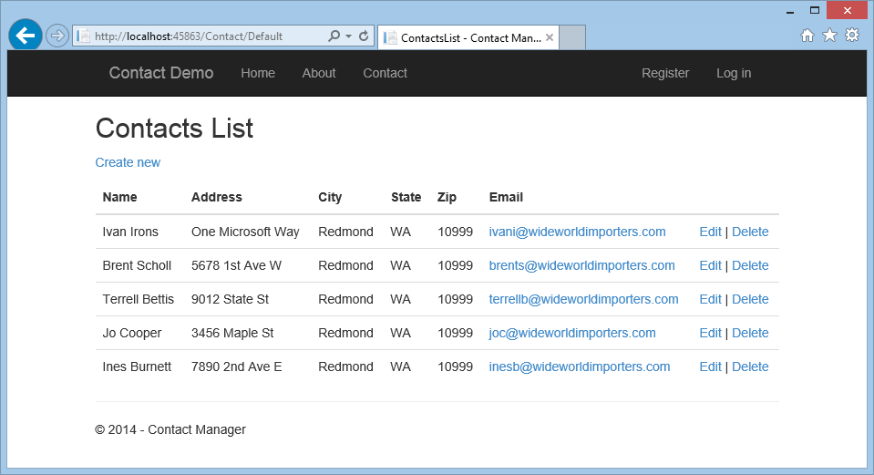  

##對專案啟用 SSL 
安全通訊端層 (SSL) 是一種定義的通訊協定，允許 Web 伺服器和 Web 用戶端透過加密，以更安全的方式進行通訊。未使用 SSL 時，在用戶端和伺服器之間傳送的資料會開放給任何可實體存取網路的人員進行封包探查。此外，數種常見驗證結構描述在一般的 HTTP 上並不是很安全。尤其是，基本驗證和表單驗證會傳送未加密的認證。為了安全的理由，這些驗證結構描述必須使用 SSL。

1. 在 [**方案總管**] 中按一下 **ContactManager** 專案，然後按 **F4** 鍵以顯示 [**屬性**] 視窗。 
2. 將 [**SSL 已啟用**] 變更為 true。 
3. 複製 **SSL URL**，以便稍後使用。  
	除非您先前已建立 SSL 網站，否則 SSL URL 將是 `https://localhost:44300/` (如下所示)。
	  
4. 在 [**方案總管**] 中以滑鼠右鍵按一下**Contact Manager** 專案，然後按一下 [**屬性**]。
5. 在左側索引標籤中，按一下 [**Web**]。
6. 將 [**專案 URL**] 變更為使用您先前儲存的 **SSL URL**。  
	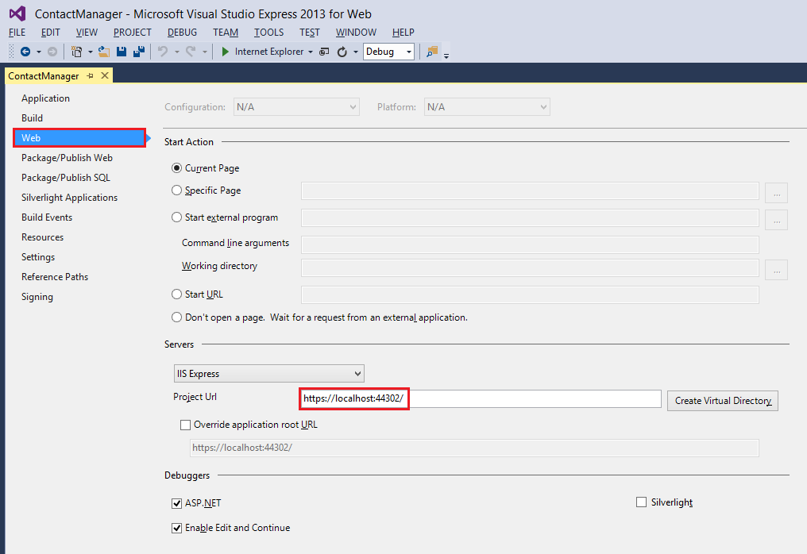  
7. 按 **CTRL+S** 儲存頁面。
8. 按 **Ctrl+F5** 執行應用程式。Visual Studio 將會顯示可避開 SSL 警告的選項。  
9. 按一下 [**是**] 以信任 IIS Express SSL 憑證並繼續。  
	  
隨即顯示一則安全性警告。  

10. 按一下 [**是**] 將憑證安裝到您的 localhost。  
	  
瀏覽器視窗隨即出現。  

您可以輕鬆地使用 SSL 在本機測試 Web 應用程式。

##新增 OAuth 2.0 提供者 
ASP.NET Web Forms 提供成員資格和驗證的增強功能選項。這些增強功能包括 OAuth。OAuth 是一種開放式通訊協定，可讓 Web、行動和桌面應用程式以簡單、標準的方法執行安全授權。ASP.NET MVC 網際網路範本使用 OAuth 來公開 Facebook、Twitter、Google 和 Microsoft 的驗證提供者身分。雖然本教學課程僅使用 Google 作為驗證提供者，但您可以輕易修改程式碼來使用任何提供者。實作其他提供者的步驟，與您將在本教學課程中看到的步驟極為類似。 

除了驗證，本教學課程也會使用角色來實作授權。只有您新增至 `canEdit` 角色的使用者才能變更資料 (建立、編輯或刪除連絡人)。 

下列步驟可新增 Google 驗證提供者。

1. 開啟 *App_Start\Startup.Auth.cs* 檔案。 
2. 移除 `app.UseGoogleAuthentication()` 方法中的註解字元，然後此方法會顯示如下：  
	<pre class="prettyprint">
	            app.UseGoogleAuthentication(new GoogleOAuth2AuthenticationOptions()
	            {
	                ClientId = "",
	                ClientSecret = ""
	            });
	</pre>
3. 瀏覽至 [Google Developers Console](https://console.developers.google.com/)。您還需要使用您的 Google 開發人員電子郵件帳戶 (gmail.com) 登入。如果您沒有 Google 帳戶，請選取 [**建立帳戶**] 連結。  
	接下來，您會看到 **Google Developers Console**。
	  

4. 按一下 [**建立專案**] 按鈕，並輸入專案名稱和識別碼 (您可以使用預設值)。然後依序按一下 [**協議**] 核取方塊和 [**建立**] 按鈕。  
	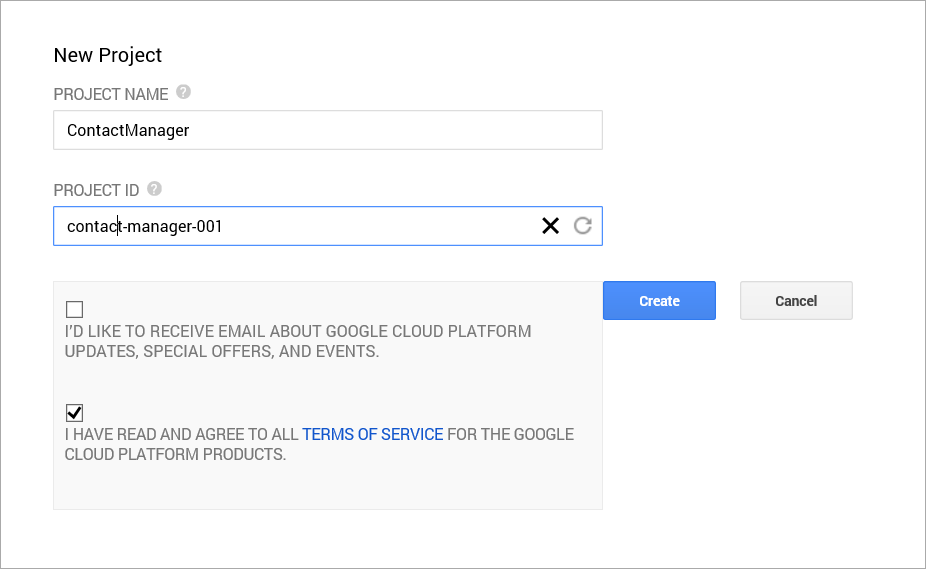  
	幾秒鐘內即可建立新的專案，您的瀏覽器便會顯示新的專案頁面。
5. 在左側索引標籤中，按一下 [**APIs & auth**]，然後按一下 [**認證**]。
6. 按一下 **OAuth** 下的 [**Create New Client ID**]。  
[**Create Client ID**] 對話方塊隨即出現。
	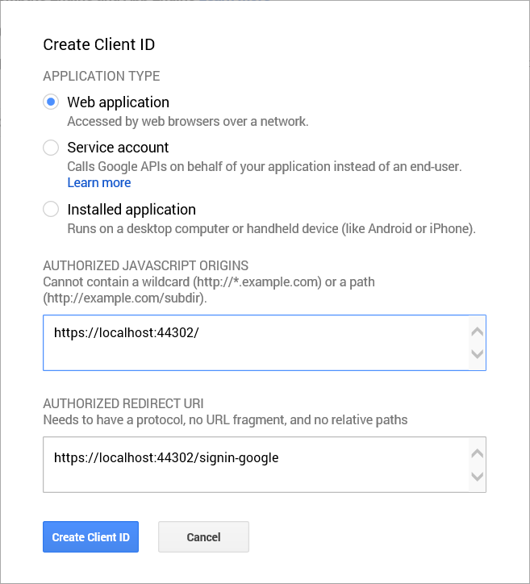  
7. 在 [**Create Client ID**] 對話方塊中，保留應用程式類型中預設的 [**Web 應用程式**]。  
8. 將 [**Authorized JavaScript Origins**] 設為您稍早在本教學課程中所使用的 SSL URL (**https://localhost:44300/** (除非您已建立其他 SSL 專案)。  
此 URL 會是應用程式的原始來源。在此範例中，您將僅輸入 localhost 測試 URL。不過，您可以在帳戶中輸入多個 URL 以供 localhost 和生產使用。  

9. 將 [**Authorized Redirect URI**] 設定如下：  
	<pre class="prettyprint">  
	https://localhost:44300/signin-google  
	</pre>  
此值是 ASP.NET OAuth 使用者與 Google OAuth 伺服器進行通訊的 URI。請記住您上面使用的 SSL URL (**https://localhost:44300/**，除非您已建立其他 SSL 專案)。  
10. 按一下 [**Create Client ID**] 按鈕。
11. 在 Visual Studio 中，將 [**應用程式識別碼**] 和 [**應用程式密鑰**] 複製並貼入 *Startup.Auth.cs* 頁面的 `UseGoogleAuthentication` 方法中，以進行更新。以下所示的 [**應用程式識別碼**] 和 [**應用程式密鑰**] 值僅作為範例，所以不會有作用。  
	<pre class="prettyprint">  
	using System;
	using Microsoft.AspNet.Identity;
	using Microsoft.AspNet.Identity.EntityFramework;
	using Microsoft.AspNet.Identity.Owin;
	using Microsoft.Owin;
	using Microsoft.Owin.Security.Cookies;
	using Microsoft.Owin.Security.DataProtection;
	using Microsoft.Owin.Security.Google;
	using Owin;
	using ContactManager.Models;
	
	namespace ContactManager
	{
	    public partial class Startup {
	
	        // For more information on configuring authentication, please visit http://go.microsoft.com/fwlink/?LinkId=301883
	        public void ConfigureAuth(IAppBuilder app)
	        {
	            // Configure the db context and user manager to use a single instance per request
	            app.CreatePerOwinContext(ApplicationDbContext.Create);
	            app.CreatePerOwinContext<ApplicationUserManager>(ApplicationUserManager.Create);
	
	            // Enable the application to use a cookie to store information for the signed in user
	            // and to use a cookie to temporarily store information about a user logging in with a third party login provider
	            // Configure the sign in cookie
	            app.UseCookieAuthentication(new CookieAuthenticationOptions
	            {
	                AuthenticationType = DefaultAuthenticationTypes.ApplicationCookie,
	                LoginPath = new PathString("/Account/Login"),
	                Provider = new CookieAuthenticationProvider
	                {
	                    OnValidateIdentity = SecurityStampValidator.OnValidateIdentity<ApplicationUserManager, ApplicationUser>(
	                        validateInterval: TimeSpan.FromMinutes(20),
	                        regenerateIdentity: (manager, user) => user.GenerateUserIdentityAsync(manager))
	                }
	            });
	            // Use a cookie to temporarily store information about a user logging in with a third party login provider
	            app.UseExternalSignInCookie(DefaultAuthenticationTypes.ExternalCookie);
	
	            // Uncomment the following lines to enable logging in with third party login providers
	            //app.UseMicrosoftAccountAuthentication(
	            //    clientId: "",
	            //    clientSecret: "");
	
	            //app.UseTwitterAuthentication(
	            //   consumerKey: "",
	            //   consumerSecret: "");
	
	            //app.UseFacebookAuthentication(
	            //   appId: "",
	            //   appSecret: "");
	
	            app.UseGoogleAuthentication(new GoogleOAuth2AuthenticationOptions()
	            {
	                ClientId = "<mark>000000000000.apps.googleusercontent.com</mark>",
	                ClientSecret = "<mark>00000000000</mark>"
	            });
	        }
	    }
	}
	</pre>  
12. 按 **CTRL+F5** 以建置並執行應用程式。按一下 [**登入**] 連結。
13. 在 [**Use another service to log in**] 下，按一下 [**Google**]。  
	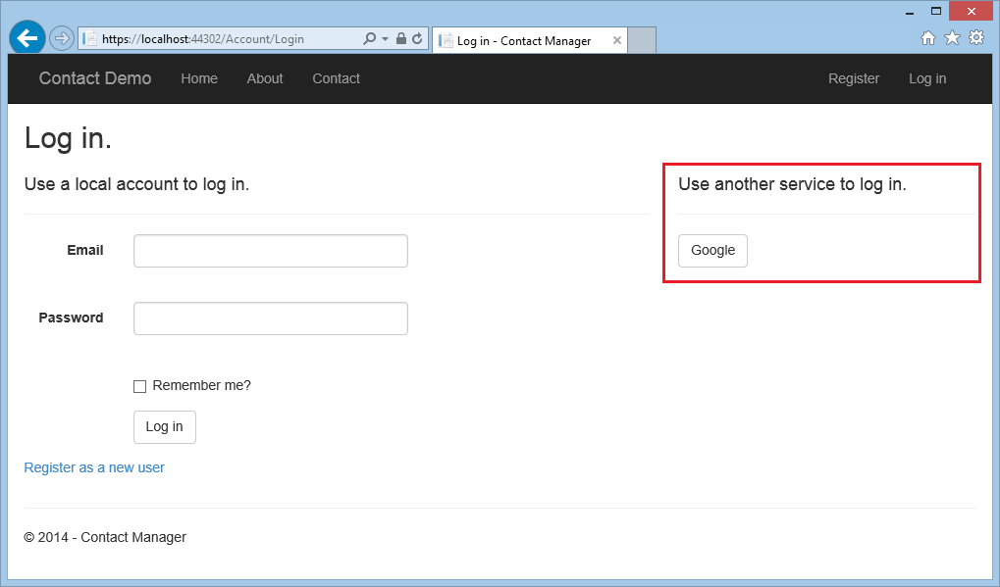  
14. 如果您需要輸入認證，您會被重新導向至 Google 網站，您可以在此輸入認證。  
	  
15. 輸入認證後，系統便會提示您提供權限給剛建立的 Web 應用程式：  
	  
16. 按一下 [**接受**]。系統會將您重新導向回到 **ContactManager** 應用程式的 [**註冊**] 頁面，您可以在此註冊 Google 帳戶。
	  
17. 您可以選擇變更用於 Gmail 帳戶的本機電子郵件註冊名稱，但您通常會想保留預設電子郵件別名 (也就是，您用來驗證的名稱)。按一下 [**登入**]。

##使用成員資格 API 來限制存取 
ASP.NET 身分識別是成員資格系統，可用於建置 ASP.NET Web 應用程式時的驗證。它會讓整合使用者特定設定檔資料與應用程式資料變得再容易不過了。另外，ASP.NET 身分識別可讓您選擇應用程式中使用者設定檔的持續性模型。您可以將資料儲存在 SQL Server 資料庫或其他資料存放區中，包括 *NoSQL* 資料存放區 (例如 Azure 儲存體資料表)。

使用預設的 ASP.NET Web Forms 範本，您便擁有內建的成員資格功能，可在應用程式執行時立即使用。您將使用 ASP.NET 身分識別新增系統管理員角色，並對該角色指派使用者。接著，您將了解如何限制存取管理資料夾，以及該資料夾中用來修改連絡人資料的頁面。

###新增系統管理員 
使用 ASP.NET 身分識別，您可以新增系統管理員角色，並使用程式碼對該角色指派使用者。 

1. 在 [**方案總管**] 中，開啟 *Migrations* 資料夾中的 *Configuration.cs* 檔案。
2. 在 `ContactManger.Migrations` 命名空間中新增下列 'using' 陳述式：  
	<pre class="prettyprint">
	using Microsoft.AspNet.Identity;
	using Microsoft.AspNet.Identity.EntityFramework;
	</pre>
3. 將下列 `AddUserAndRole` 方法新增至 `Configuration` 類別中的 `Seed` 方法後面：  
	<pre class="prettyprint">
        public void AddUserAndRole(ContactManager.Models.ApplicationDbContext context)
        {
            IdentityResult IdRoleResult;
            IdentityResult IdUserResult;

            var roleStore = new RoleStore<IdentityRole>(context);
            var roleMgr = new RoleManager<IdentityRole>(roleStore);

            if (!roleMgr.RoleExists(&quot;canEdit&quot;))
            {
                IdRoleResult = roleMgr.Create(new IdentityRole { Name = &quot;canEdit&quot; });
            }

            //var userStore = new UserStore<ApplicationUser>(context);
            //var userMgr = new UserManager<ApplicationUser>(userStore);
            var userMgr = new UserManager<ApplicationUser>(new UserStore<ApplicationUser>(context));

            var appUser = new ApplicationUser
            {
                UserName = &quot;canEditUser@wideworldimporters.com&quot;,
                Email = &quot;canEditUser@wideworldimporters.com&quot;
            };
            IdUserResult = userMgr.Create(appUser, &quot;Pa$$word1&quot;);

            if (!userMgr.IsInRole(userMgr.FindByEmail(&quot;canEditUser@wideworldimporters.com&quot;).Id, &quot;canEdit&quot;))
            {
              //  IdUserResult = userMgr.AddToRole(appUser.Id, &quot;canEdit&quot;);
                IdUserResult = userMgr.AddToRole(userMgr.FindByEmail(&quot;canEditUser@wideworldimporters.com&quot;).Id, &quot;canEdit&quot;);
            }
        }
	</pre>
4. 從 `Seed` 方法的開頭新增 `AddUserAndRole` 方法的呼叫。請注意，這裡只顯示 `Seed` 方法的開頭。  
	<pre class="prettyprint">
        protected override void Seed(ContactManager.Models.ApplicationDbContext context)
        {
            <mark>AddUserAndRole(context);</mark>
	</pre>  
5. 儲存所有變更後，請在 [**Package Manager Console**] 中執行下列命令：  
	<pre class="prettyprint">
	Update-Database
	</pre>
此程式碼會建立名為 'canEdit' 的新角色，並利用 canEditUser@wideworldimporters.com 電子郵件建立新的本機使用者。然後，程式碼會將 canEditUser@wideworldimporters.com 新增至 `canEdit` 角色。如需詳細資訊，請參閱 [ASP.NET 身分識別](http://www.asp.net/identity)資源頁面 (英文)。  

###限制對管理資料夾的存取 
**ContactManager** 範例應用程式允許匿名使用者和登入使用者檢視連絡人。不過，完成此區段之後，指派給 "canEdit" 角色的已登入使用者將會是唯一能夠修改連絡人的使用者。

您將建立名為 *Admin* 的資料夾，只有指派給 "canEdit" 角色的使用者才能存取該資料夾。

1. 在 [**方案總管**] 中，在 *Contacts* 資料夾中新增子資料夾，並將此新子資料夾命名為 *Admin*。
2. 將下列檔案從 *Contacts* 資料夾移至 *Contacts/Admin* 資料夾：  
	- *Delete.aspx* 和 *Delete.aspx.cs*
	- *Edit.aspx* 和 *Edit.aspx.cs*
	- *Insert.aspx* 和 *Insert.aspx.cs*
3. 更新 *Contacts/Default.aspx* 中的連結參考，方法是在連結至 *Insert.aspx*、*Edit.aspx* 和 *Delete.aspx* 的頁面參考前面加上 "Admin/"：  
	<pre class="prettyprint">
	<%@ Page Title=&quot;ContactsList&quot; Language=&quot;C#&quot; MasterPageFile=&quot;~/Site.Master&quot; CodeBehind=&quot;Default.aspx.cs&quot; Inherits=&quot;ContactManager.Contacts.Default&quot; ViewStateMode=&quot;Disabled&quot; %>
	<%@ Register TagPrefix=&quot;FriendlyUrls&quot; Namespace=&quot;Microsoft.AspNet.FriendlyUrls&quot; %>
	
	<asp:Content runat=&quot;server&quot; ContentPlaceHolderID=&quot;MainContent&quot;>
	    <h2>Contacts List</h2>
	    

	        <asp:HyperLink runat=&quot;server&quot; NavigateUrl=&quot;<mark>Admin/</mark>Insert.aspx&quot; Text=&quot;Create new&quot; />
	    

	    

	        <asp:ListView runat=&quot;server&quot;
	            DataKeyNames=&quot;ContactId&quot; ItemType=&quot;ContactManager.Models.Contacts&quot;
	            AutoGenerateColumns=&quot;false&quot;
	            AllowPaging=&quot;true&quot; AllowSorting=&quot;true&quot;
	            SelectMethod=&quot;GetData&quot;>
	            <EmptyDataTemplate>
	                There are no entries found for Contacts
	            </EmptyDataTemplate>
	            <LayoutTemplate>
	                <table class=&quot;table&quot;>
	                    <thead>
	                        <tr>
	                            <th>Name</th>
	                            <th>Address</th>
	                            <th>City</th>
	                            <th>State</th>
	                            <th>Zip</th>
	                            <th>Email</th>
	                            <th>&nbsp;</th>
	                        </tr>
	                    </thead>
	                    <tbody>
	                        <tr runat=&quot;server&quot; id=&quot;itemPlaceholder&quot; />
	                    </tbody>
	                </table>
	            </LayoutTemplate>
	            <ItemTemplate>
	                <tr>
	                    <td>
	                        <asp:DynamicControl runat=&quot;server&quot; DataField=&quot;Name&quot; ID=&quot;Name&quot; Mode=&quot;ReadOnly&quot; />
	                    </td>
	                    <td>
	                        <asp:DynamicControl runat=&quot;server&quot; DataField=&quot;Address&quot; ID=&quot;Address&quot; Mode=&quot;ReadOnly&quot; />
	                    </td>
	                    <td>
	                        <asp:DynamicControl runat=&quot;server&quot; DataField=&quot;City&quot; ID=&quot;City&quot; Mode=&quot;ReadOnly&quot; />
	                    </td>
	                    <td>
	                        <asp:DynamicControl runat=&quot;server&quot; DataField=&quot;State&quot; ID=&quot;State&quot; Mode=&quot;ReadOnly&quot; />
	                    </td>
	                    <td>
	                        <asp:DynamicControl runat=&quot;server&quot; DataField=&quot;Zip&quot; ID=&quot;Zip&quot; Mode=&quot;ReadOnly&quot; />
	                    </td>
	                    <td>
	                        <asp:DynamicControl runat=&quot;server&quot; DataField=&quot;Email&quot; ID=&quot;Email&quot; Mode=&quot;ReadOnly&quot; />
	                    </td>
	                    <td>
	                        <a href=&quot;<mark>Admin/</mark>Edit.aspx?ContactId=<%#: Item.ContactId%>&quot;>Edit</a> | 
	                        <a href=&quot;<mark>Admin/</mark>Delete.aspx?ContactId=<%#: Item.ContactId%>&quot;>Delete</a>
	                    </td>
	                </tr>
	            </ItemTemplate>
	        </asp:ListView>
	    

	</asp:Content>
	</pre>
4. 在下列三個檔案中，將六個參考的 `Response.Redirect("Default.aspx")` 程式碼更新為 `Response.Redirect("~/Contacts/Default.aspx")`：  
	- *Delete.aspx.cs*
	- *Edit.aspx.cs*
	- *Insert.aspx.cs*  

	現在，當您顯示與更新連絡人資料時，這些連結皆可正常運作。
5. 若要限制對 *Admin* 資料夾的存取，請在 [**方案總管**] 中以滑鼠右鍵按一下 *Admin* 資料夾，並選取 [**加入新項目**]。
6. 從 Visual C# Web 範本清單中，選取中間清單內的 [**Web 組態檔**]，並接受預設名稱為 *Web.config*，然後選取 [**新增**]。
7. 使用下列內容來取代 *Web.config* 檔案中的現有 XML 內容：
	<pre class="prettyprint">
	<?xml version=&quot;1.0&quot;?>
	<configuration>
	  <system.web>
	    <authorization>
	      <allow roles=&quot;canEdit&quot;/>
	      <deny users=&quot;*&quot;/>
	    </authorization>
	  </system.web>
	</configuration>
	</pre>
8. 儲存 *Web.config* 檔案。 
*Web.config* 檔案指定只有指派給 "canEdit" 角色的使用者可以存取 *Admin* 資料夾中所包含的頁面。 

當不屬於 "canEdit" 角色的使用者嘗試修改資料時，他們會被重新導向至 [*登入*] 頁面。

##將使用資料庫的應用程式部署至 Azure 
現在，Web 應用程式已完成，您可以將它發行至 Azure。

###發行應用程式 
1. 在 Visual Studio 中，建置專案 (**Ctrl+Shift+B**)。
2. 以滑鼠右鍵按一下 [**方案總管**] 中的專案，並選取 [**發佈**]。  
	  
[**發佈 Web**] 對話方塊隨即出現。  
	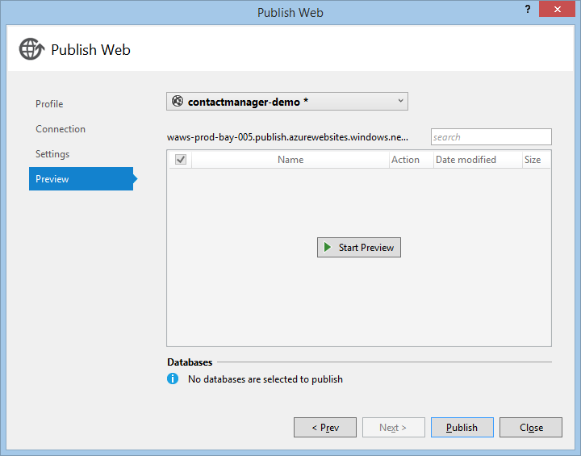  
3. 在 [**設定檔**] 索引標籤中，選取 [**Azure 網站**] 做為發佈目標 (如果尚未選取)。  
	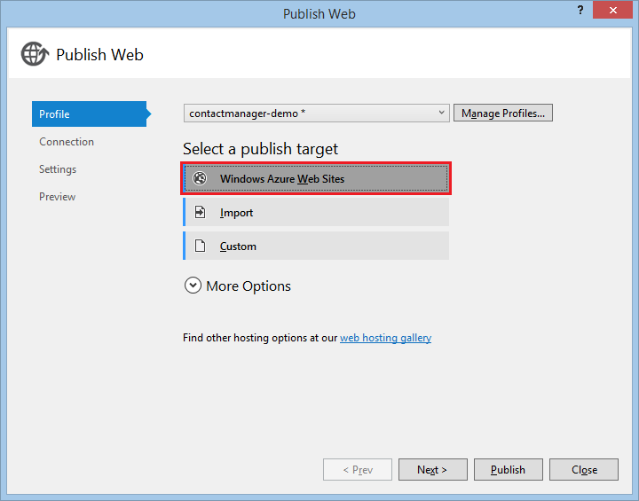  
4. 如果您尚未登入，請按一下 [**登入**]。
5. 從 [**現有網站**] 下拉式方塊中，選取您稍早在本教學課程中建立的現有網站，然後按一下 [**確定**] 按鈕。  
	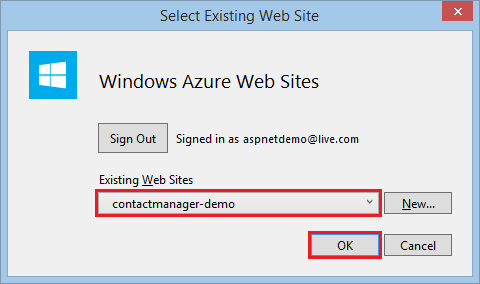  
如果系統詢問您是否要在設定檔中儲存所做的變更，請選取 [**是**]。
6. 按一下 [**設定**] 索引標籤。  
	  
7. 將 [**組態**] 下拉式方塊設為 [**偵錯**]。
8. 按一下 **ApplicationDbContext** 旁邊的 [**向下箭**] 圖示，並將它設定為 **ContactDB**。
9. 勾選 [**Execute Code First Migrations**] 核取方塊。  

	>[WACOM.NOTE]  
在本範例中，您應只在首次發佈應用程式時選取此核取方塊。如此一來，將只呼叫一次 *Configuration.cs* 檔案中的 *Seed* 方法。  

10. 然後按一下 [**發佈**]。  
	您的應用程式便會發佈到 Azure。

>[WACOM.NOTE]  
若在建立發佈設定檔後關閉再重新開啟 Visual Studio，可能無法在下拉式清單中看到連接字串。在此情況下，請不要編輯稍早建立的發佈設定檔，而是依照稍早的方式建立一個新設定檔，然後依照 [**設定**] 索引標籤上的這些步驟進行。  

###在 Azure 中檢閱應用程式 
1. 在瀏覽器中，按一下 [**Contact Demo**] 連結。  
	[連絡人清單] 便會隨即顯示。
	  

2. 選取 [**連絡人清單**] 頁面上的 [**建立新的**]。  
	  
您會被重新導向至 [**登入**] 頁面，這是因為您尚未使用可修改連絡人的帳戶登入。  
3. 在輸入以下的電子郵件和密碼之後，請按一下 [**登入**] 按鈕。  
	**電子郵件**：`canEditUser@wideworldimporters.com`  
	**密碼**：`Pa$$word1`  
	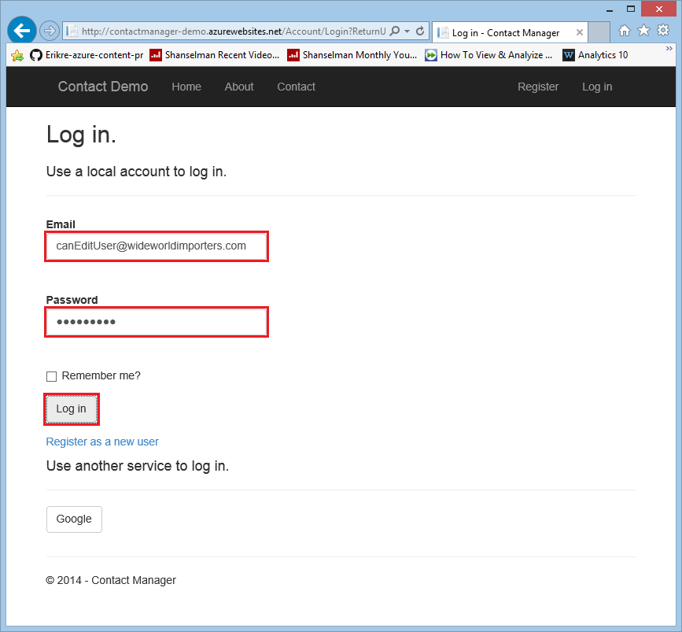  

4. 為每個欄位輸入新的資料，然後按 [**插入**] 按鈕。  
	  
*EditContactList.aspx* 頁面會顯示新的記錄。  
	  

5. 選取 [**登出**] 連結。

###停止應用程式 
為了防止其他人註冊並使用您的範例應用程式，您將停止網站。

1. 在 Visual Studio 的 [**檢視功能表**] 中，選取 [**伺服器總管**]。 
2. 在 [**伺服器總管**] 中瀏覽至 [**網站**]。
3. 在每個網站執行個體上按一下滑鼠右鍵，再選取 [**停止網站**]。  
	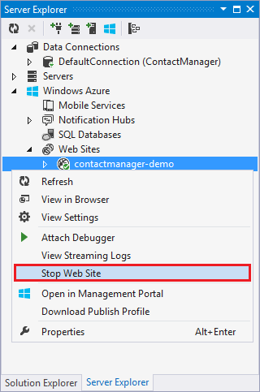  

或者，您也可以從 Microsoft Azure 管理入口網站選取網站，然後按一下頁面底部的 [ **停止**] 圖示。  
	  

##檢閱資料庫 
了解如何直接檢視與修改資料庫十分重要。了解如何直接與資料庫合作，可讓您確認資料庫中的資料，並且了解如何在每個資料表中儲存資料。

###檢查 SQL Azure DB 
1. 在 Visual Studio 中，開啟 [**伺服器總管**] 並瀏覽到 **ContactDB**。
2. 在 [**ContactDB**] 上按一下滑鼠右鍵，再選取 [**Open in SQL Server Object Explorer**]。  
	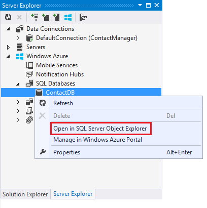  
3. 如果 [**Add Firewall Rule**] 對話方塊隨即顯示，請選取 [**Add Firewall Rule**]。  

	>[WACOM.NOTE]  
若您無法展開 [**SQL Database**]，並且在 Visual Studio 中看不到 **ContactDB**，您可以依照指示開放一個防火牆連接埠或某個範圍的連接埠。若要這樣做，請在 [MVC 教學課程](http://azure.microsoft.com/zh-tw/documentation/articles/web-sites-dotnet-deploy-aspnet-mvc-app-membership-oauth-sql-database/) 快結束時，依照 [**Set up Azure firewall rules**] 下的指示執行。作為替代的方法，您也可以透過將資料建置、執行及新增至本機的應用程式，以檢閱本機資料庫的資料 (在 Visual Studio 中按 **CTRL+F5**)。  

4. 如果 [**連接至伺服器**] 對話方塊隨即顯示，請輸入您在本教學課程一開始時建立的 [**密碼**]，然後按 [**連線**] 按鈕。  

	>[WACOM.NOTE]  
如果不記得密碼，您可以在本機專案檔案中找到此資訊。在 [**方案總管**] 中，展開 *Properties* 資料夾，然後展開 *PublishProfiles* 資料夾。開啟 *contactmanager.pubxml* 檔案 (您的檔案可能有不同的名稱)。搜尋檔案以找出您的發佈密碼。
5. 依序展開 **contactDB** 資料庫和**資料表**。
6. 以滑鼠右鍵按一下 **dbo.AspNetUsers** 資料表，然後選取 [**檢視資料**]。  
	  
您可以檢視與 canEditUser@contoso.com 使用者相關聯的資料。  
	  

###透過編輯資料庫將使用者新增至管理角色 
在本教學課程稍早的章節中，您使用程式碼將使用者新增至 canEdit 角色。替代的方法是直接在成員資格資料表中操作資料。下列步驟顯示如何使用此替代方法，將使用者新增至角色。

1. 在 [**SQL Server 物件總管**] 中，以滑鼠右鍵按一下 **dbo.AspNetUserRoles** 並選取 [**檢視資料**]。
	  
2. 複製 *RoleId* 並將其貼至空白 (新) 資料列。  
	  
3. 在 **dbo.AspNetUsers** 資料表中，尋找您要放到角色中的使用者，並複製使用者的 *Id*。
4. 複製 *Id* 並將其貼至 **AspNetUserRoles** 資料表中新資料列的 **UserId** 欄位。  

>[WACOM.NOTE]  
我們正在開發一項工具，讓使用者和角色管理起來簡單得多。  

##後續步驟
如需 ASP.NET Web Forms 的詳細資訊，請參閱 ASP.NET 網站上的 [了解 ASP.NET Web Forms](http://www.asp.net/web-forms) 和 [Microsoft Azure 教學課程和指南](http://azure.microsoft.com/zh-tw/documentation/services/web-sites/#net)。

本教學課程會以 MVC 教學課程 [將使用成員資格、OAuth 和 SQL Database 的安全 ASP.NET MVC 5 應用程式部署至 Azure 網站](http://azure.microsoft.com/zh-tw/documentation/articles/web-sites-dotnet-deploy-aspnet-mvc-app-membership-oauth-sql-database/) 為基礎，此教學課程是由 Rick Anderson (Twitter [@RickAndMSFT](https://twitter.com/RickAndMSFT)) 在 Tom Dykstra 和 Barry Dorrans (Twitter [@blowdart](https://twitter.com/blowdart)) 的協助下所撰寫。 

如果您發現喜歡的地方和希望我們改善的地方 (不論是針對本教學課程或其示範的產品)，歡迎留下意見反應。您的意見反應將協助我們訂出優先改善要務。您也可以在 [告訴我如何處理程式碼](http://aspnet.uservoice.com/forums/228522-show-me-how-with-code) (英文) 提出並對新主題進行投票。

