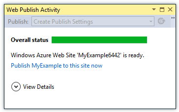

<properties  linkid="develop-net-tutorials-get-started-vs2013" urlDisplayName="Get started with Azure for ASP.NET" pageTitle="Get started with Azure for ASP.NET" metaKeywords="" description="This tutorial shows you how to create an ASP.NET web project in Visual Studio 2013 and deploy it to an Azure Web Site. In less than 15 minutes you'll have an app up and running in the cloud." metaCanonical="" services="web-sites" documentationCenter=".NET" title="Get started with Azure and ASP.NET" authors="tdykstra" solutions="" manager="wpickett" editor="mollybos" />

# 開始使用 Windows Azure 和 ASP.NET

 

<a href="/en-us/develop/net/tutorials/get-started/" title="Visual Studio 2013" class="current">Visual Studio 2013</a><a href="/en-us/develop/net/tutorials/get-started-vs2012/" title="Visual Studio 2012">Visual Studio 2012</a>

 本教學課程示範如何使用 Visual Studio 2013 中或 Visual Studio 2013 for Web Express 精靈，以建立 ASP.NET Web 應用程式並將其部署至 Azure 網站。此教學課程假設您先前沒有使用 Azure 或 ASP.NET 的經驗。完成教學課程後，您將有個在雲端中啟動並執行的簡易 Web 應用程式。

您可以免費申請 Azure 帳戶，而且如果您還沒有 Visual Studio 2013，SDK 會自動安裝 Visual Studio 2013 for Web Express。如此您就能開始免費進行 Azure 相關開發。

您將了解：

* 如何安裝 Azure SDK 好讓電腦適合用於進行 Azure 開發。
* 如何建立 Visual Studio ASP.NET Web 專案，並將該專案部署至 Azure 網站。
* 如何對專案進行變更並重新部署。

下圖顯示完成的應用程式：

> [WACOM.NOTE] 若要完成此教學課程，您需要 Azure 帳戶。如果您沒有這類帳戶，可以[啟用自己的 MSDN
> 訂戶權益](/en-us/pricing/member-offers/msdn-benefits-details/?WT.mc_id=A261C142F){:
> 
> target="_blank"}或是[申請免費試用](/en-us/pricing/free-trial/?WT.mc_id=A261C142F)。

### 教學課程區段

* [設定開發環境](#set-up-the-development-environment)
* [在 Visual Studio 中建立 ASP.NET Web 專案](#create-an-asp.net-web-project)
* [將應用程式部署至 Azure](#deploy-the-application-to-azure)
* [進行變更並重新部署](#make-a-change-and-redeploy)
* [後續步驟](#next-steps)

[WACOM.INCLUDE [install-sdk-2013-only](../includes/install-sdk-2013-only.md)]

## 建立 ASP.NET Web 應用程式

您的第一個步驟是要建立 Web 應用程式專案。Visual Studio 將自動建立 Azure 網站，您稍後會將專案部署至此。

1.  開啟 Visual Studio 2013 或 Visual Studio 2013 Express for Web。

2.  從 **檔案** 功能表，按一下 **新增專案**。
    
    ![[檔案] 功能表中的 [新增專案]](./media/web-sites-dotnet-get-started-vs2013/gs13newproj.png)

3.  在 **新增專案** 對話方塊中，展開 **C#** 或 **Visual Basic** 並選取 **已安裝的範本** 下的 **Web**，再選取 **ASP.NET Web 應用程式**。

4.  確定已選取 **.NET Framework 4.5** 作為目標架構。

5.  將應用程式命名為 **MyExample**，再按一下 **確定**。
    
    ![[新增專案]
    對話方塊](./media/web-sites-dotnet-get-started-vs2013/GS13newprojdb.png)

6.  在 **New ASP.NET Project** 對話方塊中，選取 **MVC** 或 [Web Form]**** 範本，再按一下 **變更驗證**。
    
    [MVC 和 Web Form][1] 是用於建立網站的 ASP.NET 架構。如果您沒有其他偏好，同時計劃進行其他 Azure 教學課程，那麼 MVC 是您的良好選擇，因為還有其他使用 MVC 的 Azure 教學課程。
    
    ![[New ASP.NET Project]
    對話方塊](./media/web-sites-dotnet-get-started-vs2013/GS13changeauth.png)

7.  在 **變更驗證** 對話方塊中，按一下 **不需要驗證**，然後按一下 **確定**。
    
    
    
    您要建立的範例應用程式將不會有需要使用者登入的功能。本教學課程最後的[後續步驟](#next-steps)小節會提供實作驗證與授權的教學課程連結。

8.  在對話方塊的 **Azure** 下，請將核取方塊保留選取，並將下拉式清單方塊設為 **網站**。
    
    核取方塊的標題可能為 **Host in the cloud**或 [Create remote
    resources]****。無論是哪一個，效果都是相同的。
    
    這些設定可指定 Visual Studio 將為您的 Web 專案建立 Azure 網站。您會將 Web 專案部署至新建立的網站。(做為替代的方法，您可以變更下拉式清單方塊的選擇，以讓 Visual Studio 建立執行 IIS 的 Azure 虛擬機器，但本教學課程不會詳細說明該選項的步驟。)

9.  在 **New ASP.NET Project** 對話方塊中，按一下 **確定**。
    
    ![[New ASP.NET Project]
    對話方塊](./media/web-sites-dotnet-get-started-vs2013/GS13newaspnetprojdb.png)
    
    螢幕擷取畫面會顯示選取的 MVC 範本；如果您選擇的是 Web Form，便會選取 **Web Form**。

10. 如果您尚未登入 Azure，Visual Studio 會提示您登入。按一下 **登入**。
    
    

11. 輸入您用來管理 Azure 訂閱之帳戶的識別碼和密碼。
    
    
    
    當您登入時，**Configure Azure Site Settings** 對話方塊會詢問您要建立什麼資源。
    
    

12. Visual Studio 會提供預設的**網站名稱**，Azure 將其做為應用程式 URL 的前置詞。如果需要，您可以輸入不同的網站名稱。
    
    完整的 URL 將包含您在此處輸入的字串，加上您在文字方塊旁看到的網域。例如，如果網站名稱為 `MyExample6442`，URL 會是 `MyExample6442.azurewebsites.net`。如果其他人已使用您輸入的 URL，您會在右邊看到紅色驚嘆號，而非綠色打勾記號，代表您需要輸入不同的值。

13. 在 **區域** 下拉式清單中，選擇最接近您的位置。
    
    此設定指定您的網站將執行所在的 Azure 資料中心。

14. 保留資料庫欄位不變。
    
    在本教學課程中，您不會使用資料庫。本教學課程最後的[後續步驟](#next-steps)小節會提供示範如何使用資料庫的教學課程連結。

15. 按一下 **確定**。
    
    在數秒後，Visual Studio 會在您指定的資料夾中建立 Web 專案，並在您指定的 Azure 區域中建立網站。
    
    **方案總管** 視窗會顯示新專案中的檔案和資料夾。(螢幕擷取畫面為 Web Form 專案；MVC 專案的資料夾和檔案不同。)
    
    
    
    **Web Publish Activity** 視窗會顯示已建立網站。
    
    

## 將應用程式部署至 Azure

1.  在 **Web Publish Activity** 視窗中，按一下 **Publish MyExample to this    site now**。
    
    
    
    幾秒後，**發行 Web** 精靈隨即出現。精靈會建立新的*發行設定檔*，其中包含 Visual Studio 將您的專案部署至 Azure 所需的網站 URL 之類的設定。設定檔會自動儲存，以便稍後在您對專案進行變更時，可以輕鬆將專案重新部署至相同網站。

2.  在 **發行 Web** 精靈的 **連線** 索引標籤中，按一下 **驗證連線** 可確定 Visual
    Studio 可以連線至 Azure，以便部署 Web 專案。
    
    
    
    當連線通過驗證後，**驗證連線** 按鈕旁邊會顯示綠色打勾記號。

3.  按 **下一步**。
    
    

4.  在 **設定** 索引標籤中，按 **下一步**。
    
    ![[設定]
    索引標籤](./media/web-sites-dotnet-get-started-vs2013/GS13SettingsTab.png)
    
    您可以接受此索引標籤上的預設設定。您是要部署「發行」建置，且不需要刪除目的地伺服器上的檔案、預先編譯應用程式，或排除 App\_Data 資料夾中的檔案。本教學課程最後的[後續步驟](#next-steps)小節，會提供部署偵錯建置並示範如何從遠端在偵錯模式中執行
    Visual Studio 的教學課程連結。

5.  在 **預覽** 索引標籤中，按一下 **開始預覽**。
    
    ![[預覽] 索引標籤中的 [開始預覽]
    按鈕](./media/web-sites-dotnet-get-started-vs2013/GS13Preview.png)
    
    此索引標籤會列出要複製至伺服器的檔案。顯示預覽並非要發行應用程式時的必要動作，但是是可以知道的有用功能。

6.  按一下 **發行**。
    
    
    
    Visual Studio 隨即開始進行將檔案複製至 Azure 伺服器的程序。
    
    **輸出** 和 **Web Publish Activity**
    視窗會顯示已採取的部署動作，並報告部署作業已順利完成。
    
    ![[輸出]
    視窗報告部署成功](./media/web-sites-dotnet-get-started-vs2013/PublishOutput.png)
    
    部署成功時，即會自動在預設瀏覽器中開啟已部署之網站的 URL，而您建立的應用程式現在正在雲端中執行。瀏覽器網址列中的 URL
    可顯示網站是從網際網路載入。
    
    

7.  關閉瀏覽器。

## 進行變更並重新部署

在本教學課程的選擇性小節中，您會變更 Web 專案、在開發電腦中本機執行專案以驗證變更，然後將變更部署至 Azure。

1.  如果您建立的是 MVC 專案，請在 **方案總管** 中開啟 *Views/Home/Index.cshtml* 或
    *.vbhtml* 檔案，將 **h1** 標題從 "ASP.NET" 變更為 "ASP.NET and Azure"，並儲存檔案。
    
    
    
    

2.  如果您建立的是 Web Form 專案，請在 **方案總管** 中開啟 *Default.aspx* 檔案，將 **h1** 標題從 "ASP.NET" 變更為 "ASP.NET and Azure"，並儲存檔案。
    
    
    
    

3.  透過在您的本機電腦上執行網站，按 CTRL+F5 來測試您的變更。
    
    
    
    `http://localhost` URL 表示它是在您的本機電腦上執行。根據預設，它會在 IIS Express 中執行，其為 IIS 的輕量型版本，專為在 Web 應用程式開發期間使用而設計。

4.  關閉瀏覽器。

5.  在 **方案總管** 中以滑鼠右鍵按一下專案，再選擇 **發行**。
    
    
    
    **發行 Web** 精靈的 [預覽] 索引標籤隨即出現。以往如果需要變更任何發行設定，您會選擇不同的索引標籤，但現在您只需要使用相同的設定來重新部署。

6.  在 **發行 Web** 精靈中，按一下 **發行**。
    
    ![按一下
    [發行]](./media/web-sites-dotnet-get-started-vs2013/clickpublish.png)
    
    Visual Studio 會將專案部署至 Azure，並在預設瀏覽器中開啟網站。
    
    

當您不需變更發行設定時，重新部署的更快方式為使用 **Web 單鍵發行** 工具列。

預設不會啟用此工具列；您可以在 **檢視] - [工具列** 功能表中加以啟用。您可以使用它來選取設定檔，按一下按鈕來發行，或按一下按鈕來開啟 **發行 Web** 精靈。

## 後續步驟

在本教學課程中，您已了解如何建立簡易的 Web 應用程式，並將其部署至 Azure 網站。以下是進一步了解的一些相關主題和資源：

* 部署 Web 專案的其他方式
* 如何管理、調整和疑難排解網站
* 如何新增資料庫與授權功能
* 如何在網站、雲端服務和 Web 應用程式的 VM 之間選擇

### 部署 Web 專案的其他方式

在此教學課程中，您看到在一項作業中建立網站並部署網站的最快速方式。如需如何使用 Visual Studio 或透過[來源控制系統][2]來[自動化部署][3]之其他部署方式的概觀，請參閱[如何部署 Azure 網站](/en-us/documentation/articles/web-sites-deploy/")。

自動化部署的其中一個方式是使用 Windows PowerShell 指令碼。Visual Studio 和 Azure 可簡化該作業，方法是產生 PowerShell 指令碼，該指令碼可供您用來執行與 Visual Studio 中所執行之相同部署作業。如需詳細資訊，請參閱[自動化各個項目 (使用 Azure 建置真實世界的雲端應用程式)][4] (英文)。

### 如何管理網站

[Azure 管理入口網站](en-us/services/management-portal/)是一項讓您用來管理及監視自己的 Azure 服務 (例如網站、雲端服務、虛擬機器、資料庫等等) 的 Web 介面。若要查看您可以在入口網站執行的動作，請移至 [https://manage.windowsazure.com]()，並使用具有 Azure
訂閱之管理權限帳戶的使用者名稱及密碼來登入。如需詳細資訊，請參閱[如何管理網站](/en-us/manage/services/web-sites/how-to-manage-websites/)。

您也可以直接從 Visual Studio 的 **伺服器總管** 中執行一些網站管理功能。如需可在 **伺服器總管** 中執行之功能的詳細資訊，請參閱[在 Visual Studio 中疑難排解 Azure 網站](/en-us/develop/net/tutorials/troubleshoot-web-sites-in-visual-studio/)。

### 如何調整網站

如果您的網站是公開網站，而且開始收到愈來愈多的流量，則回應時間可能會變慢。若要修補該問題，您可以在管理入口網站的 **調整** 索引標籤中輕鬆地新增伺服器資源。如需詳細資訊，請參閱[如何調整網站](/en-us/manage/services/web-sites/how-to-scale-websites/)。(新增伺服器資源來調整網站並不是免費的。)

### 如何疑難排解網站

您可能會想要查看追蹤或記錄輸出，以便進行疑難排解。Visual Studio 提供內建工具，讓您能輕鬆檢視即時產生的 Azure 記錄。您也可以在 Azure 中遠端執行偵錯模式。如需詳細資訊，請參閱[在 Visual Studio 中疑難排解 Azure 網站](/en-us/develop/net/tutorials/troubleshoot-web-sites-in-visual-studio/)。

### 如何新增資料庫與授權功能

大部分生產網站都會使用資料庫，並限制部分網站功能只有特定授權使用者才能使用。如需觀看教學課程來了解如何開始使用資料庫存取、驗證和授權，請參閱[將使用成員資格、OAuth 和 SQL Database 的安全 ASP.NET MVC 應用程式部署至 Azure 網站](/en-us/develop/net/tutorials/web-site-with-sql-database/)。

### 如何決定您的應用程式是否應該在雲端服務中執行

在 Azure 中，您可以在「網站」(如本教學課程中所示) 或在「雲端服務」或「虛擬機器」中執行 Web 應用程式。如需詳細資訊，請參閱 [Azure 執行模型](/en-us/develop/net/fundamentals/compute/)和 [Azure 網站、雲端服務和 VM：使用時機](/en-us/manage/services/web-sites/choose-web-app-service/)。

[1]: http://www.asp.net/get-started/websites
[2]: http://www.asp.net/aspnet/overview/developing-apps-with-windows-azure/building-real-world-cloud-apps-with-windows-azure/source-control
[3]: http://www.asp.net/aspnet/overview/developing-apps-with-windows-azure/building-real-world-cloud-apps-with-windows-azure/continuous-integration-and-continuous-delivery
[4]: http://www.asp.net/aspnet/overview/developing-apps-with-windows-azure/building-real-world-cloud-apps-with-windows-azure/automate-everything