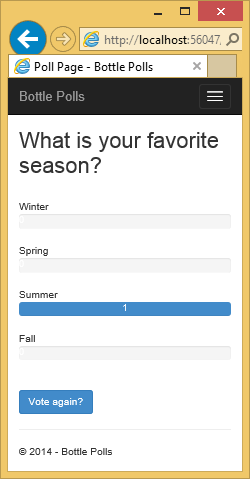

<properties linkid="web-sites-python-ptvs-bottle-table-storage" title="Bottle and Azure Table Storage on Azure with Python Tools 2.1 for Visual Studio" pageTitle="Azure 上採用 Python Tools 2.1 for Visual Studio 的 Bottle 和 Azure 資料表儲存體" description="了解如何使用 Python Tools for Visual Studio 建立 Bottle 應用程式，以在 Azure 資料表儲存體中儲存資料並佈署到網站。" metaKeywords="" services="web-sites" solutions="" documentationCenter="Python" authors="huvalo" videoId="" scriptId="" manager="wpickett" editor="" />

<tags ms.service="web-sites" ms.workload="web" ms.tgt_pltfrm="na" ms.devlang="python" ms.topic="article" ms.date="10/10/2014" ms.author="huvalo" />

# Azure 上採用 Python Tools 2.1 for Visual Studio 的 Bottle 和 Azure 資料表儲存體 

在本教學課程中，我們將使用其中一個 PTVS 範例範本來建立簡單的民調應用程式。本教學課程也提供教學[影片](https://www.youtube.com/watch?v=GJXDGaEPy94)。

民調應用程式會定義其儲存機制的抽象觀念，所以您可以輕鬆地在不同類型的儲存機制之間切換 (記憶體內、Azure 資料表儲存體、MongoDB)。

我們將了解如何建立 Azure 儲存體帳戶、如何將此應用程式設定為使用 Azure 資料表儲存體，以及如何將此應用程式發行至 Azure 網站。

請參閱 [Python 開發人員中心][]上的相關文章，內容涵蓋利用 PTVS (採用 Bottle、Flask 和 Django Web 架構)、MongoDB、Azure 資料表儲存體、MySQL 和 SQL Database 服務開發 Azure 網站。雖然這篇文章著重於 Azure 網站，但開發 [Azure 雲端服務][]時的步驟很類似。

+ [必要條件](#prerequisites)
+ [建立專案](#create-the-project)
+ [建立 Azure 儲存體帳戶](#create-an-azure-storage-account)
+ [設定專案](#configure-the-project)
+ [探索 Azure 資料表儲存體](#explore-the-azure-table-storage)
+ [發行至 Azure 網站](#publish-to-an-azure-website)
+ [設定 Azure 網站](#configure-the-azure-website)
+ [後續步驟](#next-steps)

##必要條件

 - Visual Studio 2012 或 2013
 - [Python Tools 2.1 for Visual Studio][]
 - [Python Tools 2.1 for Visual Studio 範例 VSIX][]
 - [Azure SDK Tools for VS 2013][] 或 [Azure SDK Tools for VS 2012][]
 - [Python 2.7 (32 位元)][]或 [Python 3.4 (32 位元)][]

[WACOM.INCLUDE [create-account-and-websites-note](../includes/create-account-and-websites-note.md)]

##建立專案

在這一節中，我們將使用範例範本建立 Visual Studio 專案。我們將建立虛擬環境及安裝必要的套件。然後將使用預設記憶體內儲存機制，在本機執行應用程式。

1.  在 Visual Studio 中選取 [**檔案**]、[**新增專案**]。

1.  在 [**Python**]、[**範例**] 之下可取得 PTVS 範例 VSIX 中的專案範本。選取 [**Polls Bottle Web Project**]，然後按一下 [確定] 以建立專案。

  	

1.  系統會提示您安裝外部套件。選取 [**安裝到虛擬環境**]。

  	

1.  選取 [**Python 2.7**] 或 [**Python 3.4**] 作為基礎解譯器。

  	

1.  按 <kbd>F5</kbd> 確認應用程式可運作。根據預設，應用程式會使用不需任何設定的記憶體內儲存機制。當 Web 伺服器停止時，所有資料都會遺失。

1.  按一下 [**Create Sample Polls**]，然後按一下民調並投票。

  	

##建立 Azure 儲存體帳戶

若要使用儲存體作業，您需要 Azure 儲存體帳戶。您可以依照下列步驟來建立儲存體帳戶。

1.  登入 [Azure 管理入口網站][]。

1.  在導覽窗格的底端，按一下 [**新增**]。

  	

1.  依序按一下 [**資料服務**]、[**儲存體**] 和 [**快速建立**]。

  	

1.  在 [URL] 中，為儲存體帳戶輸入要在 URI 中使用的子網域名稱。此項目可以包含 3 至 24 個小寫字母與數字。此值會成為 URI 內用來將訂閱的 Blob、「佇列」或「表格」資源定址的主機名稱。

1.  選擇要將儲存體放置於的「區域/同質群組」。如果您會從 Azure 應用程式使用儲存體，請選取您會在其中部署應用程式的相同區域。

1.  (選用) 您可以啟用地理區域複寫。利用異地複寫，Azure 儲存體現在可將您的資料持續放在兩個位置。在這兩個位置中，Azure 儲存體會不斷為您的資料維護多份健全複本。

1.  按一下 [**建立儲存體帳戶**]。

##設定專案

在這一節中，我們會將應用程式設定為使用我們剛才建立的儲存體帳戶。我們將可了解如何從 Azure 入口網站取得連線設定。然後會在本機執行此應用程式。

1.  在 [Azure 管理入口網站][]中，按一下在上一節中建立的儲存體帳戶。

1.  按一下 [**管理存取金鑰**]。

  	

1.  在 Visual Studio 的 [方案總管] 中，以滑鼠右鍵按一下您的專案節點，並選取 [**屬性**]。按一下 [**偵錯**] 索引標籤。

  	

1.  在 [**偵錯伺服器命令**]、[**環境**] 中設定應用程式所需的環境變數值。

        REPOSITORY_NAME=azuretablestorage
        STORAGE_NAME=<storage account name>
        STORAGE_KEY=<primary access key>

    此舉會在您 [**開始偵錯**] 時設定環境變數。如果您想要在 [**啟動但不偵錯**] 時設定變數，請在 [**執行伺服器命令**] 下設定相同的值。

    此外，您也可以使用 Windows 控制台定義環境變數。如果您想避免在原始程式碼 / 專案檔案中儲存認證，這是比較好的選項。請注意，您必須重新啟動 Visual Studio，新的環境值才可用於應用程式。

1.  實作 Azure 資料表儲存體儲存機制的程式碼位於 **models/azuretablestorage.py** 中。請參閱[文件]中有關如何從 Python 使用資料表服務的詳細資訊。

1.  利用 <kbd>F5</kbd> 執行應用程式。隨即會使用 [**Create Sample Polls**] 建立民調，而投票所提交的資料將會在 Azure 資料表儲存體中序列化。

1.  瀏覽至 [**關於**] 頁面，確認應用程式目前使用 [**Azure 資料表儲存體**] 儲存機制。

  	

##探索 Azure 資料表儲存體

在 Visual Studio 中使用 [伺服器總管] 即可輕鬆檢視和編輯儲存體資料表。在這一節中，我們將使用 [伺服器總管] 來檢視民調應用程式資料表的內容。

> [WACOM.NOTE] 這需要安裝 Microsoft Azure Tools，其可在 [Azure SDK for .NET][] 中取得。

1.  開啟 [**伺服器總管**]。依序展開 [**Azure**]、[ **儲存體**]、您的儲存體帳戶和 [**資料表**]。

  	

1.  連按兩下 [**民調**] 或 [ **選擇**] 資料表，以在文件視窗中檢視資料表的內容，以及新增/移除/編輯實體。

  	

##發行至 Azure 網站

PTVS 可讓您輕鬆地將 Web 應用程式發行至 Azure 網站。

1.  在 [**方案總管**] 中，以滑鼠右鍵按一下專案節點並選取 [**發行**]。

  	

1.  按一下 [**Microsoft Azure 網站**]。

1.  按一下 [**新增**] 以建立新網站。

1.  選取 [**網站名稱**] 和 [**區域**]，然後按一下 [**建立**]。

  	

1.  接受其他所有預設值並按一下 [**發行**]。

1.  您的 Web 瀏覽器將會自動開啟到發行的網站。如果您瀏覽至 [關於] 頁面，您會看見網站使用 [**記憶體內部**] 儲存機制，而非 [**Azure 資料表儲存體**] 儲存機制。

    這是因為環境變數並未設定於 Azure 網站上，所以會使用在 **settings.py** 中指定的預設值。

##設定 Azure 網站

在這一節中，我們將設定網站的環境變數。

1.  在 [Azure 管理入口網站][]中，按一下在上一節中建立的網站。

1.  在頂端功能表中，按一下 [**設定**]。

  	

1.  向下捲動至 [**應用程式設定**] 區段並如上一節所述設定 **REPOSITORY\_NAME**、**STORAGE\_NAME** 和 **STORAGE\_KEY** 的值。

  	

1. 在底部功能表中，依序按一下 [**儲存**]、[**重新啟動**] 和 [**瀏覽**]。

  	

1.  您應看到應用程式如預期般運作，並且使用 [**Azure 資料表儲存體**] 儲存機制。

    恭喜！

  	

##後續步驟

遵循下列連結，進一步了解 Python Tools for Visual Studio、Bottle 和 Azure 資料表儲存體。

- [Python Tools for Visual Studio 文件][]
  - [Web 專案][]
  - [雲端服務專案][]
  - [在 Microsoft Azure 上進行遠單偵錯][]
- [Bottle 文件][]
- [Azure 儲存體][]
- [Azure SDK for Python][]
- [如何從 Python 使用資料表儲存體服務][]

<!--Link references-->
[Python 開發人員中心]: /zh-tw/develop/python/
[Azure 雲端服務]: ../cloud-services-python-ptvs/
[文件]: ../storage-python-how-to-use-table-storage/
[如何從 Python 使用資料表儲存體服務]: ../storage-python-how-to-use-table-storage/

<!--External Link references-->
[Azure 管理入口網站]: https://manage.windowsazure.com
[Azure SDK for .NET]: http://azure.microsoft.com/zh-tw/downloads/
[Python Tools 2.1 for Visual Studio]: http://go.microsoft.com/fwlink/?LinkId=517189
[Python Tools 2.1 for Visual Studio 範例 VSIX]: http://go.microsoft.com/fwlink/?LinkId=517189
[Azure SDK Tools for VS 2013]: http://go.microsoft.com/fwlink/?LinkId=323510
[Azure SDK Tools for VS 2012]: http://go.microsoft.com/fwlink/?LinkId=323511
[Python 2.7 (32 位元)]: http://go.microsoft.com/fwlink/?LinkId=517190 
[Python 3.4 (32 位元)]: http://go.microsoft.com/fwlink/?LinkId=517191
[Python Tools for Visual Studio 文件]: http://pytools.codeplex.com/documentation
[Bottle 文件]: http://bottlepy.org/docs/dev/index.html
[在 Microsoft Azure 上進行遠單偵錯]: http://pytools.codeplex.com/wikipage?title=Features%20Azure%20Remote%20Debugging
[Web 專案]: http://pytools.codeplex.com/wikipage?title=Features%20Web%20Project
[雲端服務專案]: http://pytools.codeplex.com/wikipage?title=Features%20Cloud%20Project
[Azure 儲存體]: http://azure.microsoft.com/zh-tw/documentation/services/storage/
[Azure SDK for Python]: https://github.com/Azure/azure-sdk-for-python

<!--HONumber=35.1-->
