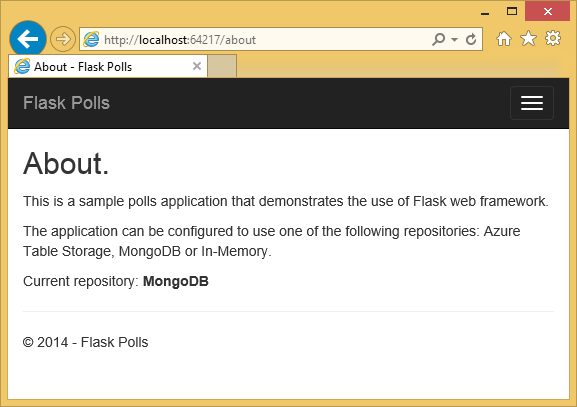

<properties linkid="web-sites-python-ptvs-flask-mongodb" title="Flask and MongoDB on Azure with Python Tools 2.1 for Visual Studio" pageTitle="Azure 上採用 Python Tools 2.1 for Visual Studio 的 Flask 和 MongoDB" description="了解如何使用 Python Tools for Visual Studio 建立 Flask 應用程式，以在 MongoDB 資料庫儲存個體中儲存資料並佈署到網站。" metaKeywords="" services="" solutions="" documentationCenter="Python" authors="huvalo" videoId="" scriptId="" manager="wpickett" editor="" />

<tags ms.service="web-sites" ms.workload="web" ms.tgt_pltfrm="na" ms.devlang="python" ms.topic="article" ms.date="10/10/2014" ms.author="huvalo" />

# Azure 上採用 Python Tools 2.1 for Visual Studio 的 Flask 和 MongoDB

在本教學課程中，我們將使用其中一個 PTVS 範例範本來建立簡單的民調應用程式。本教學課程也提供教學[影片](https://www.youtube.com/watch?v=eql-crFgrAE)。

民調應用程式會定義其儲存機制的抽象觀念，所以您可以輕鬆地在不同類型的儲存機制之間切換 (記憶體內、Azure 資料表儲存體、MongoDB)。

我們將了解如何在 Azure 上使用其中一個託管 MongoDB 服務、如何將此應用程式設定為使用 MongoDB，以及如何將此應用程式發行至 Azure 網站。

請參閱 [Python 開發人員中心][]上的相關文章，內容涵蓋利用 PTVS (採用 Bottle、Flask 和 Django Web 架構)、MongoDB、Azure 資料表儲存體、MySQL 和 SQL Database 服務開發 Azure 網站。雖然這篇文章著重於 Azure 網站，但開發 [Azure 雲端服務][]時的步驟很類似。

+ [必要條件](#prerequisites)
+ [建立專案](#create-the-project)
+ [建立 MongoDB 資料庫](#create-a-mongodb-database)
+ [設定專案](#configure-the-project)
+ [探索 MongoDB 資料庫](#explore-the-mongodb-database)
+ [發行至 Azure 網站](#publish-to-an-azure-website)
+ [設定 Azure 網站](#configure-the-azure-website)
+ [後續步驟](#next-steps)

##必要條件

 - Visual Studio 2012 或 2013
 - [Python Tools 2.1 for Visual Studio][]
 - [Python Tools 2.1 for Visual Studio 範例 VSIX][]
 - [Azure SDK Tools for VS 2013][] 或 [Azure SDK Tools for VS 2012][]
 - [Python 2.7 (32 位元)][]或 [Python 3.4 (32 位元)][]
 - [RoboMongo][] (選用)

[WACOM.INCLUDE [create-account-and-websites-note](../includes/create-account-and-websites-note.md)]

##建立專案

在這一節中，我們將使用範例範本建立 Visual Studio 專案。我們將建立虛擬環境及安裝必要的套件。然後將使用預設記憶體內儲存機制，在本機執行應用程式。

1.  在 Visual Studio 中選取 [**檔案**]、[**新增專案**]。 

1.  在 [**Python**]、[ **範例**] 之下可取得 PTVS 範例 VSIX 中的專案範本。選取 [**Polls Flask Web Project**]，然後按一下 [確定] 以建立專案。

  	

1.  系統會提示您安裝外部套件。選取 [**安裝到虛擬環境**]。

  	

1.  選取 [**Python 2.7**] 或 [**Python 3.4**] 作為基礎解譯器。

  	

1.  按 <kbd>F5</kbd> 確認應用程式可運作。根據預設，應用程式會使用不需任何設定的記憶體內儲存機制。當 Web 伺服器停止時，所有資料都會遺失。

1.  按一下 [**Create Sample Polls**]，然後按一下民調並投票。

  	

##建立 MongoDB 資料庫

對於資料庫，我們將在 Azure 上建立 MongoLab 代管資料庫。

此外，您可以在 Azure 上建立自己的虛擬機器，然後自行安裝及管理 MongoDB。

您可以依照下列步驟來建立免費試用的 MongoLab。

1.  登入 [Azure 管理入口網站][]。

1.  在導覽窗格的底端，按一下 [**新增**]。

  	

1.  按一下 [**儲存**]，再按一下 [**MongoLab**]。

  	

1.  在 [名稱] 中，輸入要用於資料庫服務的名稱。

1.  選擇要將資料庫服務放置於的「區域/同質群組」。如果您會從 Azure 應用程式使用資料庫，請選取您會在其中部署應用程式的相同區域。

  	

1.  按一下 [**購買**]。

##設定專案

在這一節中，我們會將應用程式設定為使用我們剛才建立的 MongoDB 資料庫。我們將可了解如何從 Azure 入口網站取得連線設定。然後會在本機執行此應用程式。

1.  在 [Azure 管理入口網站][]中，按一下 [**附加元件**]，然後按一下您先前建立的 MongoLab 服務。

1.  按一下 [**連線資訊**]。您可以使用複製按鈕，將 **MONGOLAB\_URI** 的值放在剪貼簿上。

  	

1.  在 Visual Studio 的 [方案總管] 中，以滑鼠右鍵按一下您的專案節點，並選取 [**屬性**]。按一下 [**偵錯**] 索引標籤。

  	

1.  在 [**偵錯伺服器命令**]、[**環境**] 中設定應用程式所需的環境變數值。

        REPOSITORY_NAME=mongodb
        MONGODB_HOST=<value of MONGOLAB_URI>
        MONGODB_DATABASE=<database name>

    此舉會在您 [**開始偵錯**] 時設定環境變數。如果您想要在 [**啟動但不偵錯**] 時設定變數，請在 [**執行伺服器命令**] 下設定相同的值。

    此外，您也可以使用 Windows 控制台定義環境變數。如果您想避免在原始程式碼 / 專案檔案中儲存認證，這是比較好的選項。請注意，您必須重新啟動 Visual Studio，新的環境值才可用於應用程式。

1.  實作 MongoDB 儲存機制的程式碼位於 **models/mongodb.py** 中。

1.  利用 <kbd>F5</kbd> 執行應用程式。隨即會使用 [**Create Sample Polls**] 民調，而投票所提交的資料將會在 MongoDB 中序列化。

1.  瀏覽至 [**關於**] 頁面，確認應用程式目前使用 **MongoDB** 儲存機制。

  	

##探索 MongoDB 資料庫

您可以使用 [RoboMongo][] 等應用程式，查詢及編輯 MongoDB 資料庫。在這一節中，我們將使用 RoboMongo 來檢視民調應用程式資料庫的內容。

1.  建立新連線。您會需要我們在上一節中擷取的 **MONGOLAB\_URI**。

    Note the format of the URI: `mongodb://<name>:<password>@<address>:<port>/<name>`

    此名稱符合您使用 Azure 建立服務時輸入的名稱。該名稱同時用於資料庫名稱和使用者名稱。

1.  在連線頁面中，將 [**名稱**] 設定為任何您要用於連線的名稱。此外，將 [**位址**] 和 [ **連接埠**] 欄位設定為 **MONGOLAB\_URI** 中的 *address* 和 *port* 。

  	

1.  在驗證頁面中，將 [**資料庫**] 和 [**使用者名稱**] 設定為 **MONGOLAB\_URI** 中的 *name* 。此外，將 [**密碼**] 設定為 **MONGOLAB\_URI** 中的 *password*。

  	

1.  儲存並連線至資料庫。您現在可以查詢民調集合。

  	

##發行至 Azure 網站

PTVS 可讓您輕鬆地將 Web 應用程式發行至 Azure 網站。

1.  在 [**方案總管**] 中，以滑鼠右鍵按一下專案節點並選取 [**發行**]。

  	

1.  按一下 [**Microsoft Azure 網站**]。

1.  按一下 [**新增**] 以建立新網站。

1.  選取 [**網站名稱**] 和 [**區域**]，然後按一下 [**建立**]。

  	

1.  接受其他所有預設值並按一下 [**發行**]。

1.  您的 Web 瀏覽器將會自動開啟到發行的網站。如果您瀏覽至 [關於] 頁面，您會看見網站使用 [**記憶體內部**] 儲存機制，而非 [**MongoDB**] 儲存機制。

    這是因為環境變數並未設定於 Azure 網站上，所以會使用在 **settings.py** 中指定的預設值。

##設定 Azure 網站

在這一節中，我們將設定網站的環境變數。

1.  在 [Azure 管理入口網站][]中，按一下在上一節中建立的網站。

1.  在頂端功能表中，按一下 [**設定**]。

  	

1.  向下捲動至 [**應用程式設定**] 區段並如上一節所述設定 **REPOSITORY\_NAME**、**MONGODB\_HOST** 和 **MONGODB\_DATABASE** 的值。

  	

1.  在底部功能表中，依序按一下 [**儲存**]、[**重新啟動**] 和 [**瀏覽**]。

  	

1.  您應看到應用程式如預期般運作，並且使用 [**MongoDB**] 儲存機制。

    恭喜！

  	

##後續步驟

遵循下列連結，進一步了解 Python Tools for Visual Studio、Flask 和 MongoDB。

- [Python Tools for Visual Studio 文件][]
  - [Web 專案][]
  - [雲端服務專案][]
  - [在 Microsoft Azure 上進行遠單偵錯][]
- [Flask 文件][]
- [MongoDB][]
- [PyMongo 文件][]
- [PyMongo][]

<!--Link references-->
[Python 開發人員中心]: /zh-tw/develop/python/
[Azure 雲端服務]: ../cloud-services-python-ptvs/

<!--External Link references-->
[Azure 管理入口網站]: https://manage.windowsazure.com
[RoboMongo]: http://robomongo.org/
[Python Tools 2.1 for Visual Studio]: http://go.microsoft.com/fwlink/?LinkId=517189
[Python Tools 2.1 for Visual Studio 範例 VSIX]: http://go.microsoft.com/fwlink/?LinkId=517189
[Azure SDK Tools for VS 2013]: http://go.microsoft.com/fwlink/?LinkId=323510
[Azure SDK Tools for VS 2012]: http://go.microsoft.com/fwlink/?LinkId=323511
[Python 2.7 (32 位元)]: http://go.microsoft.com/fwlink/?LinkId=517190 
[Python 3.4 (32 位元)]: http://go.microsoft.com/fwlink/?LinkId=517191
[Python Tools for Visual Studio 文件]: http://pytools.codeplex.com/documentation
[Flask 文件]: http://flask.pocoo.org/
[MongoDB]: http://www.mongodb.org/
[PyMongo 文件]: http://api.mongodb.org/python/current/
[PyMongo]: https://github.com/mongodb/mongo-python-driver
[在 Microsoft Azure 上進行遠單偵錯]: http://pytools.codeplex.com/wikipage?title=Features%20Azure%20Remote%20Debugging
[Web 專案]: http://pytools.codeplex.com/wikipage?title=Features%20Web%20Project
[雲端服務專案]: http://pytools.codeplex.com/wikipage?title=Features%20Cloud%20Project

<!--HONumber=35.1-->
