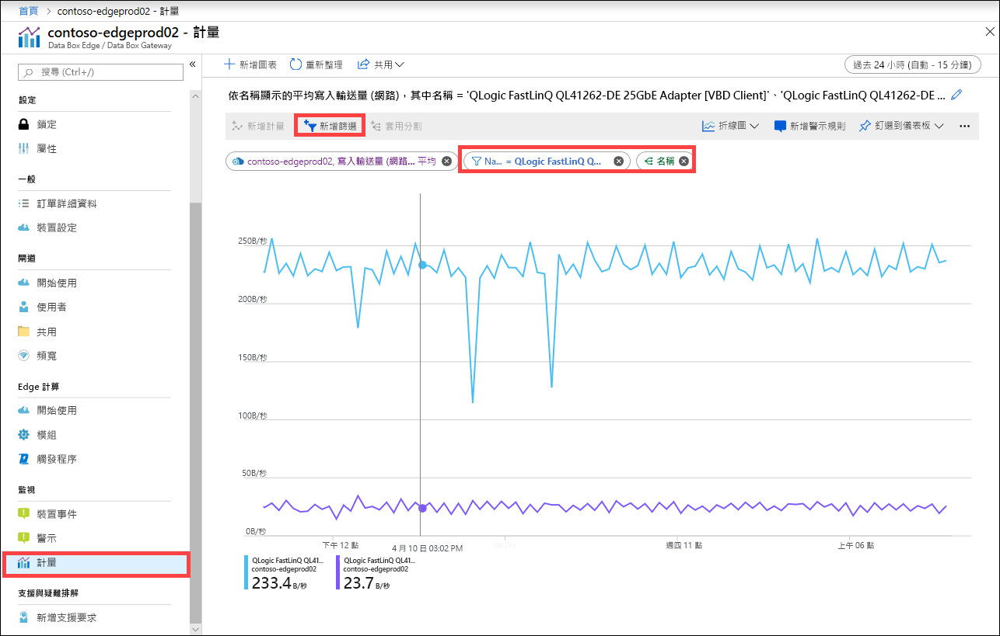

您也可以監視裝置的效能來檢視計量，並在某些情況下針對裝置問題進行疑難排解。

請在 Azure 入口網站中採取下列步驟，以建立所選裝置計量的圖表。

1. 對於您在 Azure 入口網站中的資源，請移至 [監視] > [計量]，然後選取 [新增計量]。

    

2. 資源會自動填入。  

    

    若要指定另一個資源，請選取資源。 在 [選取資源] 刀鋒視窗中，選取訂用帳戶、資源群組、資源類型，以及您要顯示的度量的特定資源，然後選取 [套用]。

    

3. 從下拉式清單中選取計量，以監視您的裝置。 計量可為**容量計量**或**交易計量**。 容量計量與裝置容量相關。 交易計量與 Azure 儲存體中的讀取和寫入作業相關。

    |容量度量                     |描述  |
    |-------------------------------------|-------------|
    |**可用容量**               | 指的是可以寫入裝置的資料大小。 換句話說，這是在裝置上可取得的容量。   您可以藉由刪除在裝置和雲端都有複本的本機複本，以釋放裝置容量。        |
    |**容量總計**                   | 指的是裝置上可寫入資料的位元組總計。 這也稱為本機快取大小總計。    您現在可藉由新增資料磁碟來增加現有虛擬裝置的容量。 透過 VM 的 Hypervisor 管理新增資料磁碟，然後將您的 VM 重新開機。 閘道裝置的本機存放集區會擴充，以適應新增的資料磁碟。   如需詳細資訊，請移至[為 HYPER-V 虛擬機器新增硬碟](https://www.youtube.com/watch?v=EWdqUw9tTe4)。 |
    
    |交易度量              | 描述         |
    |-------------------------------------|---------|
    |**上傳的雲端位元組數 (裝置)**    | 在您裝置上所有共用上傳之所有位元組的總和        |
    |**上傳的雲端位元組數 (共用)**     | 每個共用上傳的位元組數。 這可以是：    平均 (每個共用上傳的位元組總和 / 共用數目)、    最大值，即從共用上傳之位元組的最大數目   最小值，即從共用上傳之位元組的最小數目      |
    |**雲端下載輸送量 (共用)**| 每個共用下載的位元組數。 這可以是：    平均 (讀取或下載至共用的位元組總和 / 共用數目)    最大值，即從共用下載之位元組的最大數目   及最小值，即從共用下載之位元組的最小數目  |
    |**雲端讀取輸送量**            | 在您裝置上所有共用從雲端讀取之所有位元組的總和     |
    |**雲端上傳輸送量**          | 在您裝置上所有共用寫入至雲端之所有位元組的總和     |
    |**雲端上傳輸送量 (共用)**  | 從共用寫入至雲端的所有位元組總和 / 共用數目是每個共用的平均、最大值和最小值      |
    |**讀取輸送量 (網路)**           | 包括從雲端讀取之所有位元組的系統網路輸送量。 此檢視可包含未限制共用的資料。   分割會顯示裝置上所有網路介面卡的流量。 這包括未連線或未啟用的介面卡。      |
    |**寫入輸送量 (網路)**       | 包括寫入至雲端之所有位元組的系統網路輸送量。 此檢視可包含未限制共用的資料。   分割會顯示裝置上所有網路介面卡的流量。 這包括未連線或未啟用的介面卡。          |
    |**Edge 計算 - 記憶體使用量**      | 此計量不適用於 Data Box Gateway，因此未填入。          |
    |**Edge 計算 - 百分比 CPU**    | 此計量不適用於 Data Box Gateway，因此未填入。         |

4. 從下拉式清單中選取計量時，也可以定義彙總。 彙總是指在指定的時間範圍彙總的實際值。 彙總值可以是平均、最小值或最大值。 從平均、最大值或最小值選取彙總。

    

5. 如果您選取的計量有多個執行個體，則可使用分割選項。 選取 [套用分割]，然後選取您要查看明細的值。

    

6. 如果您目前想查看少數幾個執行個體的明細，您可以篩選資料。 例如，在此案例中，如果您想要僅看到裝置上兩個連線網路介面的網路輸送量，您可以篩選這些介面。 選取 [新增篩選] 並指定要篩選的網路介面名稱。

    

7. 您也可以將圖表釘選至儀表板，這樣輕鬆就能存取圖表。

    

8. 若要將圖表資料匯出至 Excel 試算表，或取得可共用的圖表連結，請從命令列選取 [共用] 選項。

    