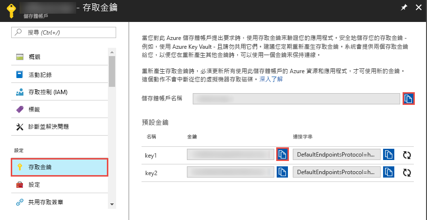

## <a name="prerequisites"></a>必要條件

### <a name="azure-subscription"></a>Azure 訂閱
如果您沒有 Azure 訂用帳戶，請在開始前建立[免費帳戶](https://azure.microsoft.com/free/) 。

### <a name="azure-roles"></a>Azure 角色
若要建立 Data Factory 執行個體，您用來登入 Azure 的使用者帳戶必須為**參與者**或**擁有者**角色，或是 Azure 訂用帳戶的**管理員**。 在 Azure 入口網站中，按一下右上角的 [使用者名稱]，然後選取 [權限] 來檢視您在訂用帳戶中所擁有的權限。 如果您有多個訂用帳戶的存取權，請選取適當的訂用帳戶。 如需將使用者新增至角色的範例指示，請參閱[新增角色](../articles/billing/billing-add-change-azure-subscription-administrator.md)文章。

### <a name="azure-storage-account"></a>Azure 儲存體帳戶
您可以使用一般用途的 Azure 儲存體帳戶 (特別是 Blob 儲存體) 作為本教學課程中的**來源**和**目的地**資料存放區。 如果您沒有一般用途的 Azure 儲存體帳戶，請參閱[建立儲存體帳戶](../articles/storage/common/storage-create-storage-account.md#create-a-storage-account)來建立帳戶。 

#### <a name="get-storage-account-name-and-account-key"></a>取得儲存體帳戶名稱和帳戶金鑰
您會在此快速入門中使用 Azure 儲存體帳戶的名稱和金鑰。 下列程序提供可取得儲存體帳戶名稱和金鑰的步驟。 

1. 啟動網頁瀏覽器並瀏覽至 [Azure 入口網站](https://portal.azure.com)。 使用您的 Azure 使用者名稱和密碼進行登入。 
2. 按一下左側功能表中的 [更多服務]，使用 **Storage** 關鍵字進行篩選，然後選取 [儲存體帳戶]。

    
3. 在儲存體帳戶清單中，篩選您的儲存體帳戶 (如有需要)，然後選取**您的儲存體帳戶**。 
4. 在 [儲存體帳戶] 頁面中，選取功能表上的 [存取金鑰]。

    
5. 將 [儲存體帳戶名稱] 和 [金鑰1] 欄位的值複製到剪貼簿。 將它們貼到 [記事本] 或任何其他編輯器中並加以儲存。 您稍後會在此快速入門中用到。   

#### <a name="create-input-folder-and-files"></a>建立輸入資料夾和檔案
在這一節中，您會在 Azure Blob 儲存體中建立一個名為 **adftutorial** 的 Blob 容器。 接著，您會在容器中建立名為 **input** 的資料夾，然後將範例檔案上傳到 input 資料夾。 

1. 在 [儲存體帳戶] 頁面上，切換至 [概觀]，然後按一下 [Blob]。 

    
2. 在 [Blob 服務] 頁面上，按一下工具列上的 [+ 容器]。 

        
3. 在 [新增容器] 對話方塊中，輸入 **adftutorial** 作為名稱，然後按一下 [確定]。 

    
4. 在容器清單中按一下 [adftutorial]。 

    
1. 在 [容器] 頁面上，按一下工具列上的 [上傳]。  

    
6. 在 [上傳 blob] 頁面上，按一下 [進階]。

    ![按一下 [進階] 連結](media/data-factory-quickstart-prerequisites/upload-blob-advanced.png)
7. 啟動 [記事本] 並使用下列內容建立名為 **emp.txt** 的檔案︰將它儲存在 **c:\ADFv2QuickStartPSH** 資料夾：如果資料夾不存在，建立資料夾 **ADFv2QuickStartPSH**。
    
    ```
    John, Doe
    Jane, Doe
    ```    
8. 在 Azure 入口網站的 [上傳 blob] 頁面上，瀏覽並選取 **emp.txt** 檔，以找到 [檔案] 欄位。 
9. 輸入 **input** 作為 [上傳到資料夾] 欄位的值。 

        
10. 確認資料夾是 **input**，且檔案是 **emp.txt**，然後按一下 [上傳]。
11. 您應該會在清單中看到 **emp.txt** 檔案以及上傳的狀態。 
12. 按一下角落的 [X] 關閉 [上傳 blob] 頁面。 

    
1. 將 [容器] 頁面保持開啟。 您可以在本快速入門結尾處使用它來確認輸出。