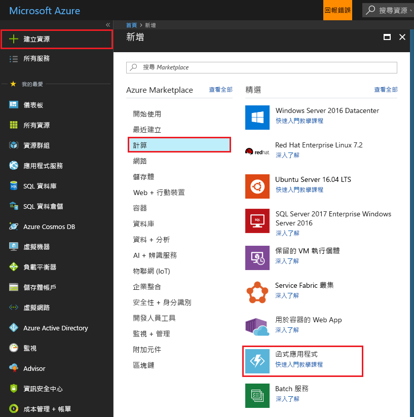

1. 按一下 Azure 入口網站左上角的 [新增] 按鈕，然後選取 [計算] > [函式應用程式]。 

    

2. 請使用影像下面的資料表中指定的函式應用程式設定。

    

    | 設定      | 建議的值  | 描述                                        |
    | ------------ |  ------- | -------------------------------------------------- |
    | **應用程式名稱** | 全域唯一的名稱 | 用以識別新函式應用程式的名稱。 有效字元是 `a-z`、`0-9` 和 `-`。  | 
    | **訂用帳戶** | 您的訂用帳戶 | 將在其下建立這個新函式應用程式的訂用帳戶。 | 
    | **[資源群組](../articles/azure-resource-manager/resource-group-overview.md)** |  myResourceGroup | 要在其中建立函式應用程式的新資源群組名稱。 | 
    | **作業系統** | Windows | 無伺服器裝載目前只能在執行於 Windows 上時使用。 若為 Linux 裝載，請參閱[使用 Azure CLI 建立第一個在 Linux 上執行的函式](../articles/azure-functions/functions-create-first-azure-function-azure-cli-linux.md)。 |
    | **[主控方案](../articles/azure-functions/functions-scale.md)** |   取用方案 | 會定義如何將資源配置給函式應用程式的主控方案。 在預設**取用方案**中，您的函式會根據需要來動態新增資源。 在此[無伺服器](https://azure.microsoft.com/overview/serverless-computing/)裝載中，您只需要針對函式有執行的時間來付費。   |
    | <bpt id="p1">**</bpt>Location<ept id="p1">**</ept> | 西歐 | 選擇與您接近的[區域](https://azure.microsoft.com/regions/)，或選擇與函式將會存取之其他服務接近的區域。 |
    | **[儲存體帳戶](../articles/storage/common/storage-create-storage-account.md#create-a-storage-account)** |  全域唯一的名稱 |  函式應用程式所使用之新儲存體帳戶的名稱。 儲存體帳戶名稱必須介於 3 到 24 個字元的長度，而且只能包含數字和小寫字母。 您也可以使用現有帳戶。 |

1. 按一下 [建立] 以佈建並部署新的函式應用程式。 您可以按一下入口網站右上方的通知圖示來監視部署的狀態。 

    

    按一下 [前往資源] 會帶您前往您的新函式應用程式。
