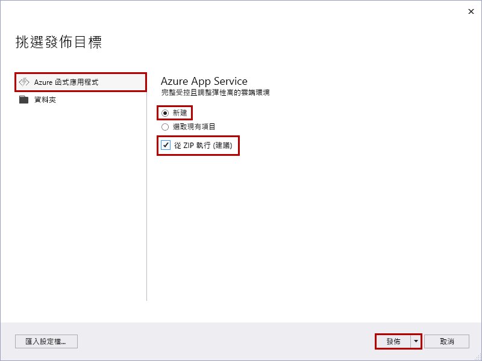
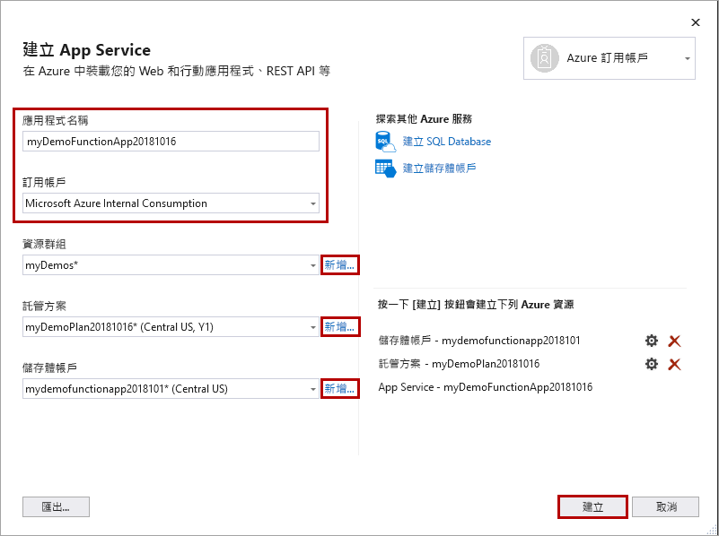
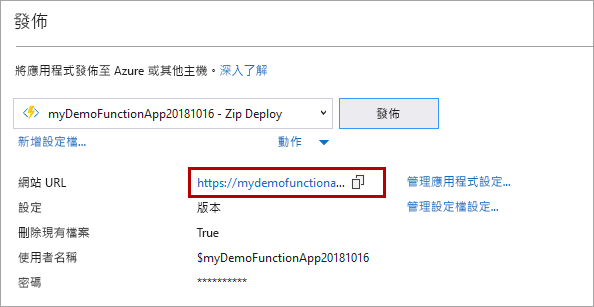

1. 在 [方案總管] 中，以滑鼠右鍵按一下專案並選取 [發佈]。

2. 選取 [Azure 函式應用程式]，選擇 [新建]，然後選取 [發行]。

    

    當您啟用 [從 Zip 執行] 時，您在 Azure 中的函式應用程式會進入唯讀模式，並直接從部署套件執行。 如需詳細資訊，請參閱[從套件檔案執行 Azure Functions](../articles/azure-functions/run-functions-from-deployment-package.md)。
     
    >[!CAUTION]
    >當您選擇 [選取現有的]，Azure 中現有函式應用程式的所有檔案都會以本機專案中的檔案加以覆寫。 請在將更新重新發佈至現有函式應用程式時，才使用此選項。

3. 如果您已將 Visual Studio 連線到您的 Azure 帳戶，請選取 [新增帳戶...]。

4. 在 [建立 App Service] 對話方塊中，使用影像下方表格中指定的 [裝載] 設定：

    

    | 設定      | 建議的值  | 說明                                |
    | ------------ |  ------- | -------------------------------------------------- |
    | **應用程式名稱** | 全域唯一的名稱 | 用以唯一識別新函式應用程式的名稱。 |
    | **訂用帳戶** | 選擇您的訂用帳戶 | 要使用的 Azure 訂用帳戶。 |
    | **[資源群組](../articles/azure-resource-manager/resource-group-overview.md)** | myResourceGroup |  要在其中建立函式應用程式的資源群組名稱。 選擇 [新增] 以建立新的資源群組。|
    | **[App Service 方案](../articles/azure-functions/functions-scale.md)** | 取用方案 | 在您按一下 [新增] 以建立無伺服器方案之後，請務必選擇 [大小] 之下的 [取用]。 或者，在[區域](https://azure.microsoft.com/regions/)中選擇您附近的 [位置]，或選擇與函式將會存取之其他服務接近的位置。 在**取用**以外的方案中執行時，您必須管理[函式應用程式的調整](../articles/azure-functions/functions-scale.md)。  |
    | **[儲存體帳戶](../articles/storage/common/storage-quickstart-create-account.md)** | 一般用途的儲存體帳戶 | Functions 執行階段需要 Azure 儲存體帳戶。 按一下 [新增] 以建立一般用途的儲存體帳戶。 您也可以使用符合[儲存體帳戶需求](../articles/azure-functions/functions-scale.md#storage-account-requirements)的現有帳戶。  |

5. 按一下 [建立] 以在 Azure 中使用這些設定建立函式應用程式和相關資源，並且部署函式專案程式碼。 

6. 部署完成之後，請記下 [網站 URL] 值，這是 Azure 中您函式應用程式的位址。

    
