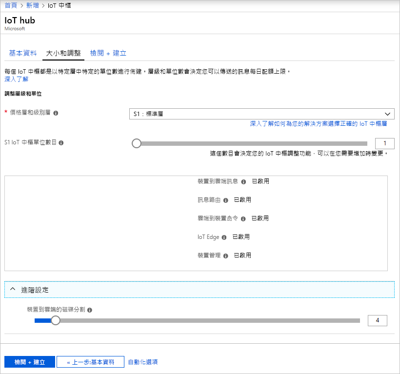
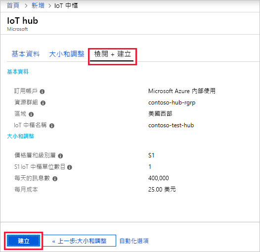

本節將說明如何使用 [Azure 入口網站](https://portal.azure.com)建立 IoT 中樞。

1. 登入 [Azure 入口網站](https://portal.azure.com)。 

2. 選擇 [+建立資源]，然後選擇 [物聯網]。

3. 按一下右側清單中的 [IoT 中樞]。 您會看到用於建立 IoT 中樞的第一個畫面。

   

   填寫欄位。

   **訂用帳戶**：選取要為您的 IoT 中樞使用的訂用帳戶。

   **資源群組**：您可以建立新的資源群組或使用現有的資源群組。 若要建立新的資源群組，請按一下 [新建] 並填入您要使用的名稱。 若要使用現有的資源群組，請按一下 [使用現有的] 並從下拉式清單中選取資源群組。 如需詳細資訊，請參閱[使用資源群組管理您的 Azure 資源](../articles/azure-resource-manager/resource-group-portal.md)。

   **區域**：這是您要放置中樞的區域。 從下拉式清單中選取最接近您的位置。

   **IoT 中樞名稱**：輸入 IoT 中樞的名稱。 此名稱必須是全域唯一的。 如果您輸入的名稱可用，則會出現綠色核取記號。

   [!INCLUDE [iot-hub-pii-note-naming-hub](iot-hub-pii-note-naming-hub.md)]

4. 按一下 [下一步：大小和級別] 繼續建立 IoT 中樞。

   

   在此畫面上，您可以接受預設值，只需按一下底部的 [檢閱 + 建立] 即可。 

   **定價與級別層**：您可以依據所需的功能多寡，以及每天透過解決方案傳送的訊息多寡，從數個層級中選擇。 免費層適用於測試和評估。 它可允許 500 個裝置連接到 IoT 中樞，每天最多可允許 8,000 則訊息。 每個 Azure 訂用帳戶可以在免費層建立一個「IoT 中樞」。 

   **IoT 中樞單位**：每天每單位允許的訊息數目取決於您中樞的定價層。 例如，如果您想要 IoT 中樞支援 700,000 封訊息的輸入，您可以選擇 2 個 S1 層單位。

   如需有關其他層級選項的詳細資料，請參閱[選擇適合的 IoT 中樞層](../articles/iot-hub/iot-hub-scaling.md)。

   **進階 / 裝置到雲端的分割區**：此屬性就是裝置到雲端的訊息數對同時閱讀這些訊息的讀者數比例。 大部分的 IoT 中樞只需要四個分割區。 

5. 按一下 [檢閱 + 建立] 以檢閱您的選擇。 您會看到類似這個畫面的內容。

   

6. 按一下 [建立] 以建立新的 IoT 中樞。 建立中樞需要幾分鐘的時間。
