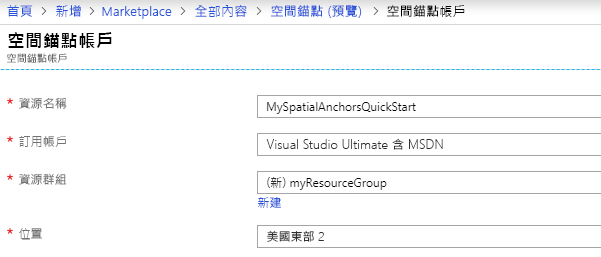

## 建立 Spatial Anchors 資源

移至 <a href="https://portal.azure.com" target="_blank">Azure 入口網站</a>。

在 Azure 入口網站的左側導覽窗格中，選取 [建立資源]。

使用搜尋方塊搜尋 **Spatial Anchors**。

   

選取 [Spatial Anchors]。 在對話方塊中，選取 [建立]。

在 [Spatial Anchors 帳戶] 對話方塊中：

- 輸入唯一的資源名稱。
- 選取您要連結資源的訂用帳戶。
- 選取 [新建] 來建立資源群組。 將其命名為 **myResourceGroup**，然後選取 [確定]。
      [!INCLUDE [resource group intro text](resource-group.md)]
- 選取要在其中放置資源的位置 (區域)。
- 選取 [新增] 開始建立資源。

   

建立資源之後，您可以檢視資源屬性。 將資源的 [帳戶識別碼] 值複製到文字編輯器，因為您稍後需要用到它。

   

在 [設定] 底下，選取 [金鑰]。 將 [主要金鑰] 值複製到文字編輯器中。 此值為 `Account Key`。 稍後您將會用到此資訊。

   
