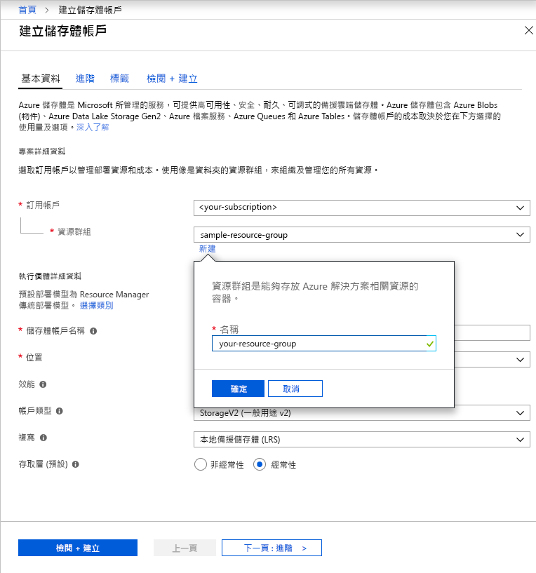

若要在 Azure 入口網站中建立一般用途 v2 儲存體帳戶，請遵循下列步驟：

1. 在 Azure 入口網站中，選取 [所有服務]。 在資源清單中，輸入**儲存體帳戶**。 當您開始輸入時，清單會根據您輸入的文字進行篩選。 選取 [儲存體帳戶] 。
1. 在出現的 [儲存體帳戶] 視窗上，選擇 [新增]。
1. 選取要在其中建立儲存體帳戶的訂用帳戶。
1. 在 [資源群組] 欄位下方，選取 [新建]。 輸入新資源群組的名稱，如下圖所示。

    

1. 接下來，輸入儲存體帳戶的名稱。 您所選擇的名稱在整個 Azure 中必須是唯一的。 名稱的長度必須介於 3 到 24 個字元之間，且只能包含數字和小寫字母。
1. 選取儲存體帳戶的位置，或使用預設位置。
1. 讓這些欄位設定為其預設值：

   |欄位  |值  |
   |---------|---------|
   |部署模型     |Resource Manager         |
   |效能     |標準         |
   |帳戶類型     |StorageV2 (一般用途 v2)         |
   |複寫     |本機備援儲存體 (LRS)         |
   |存取層     |經常性存取         |

1. 選取 [檢閱 + 建立]，以檢閱您的儲存體帳戶設定並建立帳戶。
1. 選取 [建立] 。

如需儲存體帳戶類型及其他儲存體帳戶設定的詳細資訊，請參閱 [Azure 儲存體帳戶概觀](https://docs.microsoft.com/azure/storage/common/storage-account-overview)。 如需資源群組的詳細資訊，請參閱 [Azure Resource Manager 概觀](https://docs.microsoft.com/azure/azure-resource-manager/resource-group-overview)。 
